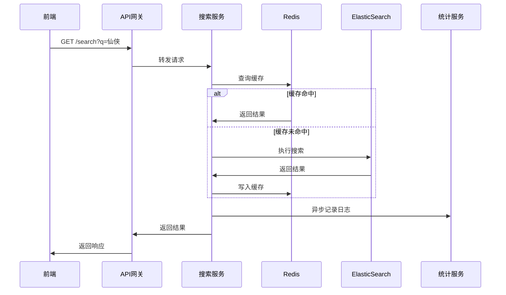
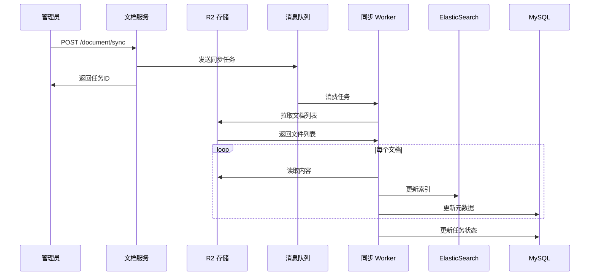

# API 接口文档

> 版本：v1.0.0  
> 日期：2025-12-13  
> 基础路径：`/api/v1`

---

## 1. 接口规范

### 1.1 请求格式

```
POST /api/v1/resource
Content-Type: application/json
Authorization: Bearer <token>
```

### 1.2 响应格式

```json
{
  "code": 200,
  "msg": "操作成功",
  "data": {},
  "timestamp": 1702454400000
}
```

### 1.3 状态码

| 状态码 | 说明 |
|-------|------|
| 200 | 成功 |
| 400 | 参数错误 |
| 401 | 未授权 |
| 403 | 无权限 |
| 404 | 资源不存在 |
| 500 | 服务器错误 |

---

## 2. 文档服务接口

### 2.1 文档列表

**请求**

```
GET /document/list
```

| 参数 | 类型 | 必填 | 说明 |
|------|-----|------|------|
| categoryId | Long | 否 | 分类ID |
| keyword | String | 否 | 关键词 |
| status | Integer | 否 | 状态 |
| pageNum | Integer | 否 | 页码，默认1 |
| pageSize | Integer | 否 | 每页数量，默认20 |

**响应**

```json
{
  "code": 200,
  "msg": "success",
  "data": {
    "total": 1000,
    "rows": [
      {
        "id": 1,
        "slug": "xianxia/jianlai",
        "title": "剑来破解版下载",
        "categoryName": "仙侠",
        "viewCount": 12345,
        "isPublished": 1,
        "publishedAt": "2025-01-01 12:00:00"
      }
    ]
  }
}
```

### 2.2 文档详情

**请求**

```
GET /document/{id}
```

**响应**

```json
{
  "code": 200,
  "data": {
    "id": 1,
    "slug": "xianxia/jianlai",
    "title": "剑来破解版下载",
    "content": "Markdown 内容...",
    "categoryId": 2,
    "keywords": "仙侠,无限元宝,破解版",
    "viewCount": 12345,
    "relatedGames": [
      {
        "id": 10,
        "name": "剑来",
        "iconUrl": "https://..."
      }
    ]
  }
}
```

### 2.3 同步文档到 ES

**请求**

```
POST /document/sync
```

| 参数 | 类型 | 必填 | 说明 |
|------|-----|------|------|
| documentIds | Long[] | 否 | 文档ID列表，空则全量同步 |
| forceReindex | Boolean | 否 | 是否强制重建索引 |

**响应**

```json
{
  "code": 200,
  "data": {
    "taskId": "sync-20250101-001",
    "totalCount": 1000,
    "status": "processing"
  }
}
```

### 2.4 从 R2 拉取文档

**请求**

```
POST /document/pull
```

| 参数 | 类型 | 必填 | 说明 |
|------|-----|------|------|
| prefix | String | 否 | R2 路径前缀 |

---

## 3. 搜索服务接口

### 3.1 全文搜索

**请求**

```
GET /search
```

| 参数 | 类型 | 必填 | 说明 |
|------|-----|------|------|
| q | String | 是 | 搜索关键词 |
| category | String | 否 | 分类筛选 |
| sort | String | 否 | 排序：relevance/date/views |
| page | Integer | 否 | 页码 |
| size | Integer | 否 | 每页数量 |

**响应**

```json
{
  "code": 200,
  "data": {
    "total": 256,
    "took": 23,
    "hits": [
      {
        "id": 1,
        "slug": "xianxia/jianlai",
        "title": "<em>剑来</em>破解版下载",
        "highlight": "...<em>无限元宝</em>修改器...",
        "category": "仙侠",
        "score": 15.234
      }
    ],
    "aggregations": {
      "categories": {
        "仙侠": 100,
        "传奇": 80,
        "三国": 50
      }
    }
  }
}
```

### 3.2 搜索建议

**请求**

```
GET /search/suggest
```

| 参数 | 类型 | 必填 | 说明 |
|------|-----|------|------|
| q | String | 是 | 输入前缀 |
| size | Integer | 否 | 建议数量 |

**响应**

```json
{
  "code": 200,
  "data": {
    "suggestions": [
      "仙侠游戏",
      "仙侠破解版",
      "仙侠无限元宝"
    ]
  }
}
```

### 3.3 热门搜索

**请求**

```
GET /search/hot
```

| 参数 | 类型 | 必填 | 说明 |
|------|-----|------|------|
| limit | Integer | 否 | 数量限制，默认10 |

**响应**

```json
{
  "code": 200,
  "data": {
    "keywords": [
      { "keyword": "传奇", "count": 5000 },
      { "keyword": "仙侠", "count": 4500 },
      { "keyword": "三国", "count": 3800 }
    ]
  }
}
```

---

## 4. 游戏服务接口

### 4.1 游戏列表

**请求**

```
GET /game/list
```

| 参数 | 类型 | 必填 | 说明 |
|------|-----|------|------|
| category | String | 否 | 游戏分类 |
| keyword | String | 否 | 搜索关键词 |
| status | Integer | 否 | 状态 |
| pageNum | Integer | 否 | 页码 |
| pageSize | Integer | 否 | 每页数量 |

### 4.2 创建游戏

**请求**

```
POST /game
```

```json
{
  "name": "剑来",
  "category": "仙侠",
  "description": "一款仙侠类手游",
  "iconUrl": "https://...",
  "downloadUrl": "https://...",
  "features": ["无限元宝", "满V特权"]
}
```

### 4.3 游戏盒子列表

**请求**

```
GET /gamebox/list
```

**响应**

```json
{
  "code": 200,
  "data": {
    "rows": [
      {
        "id": 1,
        "name": "咪噜游戏",
        "logoUrl": "https://...",
        "discountRate": 0.3,
        "gameCount": 500,
        "features": ["3折充值", "海量福利"]
      }
    ]
  }
}
```

---

## 5. 关联服务接口

### 5.1 自动关联

**请求**

```
POST /relation/auto
```

| 参数 | 类型 | 必填 | 说明 |
|------|-----|------|------|
| documentId | Long | 是 | 文档ID |
| threshold | Float | 否 | 相关度阈值，默认0.5 |
| limit | Integer | 否 | 最大关联数量 |

**响应**

```json
{
  "code": 200,
  "data": {
    "relations": [
      {
        "gameId": 10,
        "gameName": "剑来",
        "relevanceScore": 0.92,
        "matchedKeywords": ["剑来", "仙侠", "修仙"]
      }
    ]
  }
}
```

### 5.2 手动关联

**请求**

```
POST /relation/manual
```

```json
{
  "documentId": 1,
  "gameId": 10,
  "isPrimary": true
}
```

### 5.3 获取文档关联

**请求**

```
GET /relation/document/{documentId}
```

**响应**

```json
{
  "code": 200,
  "data": {
    "relations": [
      {
        "id": 1,
        "gameId": 10,
        "gameName": "剑来",
        "relationType": "auto",
        "relevanceScore": 0.92,
        "isPrimary": true
      }
    ]
  }
}
```

---

## 6. 统计服务接口

### 6.1 仪表盘数据

**请求**

```
GET /analytics/dashboard
```

**响应**

```json
{
  "code": 200,
  "data": {
    "overview": {
      "totalDocuments": 100000,
      "todayNewDocuments": 50,
      "totalGames": 500,
      "totalPageViews": 1000000,
      "todayPageViews": 5000
    },
    "categoryDistribution": [
      { "name": "仙侠", "count": 15000 },
      { "name": "传奇", "count": 12000 }
    ],
    "viewTrend": [
      { "date": "2025-01-01", "pv": 5000, "uv": 2000 }
    ],
    "hotKeywords": [
      { "keyword": "传奇", "count": 500 }
    ]
  }
}
```

### 6.2 内容统计

**请求**

```
GET /analytics/content
```

| 参数 | 类型 | 必填 | 说明 |
|------|-----|------|------|
| startDate | String | 否 | 开始日期 |
| endDate | String | 否 | 结束日期 |
| groupBy | String | 否 | 分组：day/week/month |

### 6.3 搜索统计

**请求**

```
GET /analytics/search
```

| 参数 | 类型 | 必填 | 说明 |
|------|-----|------|------|
| startDate | String | 否 | 开始日期 |
| endDate | String | 否 | 结束日期 |

**响应**

```json
{
  "code": 200,
  "data": {
    "totalSearches": 50000,
    "avgSearchTime": 45,
    "zeroResultRate": 0.05,
    "topKeywords": [
      { "keyword": "仙侠", "count": 5000, "ctr": 0.65 }
    ],
    "zeroResultKeywords": [
      { "keyword": "未知游戏", "count": 100 }
    ]
  }
}
```

### 6.4 记录浏览

**请求**

```
POST /analytics/pageview
```

```json
{
  "documentId": 1,
  "pagePath": "/pojie/xianxia/jianlai",
  "referer": "https://google.com",
  "sessionId": "abc123"
}
```

---

## 7. 前端专用接口

> 以下接口供 Next.js 前端调用，无需认证

### 7.1 获取文章内容

**请求**

```
GET /public/article/{slug}
```

**响应**

```json
{
  "code": 200,
  "data": {
    "title": "剑来破解版下载",
    "content": "Markdown 内容",
    "category": "仙侠",
    "publishedAt": "2025-01-01",
    "readingTime": 5,
    "relatedGames": [],
    "relatedArticles": []
  }
}
```

### 7.2 获取分类列表

**请求**

```
GET /public/categories
```

### 7.3 获取游戏盒子

**请求**

```
GET /public/gameboxes
```

---

## 8. 接口流程图

### 8.1 搜索流程



### 8.2 文档同步流程


