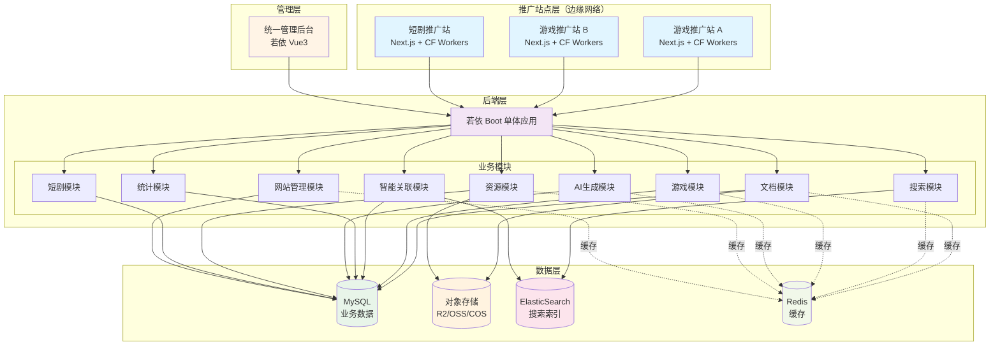
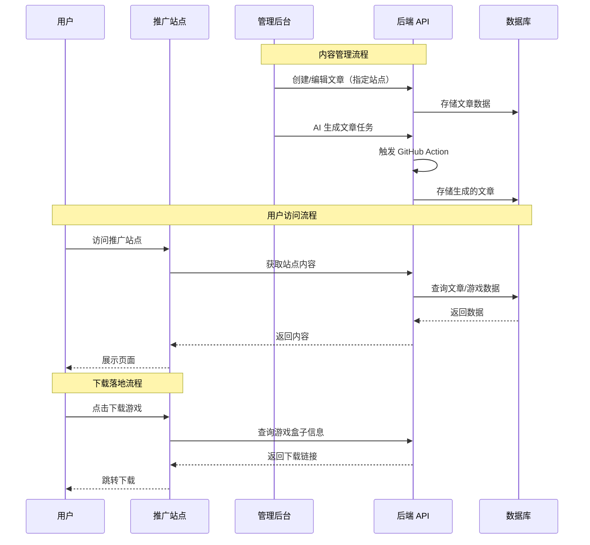
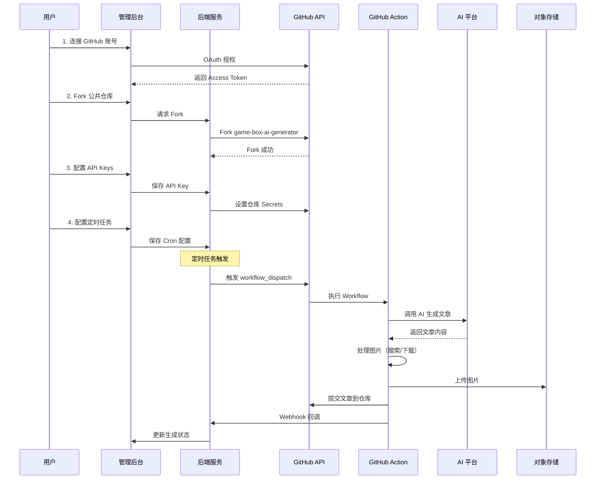
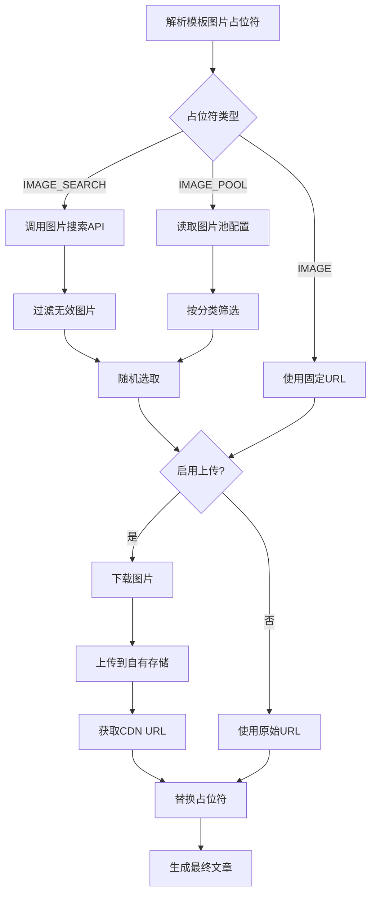

# 多产品内容管理系统 - 产品需求文档 (PRD)

> 版本：v2.7.0  
> 日期：2025-12-14  
> 状态：设计中

---

## 1. 项目概述

### 1.1 项目背景

本系统是一个多产品内容管理平台，支持游戏盒子推广和短剧推广两大业务线。游戏盒子业务面向玩家提供游戏资讯与下载服务，包含折扣游戏、BT版游戏、游戏攻略等内容；短剧业务支持多厂商短剧的推广管理。随着内容规模扩展至百万级，需要构建完整的后端管理系统来支撑内容运营、AI文章生成、多存储管理和数据分析等功能。

### 1.2 项目目标

| 目标 | 描述 |
|------|------|
| 内容管理 | 统一管理百万级 Markdown 文档 |
| 数据分析 | 实时监控内容数据指标 |
| 智能关联 | 自动关联文章与游戏盒子产品 |
| 全文搜索 | 支持百万级中文文档秒级搜索 |

### 1.3 优先级定义

| 优先级 | 定义 | 说明 |
|--------|------|------|
| **P0 - 核心** | 系统基础功能 | 必须首先实现，阻塞其他功能开发 |
| **P1 - 重要** | 核心业务功能 | 核心用户价值，优先开发 |
| **P2 - 标准** | 常规业务功能 | 重要但可延后 |
| **P3 - 次要** | 增强型功能 | 锦上添花，资源充足时开发 |

### 1.4 开发阶段规划

| 阶段 | 优先级 | 核心目标 | 预计周期 |
|------|--------|---------|---------|
| **阶段一** | P0 | 基础架构搭建、文档系统核心 | 2 周 |
| **阶段二** | P1 | AI文章生成（GitHub Action）、文档管理 | 3 周 |
| **阶段三** | P2 | 搜索功能、游戏盒子管理 | 2 周 |
| **阶段四** | P3 | 数据统计、智能关联优化 | 2 周 |

### 1.3 系统架构

#### 多站点架构说明

本系统采用**多推广站点 + 统一管理后台**的架构模式：

| 组件 | 说明 | 部署方式 |
|------|------|---------|
| **推广站点（多个）** | 面向用户的展示网站，可独立部署为游戏推广站、短剧推广站等 | Cloudflare Workers 边缘网络 |
| **管理后台（单一）** | 统一的内容管理平台，管理所有站点的内容 | 若依 Vue3 + Nginx |
| **后端服务（单一）** | 为所有前端提供 API 服务 | 若依 Boot 单体应用 |



#### 数据流向



---

## 2. 用户角色

| 角色 | 描述 | 权限 |
|------|------|------|
| 游客 | 普通访问用户 | 浏览文章、搜索、下载 |
| 运营人员 | 内容运营 | 文章管理、数据查看 |
| 管理员 | 系统管理 | 全部权限 |
| 超级管理员 | 最高权限 | 系统配置、权限管理 |

---

## 3. 功能需求

> 📌 **优先级说明**：P0（核心）> P1（重要）> P2（标准）> P3（次要）

### 3.1 用户前端 (game-box)

#### 3.1.1 首页
- [ ] 热门游戏推荐 `P2`
- [ ] 最新文章列表 `P1`
- [ ] 分类导航 `P1`
- [ ] 搜索入口 `P2`

#### 3.1.2 文章模块
- [ ] 文章详情页（SSR/ISR） `P0`
- [ ] 文章分类浏览 `P1`
- [ ] 相关游戏推荐 `P2`
- [ ] 文章搜索 `P2`

#### 3.1.3 游戏盒子模块
- [ ] 游戏盒子列表 `P1`
- [ ] 游戏盒子详情 `P1`
- [ ] 关联文章展示 `P2`
- [ ] 下载链接跳转 `P1`

#### 3.1.4 搜索功能
- [ ] 全文搜索 `P2`
- [ ] 分类筛选 `P2`
- [ ] 搜索建议（自动补全） `P3`
- [ ] 搜索历史 `P3`

---

### 3.2 管理后台 (RuoYi-Vue)

#### 3.2.1 网站管理 ⭐ 核心功能
> 💡 **多站点统一管理**：管理多个推广站点的配置，包括多语言设置

- [ ] **网站列表** `P0`
  - 站点名称、域名、类型
  - 站点状态监控
  - 快速切换工作站点
- [ ] **网站配置** `P0`
  - 基本信息（名称、域名、Logo、描述）
  - SEO 配置（标题、关键词、描述）
  - 默认存储配置
- [ ] **多语言配置** `P1` ⭐
  - 默认语言设置
  - 支持的语言列表管理
  - 多语言模式选择
    - 子目录模式（/en/、/ja/）
    - 子域名模式（en.xxx.com）
    - 参数模式（?lang=en）
  - 各语言独立配置
    - 语言代码与名称
    - 存储路径模板
    - 发布 URL 模板
    - 域名覆盖（子域名模式）
    - SEO 标题/描述模板
    - AI 生成语言提示词
    - 翻译提示词模板

#### 3.2.2 仪表盘
- [ ] 内容统计概览 `P2`
  - 文章总数、今日新增
  - 游戏盒子总数
  - 搜索热词 TOP 10
- [ ] 流量趋势图 `P3`
- [ ] 热门文章排行 `P3`
- [ ] 分类分布图 `P3`

#### 3.2.3 文档管理
- [ ] 文档列表 `P0`
  - 分页、筛选、排序
  - 批量操作
- [ ] 文档详情 `P0`
  - Markdown 预览
  - 元数据编辑
- [ ] 文档同步 `P1`
  - 从 R2 同步到 ES
  - 同步状态监控
- [ ] 文档分析 `P3`
  - 阅读量统计
  - 关键词提取

#### 3.2.4 游戏盒子管理
- [ ] 盒子列表 `P1`
  - 名称、图标、下载量
- [ ] 盒子详情 `P2`
  - 基本信息编辑
  - 下载链接管理
- [ ] 游戏分类管理 `P2`
- [ ] 折扣信息管理 `P3`

#### 3.2.5 文章-游戏关联
- [ ] 自动关联规则配置 `P2`
- [ ] 手动关联编辑 `P2`
- [ ] 关联效果预览 `P3`
- [ ] 批量关联操作 `P3`

#### 3.2.6 搜索管理
- [ ] 搜索热词统计 `P2`
- [ ] 搜索日志查看 `P3`
- [ ] 同义词配置 `P3`
- [ ] 停用词管理 `P3`
- [ ] 索引重建 `P2`

#### 3.2.7 AI文章生成 ⭐ 核心功能
> 💡 **实现方式**：用户在系统中连接公共 AI 生成仓库，配置 API Key，系统通过定时任务自动触发 GitHub Action 执行文章生成

- [ ] **公共仓库连接** `P0`
  - 连接公共 AI 生成仓库（如 game-box-ai-generator）
  - Fork 仓库到用户 GitHub 账号
  - 自动配置仓库 Secrets（API Keys）
  - 连接状态监控与测试
- [ ] **AI 平台配置** `P0`
  - 多平台 API Key 管理（OpenAI/Claude/通义千问/DeepSeek）
  - API Key 加密存储
  - 平台可用性检测
  - 配额与余额查询
- [ ] **提示词模板管理** `P0`
  - 模板列表/新增/编辑/删除
  - 模板类型（游戏介绍/攻略/评测/短剧介绍等）
  - 变量定义与默认值
  - **图片占位符配置**
    - 搜索引擎图片占位符 `{{IMAGE_SEARCH:关键词}}`
    - 自定义图片池占位符 `{{IMAGE_POOL:分类}}`
    - 固定图片占位符 `{{IMAGE:URL}}`
  - 模板预览与测试
- [ ] **图片资源管理** `P0`
  - 图片搜索引擎配置（Bing/Google/Unsplash/Pixabay）
  - 自定义图片池管理
    - 按分类上传图片
    - 批量导入图片 URL
  - 图片随机选择策略
  - 图片防盗链处理（下载并上传到自有存储）
- [ ] **定时任务调度** `P0`
  - Cron 表达式配置（可视化编辑）
  - 每日/每周/自定义周期执行
  - 任务启用/禁用开关
  - 任务执行日志与历史
  - 任务失败重试机制
- [ ] **批量生成任务** `P0`
  - **批量任务创建**
    - 支持一次配置多篇文章
    - JSON 格式批量配置导入
    - 每篇文章可独立配置：游戏名称、分类、模板、AI 平台、提示词、图片设置
  - **多语言生成配置** ⭐ `P1`
    - 目标语言选择（从网站多语言配置中选取）
    - 生成模式选择
      - 仅主语言：只生成默认语言版本
      - 翻译生成：先生成主语言，再 AI 翻译成其他语言
      - 并行生成：同时生成多语言版本（消耗更多 Token）
    - 各语言独立存储路径
    - 各语言独立发布链接
  - **任务调度方式**
    - 立即执行
    - 定时执行（Cron 表达式）
    - 周期性执行（每日/每周）
  - **执行监控**
    - 实时任务状态查询（通过 GitHub API）
    - 批量进度展示（已完成/总数）
    - 单篇文章生成状态
    - 多语言版本生成进度
  - **Webhook 回调**
    - 每篇文章完成后回调
    - 批量任务完成汇总回调
    - 失败告警通知
- [ ] **单篇生成任务** `P1`
  - 快速单篇生成入口
  - AI 平台选择
  - 实时生成日志查看
  - 生成历史记录
- [ ] **文章自动发布** `P1`
  - 生成后自动提交到仓库
  - 触发前端重新部署
  - 发布状态通知（Webhook/邮件）
- [ ] **文章重新生成** `P2`
  - 更换模板重生成
  - 更换AI平台重生成
  - 生成版本对比

#### 3.2.8 文章资源管理
- [ ] 资源列表 `P2`
  - 按文章筛选
  - 按类型筛选（图片/视频/音频）
  - 按存储位置筛选
- [ ] 资源上传 `P2`
  - 单文件上传
  - 批量上传
  - 存储位置选择
- [ ] 资源迁移 `P3`
  - 迁移规则配置
  - 批量迁移执行
  - 迁移进度监控
  - 迁移日志查看

#### 3.2.9 存储管理 ⭐ 核心功能
- [ ] 存储配置管理 `P1`
  - 多存储商支持（GitHub/MinIO/R2/OSS/COS/S3）
  - 站点级别存储配置（不同站点可配置不同存储）
  - 存储用途分类（文章存储/资源存储/混合）
  - 连接测试与健康检查
  - 优先级设置（用于存储轮换）
- [ ] 容量管理 `P1`
  - 容量上限配置
  - 已用容量监控
  - 容量预警阈值设置
  - 容量使用趋势图表
  - 容量变化记录查询
- [ ] 存储轮换 `P2`
  - 备用存储配置
  - 容量满时自动切换
  - 轮换策略配置（按优先级/按容量）
  - 轮换通知告警
- [ ] 迁移规则管理 `P3`
  - URL替换规则
  - 存储迁移规则
  - 路径重写规则
  - 域名更换规则
- [ ] 迁移任务管理 `P3`
  - 任务创建与执行
  - 试运行预览
  - 任务进度监控
  - 失败重试

#### 3.2.10 数据统计
- [ ] 内容统计报表 `P2`
  - 按分类统计
  - 按时间统计
- [ ] 流量统计 `P3`
  - PV/UV 趋势
  - 来源分析
- [ ] 搜索统计 `P3`
  - 搜索量趋势
  - 无结果搜索词
- [ ] AI生成统计 `P2`
  - 生成成功率
  - 各平台使用量
  - Token消耗统计
- [ ] 导出报表 `P3`

---

### 3.3 后端服务 (RuoYi-Boot 单体架构)

> 采用若依 Boot 单体架构，所有业务模块集成在一个应用中，简化部署和运维。

#### 3.3.1 文档模块
- [ ] Markdown 解析 `P0`
- [ ] R2 对象存储操作 `P0`
- [ ] 文档元数据提取 `P1`
- [ ] 文档同步任务 `P1`

#### 3.3.2 搜索模块
- [ ] ES 索引管理 `P1`
- [ ] 全文搜索 API `P2`
- [ ] 搜索建议 API `P3`
- [ ] 搜索统计 `P3`

#### 3.3.3 游戏盒子模块
- [ ] 盒子 CRUD `P1`
- [ ] 分类管理 `P2`
- [ ] 关联管理 `P2`
- [ ] 推广链接管理 `P1`

#### 3.3.4 短剧模块
- [ ] 短剧厂商管理 `P2`
- [ ] 短剧 CRUD `P2`
- [ ] 分类管理 `P2`

#### 3.3.5 智能关联模块
- [ ] 关键词提取 `P2`
- [ ] 相似度计算 `P3`
- [ ] 自动关联匹配 `P2`
- [ ] 关联规则引擎 `P3`

#### 3.3.6 AI生成模块 ⭐ 核心功能

**GitHub 仓库集成服务**
- [ ] **GitHub OAuth 集成** `P0`
  - 用户授权连接 GitHub 账号
  - 获取用户仓库列表
  - Fork 公共 AI 生成仓库
- [ ] **仓库 Secrets 管理** `P0`
  - 通过 GitHub API 配置仓库 Secrets
  - API Key 自动同步到仓库
  - Secrets 更新与删除
- [ ] **Workflow 调度服务** `P0`
  - 通过 GitHub API 触发 workflow_dispatch
  - 传递生成参数（模板、游戏名、图片配置等）
  - 批量任务触发（batch_mode + batch_config）
- [ ] **Workflow 状态监控服务** `P0`
  - 查询 Workflow Run 状态（queued/in_progress/completed）
  - 获取 Jobs 列表解析各文章执行进度
  - 状态自动同步到本地数据库
  - 支持取消执行中的 Workflow

**图片服务**
- [ ] **图片搜索引擎集成** `P0`
  - Bing Image Search API
  - Google Custom Search API
  - Unsplash API（免费图片）
  - Pixabay API（免费图片）
- [ ] **图片池管理** `P0`
  - 分类图片库（游戏截图/角色图/背景图等）
  - 批量上传/导入
  - 图片随机选取算法
- [ ] **图片处理服务** `P1`
  - 下载外部图片到自有存储
  - 图片压缩与格式转换
  - 图片水印处理
  - CDN URL 生成

**核心生成服务**
- [ ] **GitHub Action Webhook 接收** `P0`
  - 接收 Action 执行完成回调
  - 验证 Webhook 签名
  - 单篇完成回调（更新执行详情）
  - 批量完成回调（更新任务状态）
  - 解析生成结果
  - 文章入库处理
- [ ] 提示词模板管理 `P0`
- [ ] 多AI平台适配 `P0`
  - OpenAI API
  - Claude API
  - 通义千问 API
  - DeepSeek API
- [ ] 定时任务调度（Spring Scheduler） `P0`
  - Cron 表达式解析
  - 触发 GitHub Workflow
  - 失败重试机制
- [ ] **任务执行监控** `P0`
  - 执行记录列表查询
  - 实时进度展示（总数/已完成/失败）
  - 单篇文章执行详情
  - 轮询 GitHub API 同步状态
  - WebSocket 实时推送进度
- [ ] 生成记录管理 `P1`

#### 3.3.7 资源模块
- [ ] 多存储适配器 `P1`
  - GitHub 仓库
  - MinIO
  - Cloudflare R2
  - 阿里云 OSS
  - 腾讯云 COS
- [ ] 资源上传/下载 `P2`
- [ ] 存储迁移引擎 `P3`
- [ ] 迁移任务调度（Spring Scheduler） `P3`

#### 3.3.8 统计模块
- [ ] 数据采集 `P2`
- [ ] 指标计算 `P2`
- [ ] AI生成统计 `P2`
- [ ] 报表生成 `P3`

---

### 3.4 GitHub Action 集成（AI文章生成）⭐ 核心功能

> 💡 **设计理念**：提供一个公共的 GitHub 仓库（game-box-ai-generator），用户只需在管理后台连接该仓库并配置 API Key，系统即可通过定时任务自动触发 GitHub Action 执行文章生成任务。

#### 3.4.1 系统集成流程 `P0`



#### 3.4.2 公共仓库设计 `P0`

**仓库名称**：`game-box-ai-generator`

**仓库结构**：
```
game-box-ai-generator/
├── .github/
│   └── workflows/
│       └── generate.yml      # 主工作流
├── action.yml                # Action 元数据
├── src/
│   ├── index.ts              # 入口
│   ├── ai-providers/         # AI 提供商适配器
│   │   ├── openai.ts
│   │   ├── claude.ts
│   │   ├── qwen.ts
│   │   └── deepseek.ts
│   ├── image-service/        # 图片服务
│   │   ├── search-engines/   # 图片搜索引擎
│   │   │   ├── bing.ts
│   │   │   ├── google.ts
│   │   │   ├── unsplash.ts
│   │   │   └── pixabay.ts
│   │   ├── image-pool.ts     # 图片池处理
│   │   └── image-processor.ts # 图片处理
│   ├── template-engine/      # 模板引擎
│   │   ├── parser.ts         # 模板解析
│   │   └── image-placeholder.ts # 图片占位符处理
│   └── utils/
├── templates/                # 内置模板
│   ├── game-intro.md
│   ├── strategy.md
│   └── review.md
├── package.json
└── tsconfig.json
```

#### 3.4.3 Action 输入参数 `P0`

| 参数 | 类型 | 必填 | 说明 |
|------|------|------|------|
| `ai-provider` | string | ✅ | AI 提供商：openai/claude/qwen/deepseek |
| `api-key` | secret | ✅ | AI 平台 API Key |
| `template` | string | ✅ | 模板名称或自定义模板内容（Base64） |
| `game-name` | string | ✅ | 游戏名称 |
| `category` | string | ❌ | 游戏分类 |
| `output-path` | string | ❌ | 输出文件路径 |
| `commit-changes` | boolean | ❌ | 是否自动提交，默认 true |
| `webhook-url` | string | ❌ | 完成后回调 URL |
| **图片相关参数** | | | |
| `image-search-enabled` | boolean | ❌ | 是否启用图片搜索 |
| `image-search-engine` | string | ❌ | 图片搜索引擎：bing/google/unsplash/pixabay |
| `image-search-api-key` | secret | ❌ | 图片搜索 API Key |
| `image-pool-url` | string | ❌ | 图片池配置 JSON URL |
| `image-upload-enabled` | boolean | ❌ | 是否上传图片到自有存储 |
| `storage-config` | secret | ❌ | 存储配置（R2/OSS/COS） |

#### 3.4.4 图片处理机制 `P0`

**图片占位符语法**：

| 占位符格式 | 说明 | 示例 |
|-----------|------|------|
| `{{IMAGE_SEARCH:关键词}}` | 通过搜索引擎搜索图片 | `{{IMAGE_SEARCH:剑来游戏截图}}` |
| `{{IMAGE_SEARCH:关键词:数量}}` | 搜索并随机选取 | `{{IMAGE_SEARCH:仙侠游戏:3}}` |
| `{{IMAGE_POOL:分类}}` | 从图片池随机选取 | `{{IMAGE_POOL:game-screenshot}}` |
| `{{IMAGE_POOL:分类:数量}}` | 从图片池选取多张 | `{{IMAGE_POOL:character:2}}` |
| `{{IMAGE:URL}}` | 固定图片 | `{{IMAGE:https://example.com/img.jpg}}` |

**图片处理流程**：



#### 3.4.5 图片池配置格式 `P1`

```json
{
  "pools": {
    "game-screenshot": {
      "description": "游戏截图",
      "images": [
        "https://cdn.example.com/screenshots/1.jpg",
        "https://cdn.example.com/screenshots/2.jpg"
      ]
    },
    "character": {
      "description": "游戏角色图",
      "images": [
        "https://cdn.example.com/characters/warrior.jpg",
        "https://cdn.example.com/characters/mage.jpg"
      ]
    },
    "banner": {
      "description": "文章横幅图",
      "images": [
        "https://cdn.example.com/banners/xianxia.jpg",
        "https://cdn.example.com/banners/chuanqi.jpg"
      ]
    }
  },
  "defaultPool": "game-screenshot"
}
```

#### 3.4.6 模板示例（含图片） `P0`

```markdown
---
title: "{{gameName}}破解版下载"
description: "{{gameName}}破解版，无限元宝，满VIP特权"
keywords: ["{{gameName}}", "破解版", "无限元宝"]
category: "{{category}}"
date: "{{date}}"
cover: "{{IMAGE_POOL:banner}}"
---

# {{gameName}}破解版下载

{{IMAGE_SEARCH:{{gameName}}游戏截图}}

## 游戏简介

{{AI_GENERATE:请为{{gameName}}写一段200字的游戏简介}}

## 游戏截图

{{IMAGE_SEARCH:{{gameName}}:3}}

## 游戏特色

{{AI_GENERATE:请列出{{gameName}}的5个主要特色}}

## 下载说明

{{IMAGE_POOL:download-guide}}

点击下方按钮下载游戏：

[立即下载]({{downloadUrl}})
```

#### 3.4.7 后端触发 API `P0`

**触发 Workflow**：

```
POST /api/ai-generate/trigger
```

```json
{
  "repositoryId": 123,
  "templateId": 456,
  "gameName": "剑来",
  "category": "xianxia",
  "aiProvider": "deepseek",
  "imageConfig": {
    "searchEnabled": true,
    "searchEngine": "bing",
    "uploadEnabled": true
  }
}
```

**响应**：

```json
{
  "code": 200,
  "data": {
    "taskId": "task-20251214-001",
    "workflowRunId": 12345678,
    "status": "queued",
    "estimatedTime": 60
  }
}
```

#### 3.4.5 Action 输出 `P1`

| 输出 | 类型 | 说明 |
|------|------|------|
| `generated-files` | string[] | 生成的文件路径列表 |
| `success-count` | number | 成功生成数量 |
| `failed-count` | number | 失败数量 |
| `total-tokens` | number | 消耗的 Token 数量 |

---

## 4. 非功能需求

### 4.1 性能要求

| 指标 | 要求 |
|------|------|
| 搜索响应时间 | < 200ms (P99) |
| 文章页加载 | < 1s (首屏) |
| 并发支持 | 1000 QPS |
| 数据规模 | 支持百万级文档 |

### 4.2 可用性要求

| 指标 | 要求 |
|------|------|
| 系统可用性 | 99.9% |
| 数据备份 | 每日备份 |
| 故障恢复 | < 30 分钟 |

### 4.3 安全要求

- [ ] 接口鉴权 (JWT)
- [ ] 敏感数据加密
- [ ] SQL 注入防护
- [ ] XSS 防护
- [ ] 操作日志审计

---

## 5. 数据统计指标

### 5.1 内容指标

| 指标名称 | 计算方式 | 展示周期 |
|---------|---------|---------|
| 文章总数 | COUNT(articles) | 实时 |
| 今日新增 | COUNT(created_at = today) | 日 |
| 分类分布 | GROUP BY category | 实时 |
| 平均阅读时长 | AVG(reading_time) | 周 |

### 5.2 流量指标

| 指标名称 | 计算方式 | 展示周期 |
|---------|---------|---------|
| 页面浏览量 (PV) | SUM(page_views) | 日/周/月 |
| 独立访客 (UV) | COUNT(DISTINCT user_id) | 日/周/月 |
| 热门文章 TOP N | ORDER BY views DESC | 日/周 |
| 跳出率 | single_page_sessions / total_sessions | 周 |

### 5.3 搜索指标

| 指标名称 | 计算方式 | 展示周期 |
|---------|---------|---------|
| 搜索总量 | COUNT(search_logs) | 日 |
| 热门搜索词 | GROUP BY keyword | 日/周 |
| 无结果率 | zero_results / total_searches | 周 |
| 平均搜索耗时 | AVG(search_duration) | 日 |

### 5.4 业务指标

| 指标名称 | 计算方式 | 展示周期 |
|---------|---------|---------|
| 下载转化率 | downloads / page_views | 周 |
| 游戏盒子点击率 | box_clicks / article_views | 周 |
| 关联匹配率 | matched_articles / total_articles | 月 |

---

## 6. 项目里程碑

| 阶段 | 内容 | 优先级 | 预计时间 |
|------|------|--------|---------|
| **P0** | 基础架构搭建、若依框架集成、GitHub Action 核心开发 | 核心 | 2 周 |
| **P1** | 文档管理、AI文章生成、R2/ES 集成 | 重要 | 3 周 |
| **P2** | 搜索功能、游戏盒子管理、数据统计 | 标准 | 2 周 |
| **P3** | 智能关联优化、资源迁移、高级统计 | 次要 | 2 周 |

### 6.1 P0 阶段详细任务（核心 - 第1-2周）

| 任务 | 说明 | 验收标准 |
|------|------|---------|
| 若依框架搭建 | 基础工程结构 | 项目可启动运行 |
| 数据库设计 | MySQL 表结构 | DDL 脚本完成 |
| **GitHub Action 开发** | AI文章生成 Action | Action 可正常触发执行 |
| **提示词模板系统** | 模板管理基础功能 | 模板 CRUD 完成 |
| **多 AI 平台适配** | OpenAI/Claude/DeepSeek | 至少支持 2 个平台 |

### 6.2 P1 阶段详细任务（重要 - 第3-5周）

| 任务 | 说明 | 验收标准 |
|------|------|---------|
| R2 存储集成 | 对象存储 CRUD | 文件上传下载正常 |
| ES 搜索集成 | 索引管理 | 索引创建成功 |
| 文档管理模块 | 文档列表、详情 | CRUD 功能完成 |
| **批量生成功能** | Action 批量任务 | 批量生成配置可用 |
| **定时生成调度** | Cron 触发 | 定时任务执行正常 |

### 6.3 P2 阶段详细任务（标准 - 第6-7周）

| 任务 | 说明 | 验收标准 |
|------|------|---------|
| 全文搜索 | ES 搜索 API | 搜索响应 < 200ms |
| 游戏盒子管理 | 盒子 CRUD | 功能完成 |
| 数据统计基础 | 基本统计指标 | 报表可查看 |
| 资源管理 | 资源上传下载 | 功能正常 |

### 6.4 P3 阶段详细任务（次要 - 第8-9周）

| 任务 | 说明 | 验收标准 |
|------|------|---------|
| 智能关联优化 | 关联算法调优 | 匹配准确率 > 80% |
| 存储迁移 | 资源迁移引擎 | 迁移功能可用 |
| 高级统计 | Token 消耗分析等 | 报表完善 |

---

## 7. 风险评估

| 风险 | 影响 | 应对措施 |
|------|------|---------|
| ES 性能瓶颈 | 搜索变慢 | 分片优化、缓存 |
| 数据同步延迟 | 内容不一致 | 消息队列、重试机制 |
| R2 访问超时 | 文章加载失败 | CDN 缓存、降级策略 |

---

## 附录

- [系统架构设计文档](./架构设计文档.md)
- [数据库设计文档](./数据库设计文档.md)
- [API 接口文档](./API接口文档.md)
