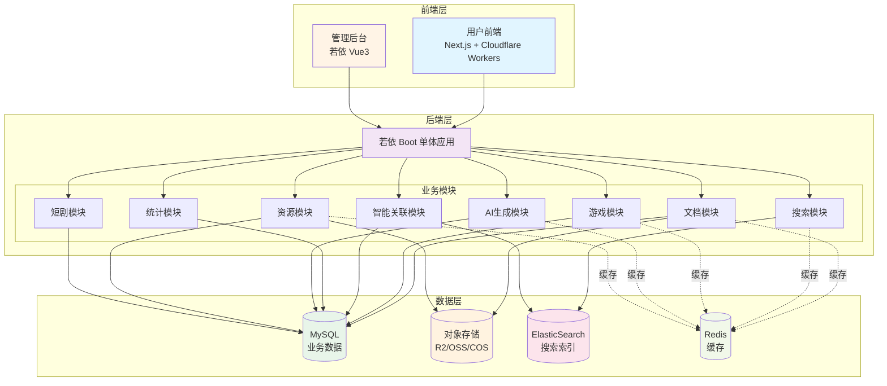

# 多产品内容管理系统 - 产品需求文档 (PRD)

> 版本：v2.3.0  
> 日期：2025-12-14  
> 状态：设计中

---

## 1. 项目概述

### 1.1 项目背景

本系统是一个多产品内容管理平台，支持游戏盒子推广和短剧推广两大业务线。游戏盒子业务面向玩家提供游戏资讯与下载服务，包含折扣游戏、BT版游戏、游戏攻略等内容；短剧业务支持多厂商短剧的推广管理。随着内容规模扩展至百万级，需要构建完整的后端管理系统来支撑内容运营、AI文章生成、多存储管理和数据分析等功能。

### 1.2 项目目标

| 目标 | 描述 |
|------|------|
| 内容管理 | 统一管理百万级 Markdown 文档 |
| 数据分析 | 实时监控内容数据指标 |
| 智能关联 | 自动关联文章与游戏盒子产品 |
| 全文搜索 | 支持百万级中文文档秒级搜索 |

### 1.3 系统架构

---

## 2. 用户角色

| 角色 | 描述 | 权限 |
|------|------|------|
| 游客 | 普通访问用户 | 浏览文章、搜索、下载 |
| 运营人员 | 内容运营 | 文章管理、数据查看 |
| 管理员 | 系统管理 | 全部权限 |
| 超级管理员 | 最高权限 | 系统配置、权限管理 |

---

## 3. 功能需求

### 3.1 用户前端 (game-box)

#### 3.1.1 首页
- [ ] 热门游戏推荐
- [ ] 最新文章列表
- [ ] 分类导航
- [ ] 搜索入口

#### 3.1.2 文章模块
- [ ] 文章详情页（SSR/ISR）
- [ ] 文章分类浏览
- [ ] 相关游戏推荐
- [ ] 文章搜索

#### 3.1.3 游戏盒子模块
- [ ] 游戏盒子列表
- [ ] 游戏盒子详情
- [ ] 关联文章展示
- [ ] 下载链接跳转

#### 3.1.4 搜索功能
- [ ] 全文搜索
- [ ] 分类筛选
- [ ] 搜索建议（自动补全）
- [ ] 搜索历史

---

### 3.2 管理后台 (RuoYi-Vue)

#### 3.2.1 仪表盘
- [ ] 内容统计概览
  - 文章总数、今日新增
  - 游戏盒子总数
  - 搜索热词 TOP 10
- [ ] 流量趋势图
- [ ] 热门文章排行
- [ ] 分类分布图

#### 3.2.2 文档管理
- [ ] 文档列表
  - 分页、筛选、排序
  - 批量操作
- [ ] 文档详情
  - Markdown 预览
  - 元数据编辑
- [ ] 文档同步
  - 从 R2 同步到 ES
  - 同步状态监控
- [ ] 文档分析
  - 阅读量统计
  - 关键词提取

#### 3.2.3 游戏盒子管理
- [ ] 盒子列表
  - 名称、图标、下载量
- [ ] 盒子详情
  - 基本信息编辑
  - 下载链接管理
- [ ] 游戏分类管理
- [ ] 折扣信息管理

#### 3.2.4 文章-游戏关联
- [ ] 自动关联规则配置
- [ ] 手动关联编辑
- [ ] 关联效果预览
- [ ] 批量关联操作

#### 3.2.5 搜索管理
- [ ] 搜索热词统计
- [ ] 搜索日志查看
- [ ] 同义词配置
- [ ] 停用词管理
- [ ] 索引重建

#### 3.2.6 AI文章生成
- [ ] 提示词模板管理
  - 模板列表/新增/编辑/删除
  - 模板类型（游戏介绍/攻略/评测/短剧介绍等）
  - 变量定义与默认值
  - 模板预览与测试
- [ ] 文章生成任务
  - 单篇生成/批量生成
  - AI平台选择（OpenAI/Claude/通义千问等）
  - 生成进度监控
  - 生成历史查看
- [ ] 文章重新生成
  - 更换模板重生成
  - 更换AI平台重生成
  - 生成版本对比

#### 3.2.7 文章资源管理
- [ ] 资源列表
  - 按文章筛选
  - 按类型筛选（图片/视频/音频）
  - 按存储位置筛选
- [ ] 资源上传
  - 单文件上传
  - 批量上传
  - 存储位置选择
- [ ] 资源迁移
  - 迁移规则配置
  - 批量迁移执行
  - 迁移进度监控
  - 迁移日志查看

#### 3.2.8 存储管理
- [ ] 存储配置管理
  - 多存储商支持（GitHub/MinIO/R2/OSS/COS）
  - 连接测试
  - 容量监控
- [ ] 迁移规则管理
  - URL替换规则
  - 存储迁移规则
  - 路径重写规则
  - 域名更换规则
- [ ] 迁移任务管理
  - 任务创建与执行
  - 试运行预览
  - 任务进度监控
  - 失败重试

#### 3.2.9 数据统计
- [ ] 内容统计报表
  - 按分类统计
  - 按时间统计
- [ ] 流量统计
  - PV/UV 趋势
  - 来源分析
- [ ] 搜索统计
  - 搜索量趋势
  - 无结果搜索词
- [ ] AI生成统计
  - 生成成功率
  - 各平台使用量
  - Token消耗统计
- [ ] 导出报表

---

### 3.3 后端服务 (RuoYi-Boot 单体架构)

> 采用若依 Boot 单体架构，所有业务模块集成在一个应用中，简化部署和运维。

#### 3.3.1 文档模块
- [ ] Markdown 解析
- [ ] R2 对象存储操作
- [ ] 文档元数据提取
- [ ] 文档同步任务

#### 3.3.2 搜索模块
- [ ] ES 索引管理
- [ ] 全文搜索 API
- [ ] 搜索建议 API
- [ ] 搜索统计

#### 3.3.3 游戏盒子模块
- [ ] 盒子 CRUD
- [ ] 分类管理
- [ ] 关联管理
- [ ] 推广链接管理

#### 3.3.4 短剧模块
- [ ] 短剧厂商管理
- [ ] 短剧 CRUD
- [ ] 分类管理

#### 3.3.5 智能关联模块
- [ ] 关键词提取
- [ ] 相似度计算
- [ ] 自动关联匹配
- [ ] 关联规则引擎

#### 3.3.6 AI生成模块
- [ ] 提示词模板管理
- [ ] 多AI平台适配
  - OpenAI API
  - Claude API
  - 通义千问 API
  - DeepSeek API
- [ ] 文章生成任务队列（Spring Scheduler）
- [ ] 生成记录管理

#### 3.3.7 资源模块
- [ ] 多存储适配器
  - GitHub 仓库
  - MinIO
  - Cloudflare R2
  - 阿里云 OSS
  - 腾讯云 COS
- [ ] 资源上传/下载
- [ ] 存储迁移引擎
- [ ] 迁移任务调度（Spring Scheduler）

#### 3.3.8 统计模块
- [ ] 数据采集
- [ ] 指标计算
- [ ] AI生成统计
- [ ] 报表生成

---

## 4. 非功能需求

### 4.1 性能要求

| 指标 | 要求 |
|------|------|
| 搜索响应时间 | < 200ms (P99) |
| 文章页加载 | < 1s (首屏) |
| 并发支持 | 1000 QPS |
| 数据规模 | 支持百万级文档 |

### 4.2 可用性要求

| 指标 | 要求 |
|------|------|
| 系统可用性 | 99.9% |
| 数据备份 | 每日备份 |
| 故障恢复 | < 30 分钟 |

### 4.3 安全要求

- [ ] 接口鉴权 (JWT)
- [ ] 敏感数据加密
- [ ] SQL 注入防护
- [ ] XSS 防护
- [ ] 操作日志审计

---

## 5. 数据统计指标

### 5.1 内容指标

| 指标名称 | 计算方式 | 展示周期 |
|---------|---------|---------|
| 文章总数 | COUNT(articles) | 实时 |
| 今日新增 | COUNT(created_at = today) | 日 |
| 分类分布 | GROUP BY category | 实时 |
| 平均阅读时长 | AVG(reading_time) | 周 |

### 5.2 流量指标

| 指标名称 | 计算方式 | 展示周期 |
|---------|---------|---------|
| 页面浏览量 (PV) | SUM(page_views) | 日/周/月 |
| 独立访客 (UV) | COUNT(DISTINCT user_id) | 日/周/月 |
| 热门文章 TOP N | ORDER BY views DESC | 日/周 |
| 跳出率 | single_page_sessions / total_sessions | 周 |

### 5.3 搜索指标

| 指标名称 | 计算方式 | 展示周期 |
|---------|---------|---------|
| 搜索总量 | COUNT(search_logs) | 日 |
| 热门搜索词 | GROUP BY keyword | 日/周 |
| 无结果率 | zero_results / total_searches | 周 |
| 平均搜索耗时 | AVG(search_duration) | 日 |

### 5.4 业务指标

| 指标名称 | 计算方式 | 展示周期 |
|---------|---------|---------|
| 下载转化率 | downloads / page_views | 周 |
| 游戏盒子点击率 | box_clicks / article_views | 周 |
| 关联匹配率 | matched_articles / total_articles | 月 |

---

## 6. 项目里程碑

| 阶段 | 内容 | 预计时间 |
|------|------|---------|
| P0 | 基础架构搭建、若依框架集成 | 2 周 |
| P1 | 文档管理、R2/ES 集成 | 3 周 |
| P2 | 搜索功能、数据统计 | 2 周 |
| P3 | 智能关联、游戏盒子管理 | 2 周 |
| P4 | 优化迭代、上线 | 2 周 |

---

## 7. 风险评估

| 风险 | 影响 | 应对措施 |
|------|------|---------|
| ES 性能瓶颈 | 搜索变慢 | 分片优化、缓存 |
| 数据同步延迟 | 内容不一致 | 消息队列、重试机制 |
| R2 访问超时 | 文章加载失败 | CDN 缓存、降级策略 |

---

## 附录

- [系统架构设计文档](./架构设计文档.md)
- [数据库设计文档](./数据库设计文档.md)
- [API 接口文档](./API接口文档.md)
