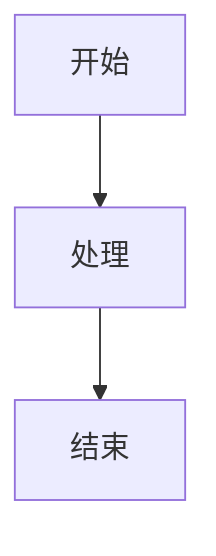
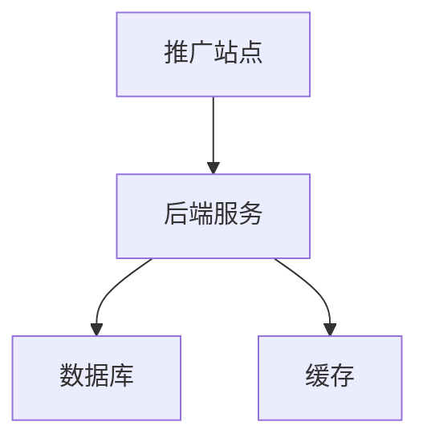
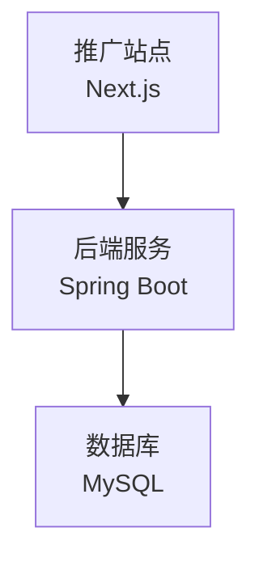
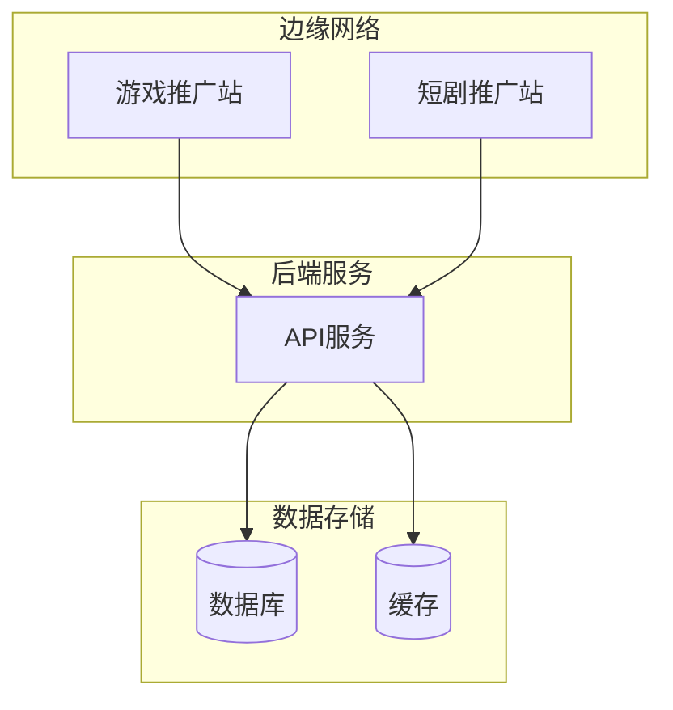
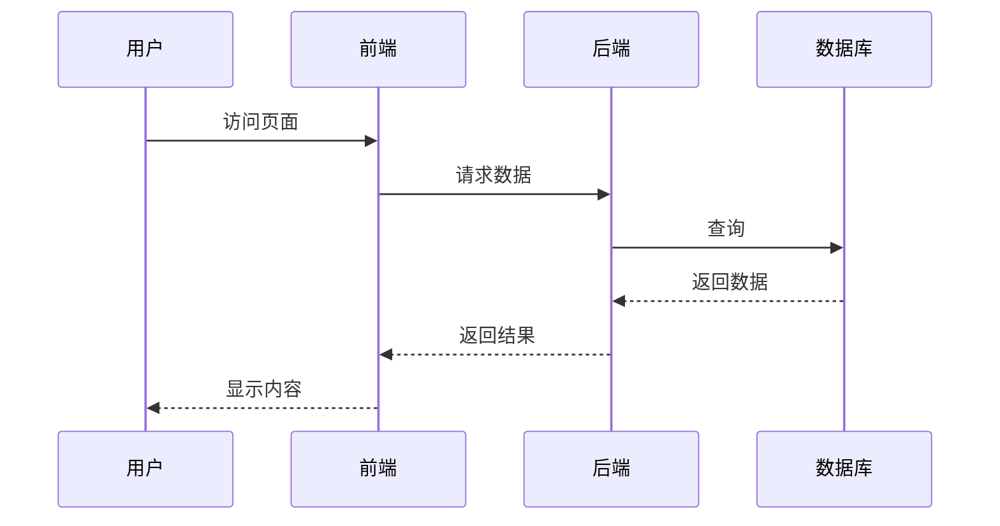
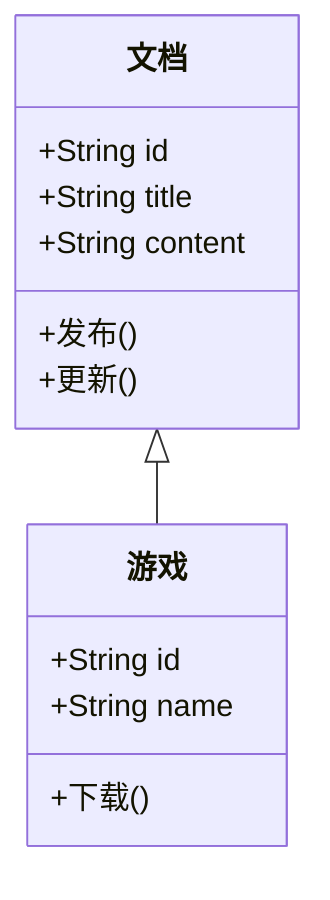

# Mermaid 图表测试

## 简单流程图

```mermaid
graph TD
    A[开始] --> B[处理]
    B --> C[结束]
```

## 包含中文的流程图

```mermaid
graph TB
    A[推广站点] --> B[后端服务]
    B --> C[数据库]
    B --> D[缓存]
```

## 包含 HTML 标签的流程图

```mermaid
graph TB
    A["推广站点<br/>Next.js"] --> B["后端服务<br/>Spring Boot"]
    B --> C["数据库<br/>MySQL"]
```

## 复杂的多层图表

```mermaid
graph TB
    subgraph "边缘网络"
        W1[游戏推广站]
        W2[短剧推广站]
    end
    
    subgraph "后端服务"
        Backend[API服务]
    end
    
    subgraph "数据存储"
        DB[(数据库)]
        Cache[(缓存)]
    end
    
    W1 --> Backend
    W2 --> Backend
    Backend --> DB
    Backend --> Cache
```

## 时序图

```mermaid
sequenceDiagram
    participant 用户
    participant 前端
    participant 后端
    participant 数据库
    
    用户->>前端: 访问页面
    前端->>后端: 请求数据
    后端->>数据库: 查询
    数据库-->>后端: 返回数据
    后端-->>前端: 返回结果
    前端-->>用户: 显示内容
```

## 类图

```mermaid
classDiagram
    class 文档 {
        +String id
        +String title
        +String content
        +发布()
        +更新()
    }
    
    class 游戏 {
        +String id
        +String name
        +下载()
    }
    
    文档 <|-- 游戏
```
