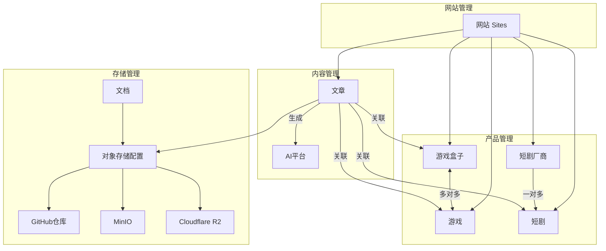
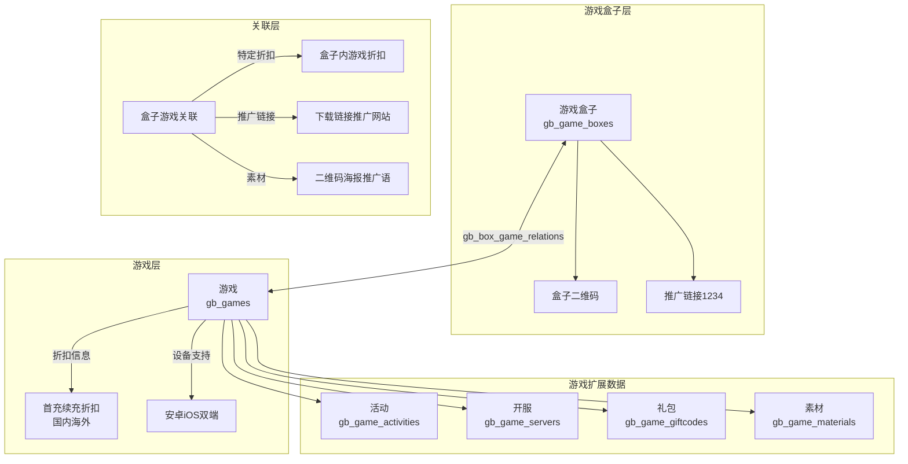
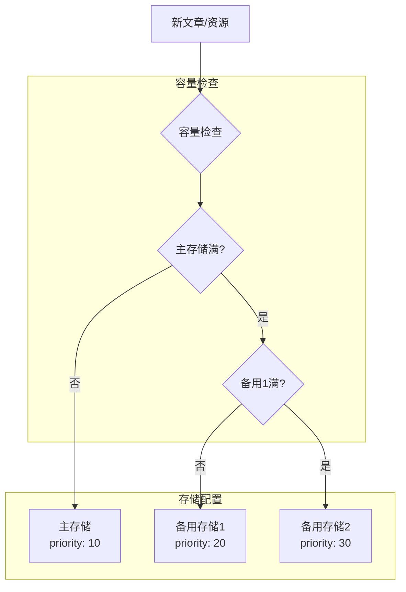
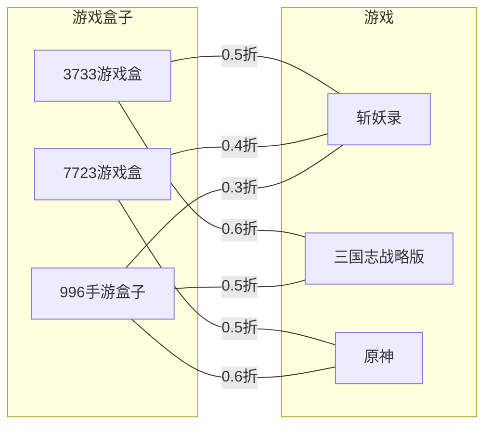
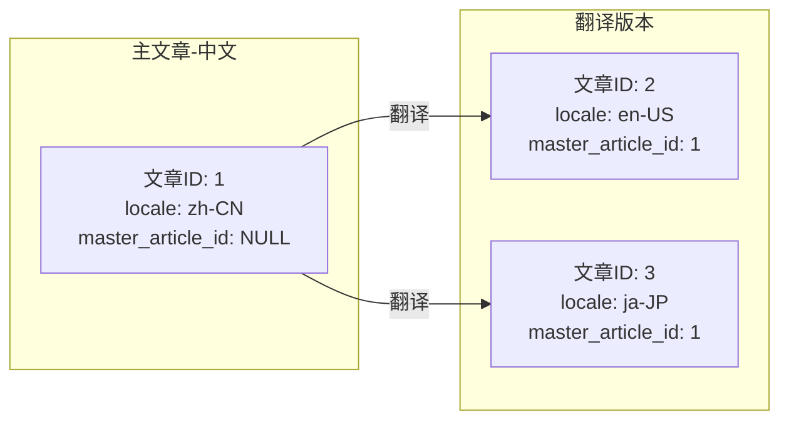
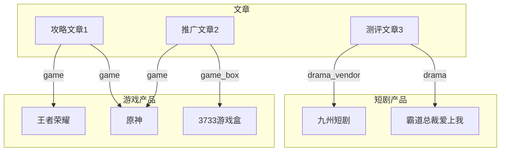
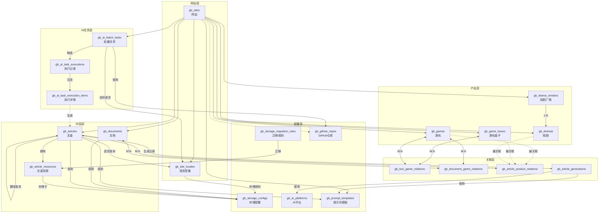

# 数据库设计文档

> 版本：v2.7.0  
> 日期：2025-12-14  
> 项目：多产品内容管理系统（游戏盒子 / 短剧推广）

---

## 1. 数据库概览

### 1.1 数据库规划

| 数据库 | 用途 | 字符集 |
|-------|------|--------|
| `ruoyi_system` | 若依系统库（用户、权限等） | utf8mb4 |
| `product_content` | 内容业务库（网站、产品、文章、存储） | utf8mb4 |
| `product_analytics` | 统计分析库（日志、报表） | utf8mb4 |

### 1.2 系统架构图



### 1.3 ER 总览图

```mermaid
erDiagram
    %% 网站核心
    gb_sites ||--o{ gb_game_boxes : "拥有"
    gb_sites ||--o{ gb_games : "拥有"
    gb_sites ||--o{ gb_articles : "拥有"
    gb_sites ||--o{ gb_drama_vendors : "拥有"
    gb_sites ||--o{ gb_dramas : "拥有"
    gb_sites ||--o{ gb_prompt_templates : "拥有"
    
    %% 游戏盒子-游戏多对多关系
    gb_game_boxes ||--o{ gb_box_game_relations : "包含游戏"
    gb_games ||--o{ gb_box_game_relations : "被盒子收录"
    
    %% 游戏相关扩展
    gb_games ||--o{ gb_game_activities : "活动"
    gb_games ||--o{ gb_game_servers : "开服"
    gb_games ||--o{ gb_game_giftcodes : "礼包"
    gb_games ||--o{ gb_game_materials : "素材"
    
    %% 文档相关
    gb_documents ||--o{ gb_document_game_relations : "关联游戏"
    gb_documents ||--o{ gb_document_tags : "标签"
    gb_documents }|--|| gb_categories : "所属分类"
    gb_documents }|--o| gb_storage_configs : "存储配置"
    
    %% 文章相关（AI生成）
    gb_articles ||--o{ gb_article_generations : "生成记录"
    gb_articles ||--o{ gb_article_product_relations : "关联产品"
    gb_articles ||--o{ gb_article_resources : "资源附件"
    gb_articles }|--o| gb_prompt_templates : "使用模板"
    gb_articles }|--o| gb_storage_configs : "资源存储配置"
    gb_article_generations }|--|| gb_ai_platforms : "使用平台"
    gb_article_generations }|--o| gb_prompt_templates : "使用模板"
    gb_article_resources }|--o| gb_storage_configs : "存储位置"
    
    %% 提示词模板
    gb_prompt_templates ||--o{ gb_articles : "生成文章"
    gb_prompt_templates ||--o{ gb_article_generations : "生成记录"
    
    %% 存储迁移相关
    gb_storage_migration_rules ||--o{ gb_storage_migration_logs : "执行日志"
    gb_article_resources ||--o{ gb_storage_migration_logs : "迁移记录"
    
    %% 短剧相关
    gb_drama_vendors ||--o{ gb_dramas : "拥有"
    gb_dramas ||--o{ gb_article_product_relations : "被文章关联"
    
    %% 游戏与文章关联
    gb_games ||--o{ gb_document_game_relations : "被文档关联"
    gb_games ||--o{ gb_article_product_relations : "被文章关联"
    gb_game_boxes ||--o{ gb_article_product_relations : "被文章关联"
    
    %% 统计相关
    gb_documents ||--o{ gb_page_views : "浏览记录"
    gb_articles ||--o{ gb_page_views : "浏览记录"
    
    %% 搜索相关
    gb_search_logs ||--o{ gb_search_clicks : "点击记录"
```



### 1.4 游戏推广数据结构图



### 1.5 产品类型说明

本系统支持多种产品类型的推广管理：

| 产品类型 | 类型标识 | 说明 |
|---------|---------|------|
| 游戏盒子 | `game_box` | 包含多个游戏的聚合平台 |
| 游戏 | `game` | 单个游戏产品 |
| 短剧厂商 | `drama_vendor` | 短剧发行/制作平台 |
| 短剧 | `drama` | 单个短剧作品 |
| 其他产品 | `other` | 预留扩展类型 |

---

## 2. 内容业务库表设计

### 2.1 网站表 (gb_sites)

管理多个推广网站，每个网站可独立管理其产品和内容。

```sql
CREATE TABLE `gb_sites` (
  `id` bigint NOT NULL AUTO_INCREMENT COMMENT '主键ID',
  `name` varchar(100) NOT NULL COMMENT '网站名称',
  `domain` varchar(255) NOT NULL COMMENT '网站域名',
  `site_type` varchar(20) NOT NULL DEFAULT 'game' COMMENT '网站类型：game-游戏推广 drama-短剧推广 mixed-混合',
  `logo_url` varchar(500) DEFAULT NULL COMMENT '网站Logo',
  `favicon_url` varchar(500) DEFAULT NULL COMMENT '网站Favicon',
  `description` text COMMENT '网站描述',
  `seo_title` varchar(255) DEFAULT NULL COMMENT 'SEO标题',
  `seo_keywords` varchar(500) DEFAULT NULL COMMENT 'SEO关键词',
  `seo_description` varchar(500) DEFAULT NULL COMMENT 'SEO描述',
  `config` json DEFAULT NULL COMMENT '网站配置（JSON）',
  `storage_config_id` bigint DEFAULT NULL COMMENT '默认存储配置ID',
  
  -- 多语言配置
  `default_locale` varchar(10) DEFAULT 'zh-CN' COMMENT '默认语言',
  `supported_locales` json DEFAULT NULL COMMENT '支持的语言列表（JSON数组）',
  `i18n_mode` varchar(20) DEFAULT 'subdirectory' COMMENT '多语言模式：subdirectory-子目录(/en/) subdomain-子域名(en.xxx.com) query-参数(?lang=en)',
  
  `status` tinyint DEFAULT 1 COMMENT '状态：0-禁用 1-启用',
  `created_at` datetime DEFAULT CURRENT_TIMESTAMP,
  `updated_at` datetime DEFAULT CURRENT_TIMESTAMP ON UPDATE CURRENT_TIMESTAMP,
  PRIMARY KEY (`id`),
  UNIQUE KEY `uk_domain` (`domain`),
  KEY `idx_site_type` (`site_type`),
  KEY `idx_status` (`status`)
) ENGINE=InnoDB DEFAULT CHARSET=utf8mb4 COLLATE=utf8mb4_unicode_ci COMMENT='网站表';
```

**多语言模式说明：**

| i18n_mode | 说明 | URL示例 |
|-----------|------|---------|
| subdirectory | 子目录模式 | `https://example.com/en/article/xxx` |
| subdomain | 子域名模式 | `https://en.example.com/article/xxx` |
| query | 参数模式 | `https://example.com/article/xxx?lang=en` |

### 2.2 网站语言配置表 (gb_site_locales)

管理网站支持的语言及其存储、发布规则配置。

```sql
CREATE TABLE `gb_site_locales` (
  `id` bigint NOT NULL AUTO_INCREMENT COMMENT '主键ID',
  `site_id` bigint NOT NULL COMMENT '网站ID',
  `locale` varchar(10) NOT NULL COMMENT '语言代码（如 zh-CN, en-US, ja-JP）',
  `locale_name` varchar(50) NOT NULL COMMENT '语言名称（如 简体中文, English）',
  `native_name` varchar(50) DEFAULT NULL COMMENT '语言本地名称（如 简体中文, English）',
  `is_default` tinyint DEFAULT 0 COMMENT '是否默认语言：0-否 1-是',
  `is_enabled` tinyint DEFAULT 1 COMMENT '是否启用：0-否 1-是',
  
  -- 存储规则配置
  `storage_config_id` bigint DEFAULT NULL COMMENT '该语言专用存储配置ID（NULL使用网站默认）',
  `storage_path_template` varchar(500) DEFAULT '{locale}/{category}/{slug}' COMMENT '存储路径模板',
  
  -- 发布链接规则
  `url_prefix` varchar(100) DEFAULT NULL COMMENT 'URL前缀（如 /en 或 en.）',
  `url_template` varchar(500) DEFAULT '/{locale}/{category}/{slug}' COMMENT '发布URL模板',
  `domain_override` varchar(255) DEFAULT NULL COMMENT '域名覆盖（用于子域名模式）',
  
  -- SEO配置
  `seo_title_template` varchar(255) DEFAULT NULL COMMENT 'SEO标题模板',
  `seo_description_template` varchar(500) DEFAULT NULL COMMENT 'SEO描述模板',
  
  -- AI生成配置
  `ai_prompt_suffix` text COMMENT 'AI生成时的语言提示词后缀',
  `translation_prompt` text COMMENT '翻译提示词模板',
  
  `sort_order` int DEFAULT 0 COMMENT '排序',
  `created_at` datetime DEFAULT CURRENT_TIMESTAMP,
  `updated_at` datetime DEFAULT CURRENT_TIMESTAMP ON UPDATE CURRENT_TIMESTAMP,
  PRIMARY KEY (`id`),
  UNIQUE KEY `uk_site_locale` (`site_id`, `locale`),
  KEY `idx_site_id` (`site_id`),
  KEY `idx_is_enabled` (`is_enabled`)
) ENGINE=InnoDB DEFAULT CHARSET=utf8mb4 COLLATE=utf8mb4_unicode_ci COMMENT='网站语言配置表';
```

**存储路径模板变量：**

| 变量 | 说明 | 示例 |
|------|------|------|
| `{locale}` | 语言代码 | `en-US` |
| `{locale_short}` | 短语言代码 | `en` |
| `{category}` | 分类标识 | `strategy` |
| `{slug}` | 文章标识 | `game-guide` |
| `{year}` | 年份 | `2025` |
| `{month}` | 月份 | `12` |

**配置示例：**

```json
{
  "site_id": 1,
  "locales": [
    {
      "locale": "zh-CN",
      "locale_name": "简体中文",
      "is_default": true,
      "storage_path_template": "zh-CN/{category}/{slug}",
      "url_template": "/{category}/{slug}"
    },
    {
      "locale": "en-US",
      "locale_name": "English",
      "is_default": false,
      "storage_path_template": "en-US/{category}/{slug}",
      "url_template": "/en/{category}/{slug}",
      "ai_prompt_suffix": "Please write the article in English."
    },
    {
      "locale": "ja-JP",
      "locale_name": "日本語",
      "is_default": false,
      "storage_path_template": "ja-JP/{category}/{slug}",
      "url_template": "/ja/{category}/{slug}",
      "ai_prompt_suffix": "記事を日本語で書いてください。"
    }
  ]
}
```

### 2.3 对象存储配置表 (gb_storage_configs)

支持多种对象存储方式：GitHub仓库、MinIO、Cloudflare R2等。支持站点级别的存储配置管理，可配置多个存储用于轮换或容量满后切换。

```sql
CREATE TABLE `gb_storage_configs` (
  `id` bigint NOT NULL AUTO_INCREMENT COMMENT '主键ID',
  `site_id` bigint DEFAULT NULL COMMENT '所属网站ID（NULL表示全局配置）',
  `name` varchar(100) NOT NULL COMMENT '配置名称',
  `code` varchar(50) NOT NULL COMMENT '配置代码（唯一标识，如 github-main, r2-backup）',
  `storage_type` varchar(20) NOT NULL COMMENT '存储类型：github/minio/r2/oss/cos/s3',
  `storage_purpose` varchar(20) DEFAULT 'mixed' COMMENT '存储用途：article-文章内容 resource-资源文件 mixed-混合',
  `is_default` tinyint DEFAULT 0 COMMENT '是否默认：0-否 1-是',
  `priority` int DEFAULT 100 COMMENT '优先级（数值越小优先级越高，用于存储轮换）',
  
  -- GitHub 仓库配置
  `github_owner` varchar(100) DEFAULT NULL COMMENT 'GitHub 用户名/组织名',
  `github_repo` varchar(100) DEFAULT NULL COMMENT 'GitHub 仓库名',
  `github_branch` varchar(50) DEFAULT 'main' COMMENT 'GitHub 分支',
  `github_token` varchar(255) DEFAULT NULL COMMENT 'GitHub Token（加密存储）',
  `github_path_prefix` varchar(255) DEFAULT '' COMMENT 'GitHub 路径前缀',
  
  -- MinIO 配置
  `minio_endpoint` varchar(255) DEFAULT NULL COMMENT 'MinIO 服务地址',
  `minio_port` int DEFAULT 9000 COMMENT 'MinIO 端口',
  `minio_use_ssl` tinyint DEFAULT 0 COMMENT '是否使用SSL',
  `minio_access_key` varchar(255) DEFAULT NULL COMMENT 'MinIO Access Key',
  `minio_secret_key` varchar(255) DEFAULT NULL COMMENT 'MinIO Secret Key（加密存储）',
  `minio_bucket` varchar(100) DEFAULT NULL COMMENT 'MinIO Bucket名称',
  `minio_region` varchar(50) DEFAULT NULL COMMENT 'MinIO Region',
  
  -- R2 / S3兼容配置
  `r2_account_id` varchar(100) DEFAULT NULL COMMENT 'R2 Account ID',
  `r2_access_key` varchar(255) DEFAULT NULL COMMENT 'R2 Access Key',
  `r2_secret_key` varchar(255) DEFAULT NULL COMMENT 'R2 Secret Key（加密存储）',
  `r2_bucket` varchar(100) DEFAULT NULL COMMENT 'R2 Bucket名称',
  `r2_public_url` varchar(500) DEFAULT NULL COMMENT 'R2 公开访问URL',
  
  -- 阿里云 OSS 配置
  `oss_endpoint` varchar(255) DEFAULT NULL COMMENT 'OSS Endpoint',
  `oss_access_key` varchar(255) DEFAULT NULL COMMENT 'OSS Access Key',
  `oss_secret_key` varchar(255) DEFAULT NULL COMMENT 'OSS Secret Key（加密存储）',
  `oss_bucket` varchar(100) DEFAULT NULL COMMENT 'OSS Bucket名称',
  `oss_region` varchar(50) DEFAULT NULL COMMENT 'OSS Region',
  
  -- 腾讯云 COS 配置
  `cos_secret_id` varchar(255) DEFAULT NULL COMMENT 'COS Secret ID',
  `cos_secret_key` varchar(255) DEFAULT NULL COMMENT 'COS Secret Key（加密存储）',
  `cos_bucket` varchar(100) DEFAULT NULL COMMENT 'COS Bucket名称',
  `cos_region` varchar(50) DEFAULT NULL COMMENT 'COS Region',
  
  -- 通用配置
  `cdn_url` varchar(500) DEFAULT NULL COMMENT 'CDN加速地址',
  `custom_domain` varchar(255) DEFAULT NULL COMMENT '自定义访问域名',
  `base_path` varchar(255) DEFAULT '' COMMENT '基础路径前缀',
  `max_file_size` bigint DEFAULT 10485760 COMMENT '最大文件大小（字节），默认10MB',
  `allowed_extensions` varchar(500) DEFAULT 'md,json,txt,jpg,png,gif,webp,mp4,webm' COMMENT '允许的文件扩展名',
  
  -- 容量管理
  `capacity_limit` bigint DEFAULT NULL COMMENT '容量上限（字节，NULL表示不限制）',
  `used_capacity` bigint DEFAULT 0 COMMENT '已使用容量（字节）',
  `file_count` int DEFAULT 0 COMMENT '文件数量',
  `file_count_limit` int DEFAULT NULL COMMENT '文件数量上限（NULL表示不限制）',
  `capacity_warning_threshold` decimal(5,2) DEFAULT 80.00 COMMENT '容量预警阈值（百分比）',
  `is_capacity_full` tinyint DEFAULT 0 COMMENT '容量是否已满：0-否 1-是',
  `capacity_full_at` datetime DEFAULT NULL COMMENT '容量满时间',
  
  -- 轮换配置
  `fallback_storage_id` bigint DEFAULT NULL COMMENT '备用存储配置ID（当前存储满后使用）',
  `auto_switch_on_full` tinyint DEFAULT 1 COMMENT '容量满时是否自动切换到备用存储：0-否 1-是',
  
  -- 健康检查
  `last_health_check` datetime DEFAULT NULL COMMENT '最后健康检查时间',
  `health_status` varchar(20) DEFAULT 'unknown' COMMENT '健康状态：unknown/healthy/degraded/unhealthy',
  `health_message` varchar(500) DEFAULT NULL COMMENT '健康状态信息',
  
  `description` text COMMENT '配置描述',
  `status` tinyint DEFAULT 1 COMMENT '状态：0-禁用 1-启用',
  `created_by` bigint DEFAULT NULL COMMENT '创建人',
  `created_at` datetime DEFAULT CURRENT_TIMESTAMP,
  `updated_at` datetime DEFAULT CURRENT_TIMESTAMP ON UPDATE CURRENT_TIMESTAMP,
  PRIMARY KEY (`id`),
  UNIQUE KEY `uk_code` (`code`),
  KEY `idx_site_id` (`site_id`),
  KEY `idx_storage_type` (`storage_type`),
  KEY `idx_storage_purpose` (`storage_purpose`),
  KEY `idx_is_default` (`is_default`),
  KEY `idx_priority` (`priority`),
  KEY `idx_is_capacity_full` (`is_capacity_full`),
  KEY `idx_health_status` (`health_status`),
  KEY `idx_status` (`status`)
) ENGINE=InnoDB DEFAULT CHARSET=utf8mb4 COLLATE=utf8mb4_unicode_ci COMMENT='对象存储配置表';
```

**存储配置示例：**

| 存储类型 | 访问地址示例 | 说明 |
|---------|-------------|------|
| GitHub | `https://raw.githubusercontent.com/{owner}/{repo}/{branch}/{path}` | 适合文档类静态内容 |
| MinIO | `http://{endpoint}:{port}/{bucket}/{path}` | 自建对象存储 |
| R2 | `https://{custom_domain}/{path}` | Cloudflare边缘存储 |
| OSS | `https://{bucket}.{region}.aliyuncs.com/{path}` | 阿里云对象存储 |
| COS | `https://{bucket}.cos.{region}.myqcloud.com/{path}` | 腾讯云对象存储 |

**存储轮换策略：**



**存储用途说明：**

| storage_purpose | 说明 | 典型场景 |
|-----------------|------|---------|
| article | 文章内容存储 | Markdown文件、HTML文件 |
| resource | 资源文件存储 | 图片、视频、音频 |
| mixed | 混合存储 | 同时存储文章和资源 |

### 2.3 文档表 (gb_documents)

存储 Markdown 文档的元数据信息，支持按发布日期分类。

```sql
CREATE TABLE `gb_documents` (
  `id` bigint NOT NULL AUTO_INCREMENT COMMENT '主键ID',
  `site_id` bigint DEFAULT NULL COMMENT '所属网站ID',
  `slug` varchar(255) NOT NULL COMMENT '文档路径标识（唯一）',
  `title` varchar(255) NOT NULL COMMENT '文档标题',
  `category_id` bigint DEFAULT NULL COMMENT '分类ID',
  `subcategory` varchar(100) DEFAULT NULL COMMENT '子分类',
  `keywords` varchar(500) DEFAULT NULL COMMENT '关键词，逗号分隔',
  `description` text COMMENT '文档描述/摘要',
  `content_preview` text COMMENT '内容预览（前500字）',
  
  -- 存储信息
  `storage_config_id` bigint DEFAULT NULL COMMENT '存储配置ID',
  `storage_key` varchar(500) NOT NULL COMMENT '存储键/路径',
  `storage_url` varchar(1000) DEFAULT NULL COMMENT '完整访问URL',
  
  -- 文档统计
  `file_size` int DEFAULT 0 COMMENT '文件大小（字节）',
  `reading_time` int DEFAULT 0 COMMENT '预估阅读时间（分钟）',
  `word_count` int DEFAULT 0 COMMENT '字数统计',
  `view_count` int DEFAULT 0 COMMENT '浏览次数',
  `like_count` int DEFAULT 0 COMMENT '点赞次数',
  
  -- 发布日期分类
  `publish_year` int DEFAULT NULL COMMENT '发布年份',
  `publish_month` int DEFAULT NULL COMMENT '发布月份',
  `publish_day` int DEFAULT NULL COMMENT '发布日期',
  
  `is_published` tinyint DEFAULT 1 COMMENT '是否发布：0-否 1-是',
  `is_indexed` tinyint DEFAULT 0 COMMENT '是否已索引到ES：0-否 1-是',
  `published_at` datetime DEFAULT NULL COMMENT '发布时间',
  `created_at` datetime DEFAULT CURRENT_TIMESTAMP COMMENT '创建时间',
  `updated_at` datetime DEFAULT CURRENT_TIMESTAMP ON UPDATE CURRENT_TIMESTAMP COMMENT '更新时间',
  `deleted_at` datetime DEFAULT NULL COMMENT '删除时间（软删除）',
  PRIMARY KEY (`id`),
  UNIQUE KEY `uk_slug` (`slug`),
  KEY `idx_site_id` (`site_id`),
  KEY `idx_category` (`category_id`),
  KEY `idx_storage_config` (`storage_config_id`),
  KEY `idx_published_at` (`published_at`),
  KEY `idx_publish_date` (`publish_year`, `publish_month`, `publish_day`),
  KEY `idx_is_published` (`is_published`),
  KEY `idx_created_at` (`created_at`)
) ENGINE=InnoDB DEFAULT CHARSET=utf8mb4 COLLATE=utf8mb4_unicode_ci COMMENT='文档表';
```

### 2.4 分类表 (gb_categories)

```sql
CREATE TABLE `gb_categories` (
  `id` bigint NOT NULL AUTO_INCREMENT COMMENT '主键ID',
  `site_id` bigint DEFAULT NULL COMMENT '所属网站ID',
  `parent_id` bigint DEFAULT 0 COMMENT '父分类ID，0为顶级',
  `category_type` varchar(20) DEFAULT 'game' COMMENT '分类类型：game-游戏 drama-短剧 article-文章',
  `name` varchar(50) NOT NULL COMMENT '分类名称',
  `slug` varchar(50) NOT NULL COMMENT '分类标识',
  `icon` varchar(100) DEFAULT NULL COMMENT '分类图标',
  `description` varchar(255) DEFAULT NULL COMMENT '分类描述',
  `sort_order` int DEFAULT 0 COMMENT '排序序号',
  `document_count` int DEFAULT 0 COMMENT '文档数量',
  `status` tinyint DEFAULT 1 COMMENT '状态：0-禁用 1-启用',
  `created_at` datetime DEFAULT CURRENT_TIMESTAMP,
  `updated_at` datetime DEFAULT CURRENT_TIMESTAMP ON UPDATE CURRENT_TIMESTAMP,
  PRIMARY KEY (`id`),
  UNIQUE KEY `uk_site_slug` (`site_id`, `slug`),
  KEY `idx_parent_id` (`parent_id`),
  KEY `idx_category_type` (`category_type`)
) ENGINE=InnoDB DEFAULT CHARSET=utf8mb4 COLLATE=utf8mb4_unicode_ci COMMENT='分类表';
```

### 2.5 游戏表 (gb_games)

存储游戏详细信息，包括折扣、设备支持、上架时间等。

```sql
CREATE TABLE `gb_games` (
  `id` bigint NOT NULL AUTO_INCREMENT COMMENT '主键ID',
  `site_id` bigint DEFAULT NULL COMMENT '所属网站ID',
  `name` varchar(100) NOT NULL COMMENT '游戏名称',
  `subtitle` varchar(200) DEFAULT NULL COMMENT '游戏副标题/版本说明（如：0.1折都市打金）',
  `short_name` varchar(50) DEFAULT NULL COMMENT '游戏简称',
  `category` varchar(50) DEFAULT NULL COMMENT '游戏分类（仙侠、传奇等）',
  `game_type` varchar(20) DEFAULT 'official' COMMENT '游戏类型：official-官方 discount-折扣 bt-BT版 coming-即将上线',
  `icon_url` varchar(500) DEFAULT NULL COMMENT '游戏图标URL',
  `cover_url` varchar(500) DEFAULT NULL COMMENT '游戏封面URL',
  `screenshots` json DEFAULT NULL COMMENT '游戏截图（JSON数组）',
  `video_url` varchar(500) DEFAULT NULL COMMENT '游戏视频URL',
  `description` text COMMENT '游戏描述',
  `promotion_desc` text COMMENT '推广说明',
  `developer` varchar(100) DEFAULT NULL COMMENT '开发商',
  `publisher` varchar(100) DEFAULT NULL COMMENT '发行商',
  `package_name` varchar(200) DEFAULT NULL COMMENT '包名',
  `version` varchar(50) DEFAULT NULL COMMENT '版本号',
  `size` varchar(50) DEFAULT NULL COMMENT '安装包大小',
  
  -- 下载相关
  `download_url` varchar(500) DEFAULT NULL COMMENT '通用下载链接',
  `android_url` varchar(500) DEFAULT NULL COMMENT '安卓下载链接',
  `ios_url` varchar(500) DEFAULT NULL COMMENT 'iOS下载链接',
  `apk_url` varchar(500) DEFAULT NULL COMMENT 'APK直接下载',
  
  -- 设备支持
  `device_support` varchar(20) DEFAULT 'both' COMMENT '设备支持：android-安卓 ios-iOS both-双端',
  
  -- 折扣信息
  `discount_label` varchar(20) DEFAULT NULL COMMENT '折扣标签（0.1折、BT等）',
  `first_charge_domestic` decimal(4,2) DEFAULT NULL COMMENT '首充折扣-国内',
  `first_charge_overseas` decimal(4,2) DEFAULT NULL COMMENT '首充折扣-海外',
  `recharge_domestic` decimal(4,2) DEFAULT NULL COMMENT '续充折扣-国内',
  `recharge_overseas` decimal(4,2) DEFAULT NULL COMMENT '续充折扣-海外',
  
  -- 扶持与福利
  `has_support` tinyint DEFAULT 0 COMMENT '是否有扶持：0-无 1-有',
  `support_desc` text COMMENT '扶持说明',
  `has_low_deduct_coupon` tinyint DEFAULT 0 COMMENT '是否有低扣券领取：0-无 1-有',
  `low_deduct_coupon_url` varchar(500) DEFAULT NULL COMMENT '低扣券领取链接',
  
  -- 统计
  `download_count` int DEFAULT 0 COMMENT '下载次数',
  `rating` decimal(2,1) DEFAULT 0.0 COMMENT '评分（0-5）',
  `features` json DEFAULT NULL COMMENT '游戏特性（JSON数组）',
  `tags` varchar(255) DEFAULT NULL COMMENT '标签，逗号分隔',
  
  -- 上架信息
  `launch_time` datetime DEFAULT NULL COMMENT '上架/开服时间',
  `is_new` tinyint DEFAULT 0 COMMENT '是否新游：0-否 1-是',
  `is_hot` tinyint DEFAULT 0 COMMENT '是否热门：0-否 1-是',
  `is_recommend` tinyint DEFAULT 0 COMMENT '是否推荐：0-否 1-是',
  `sort_order` int DEFAULT 0 COMMENT '排序',
  `status` tinyint DEFAULT 1 COMMENT '状态：0-下架 1-上架',
  `created_at` datetime DEFAULT CURRENT_TIMESTAMP,
  `updated_at` datetime DEFAULT CURRENT_TIMESTAMP ON UPDATE CURRENT_TIMESTAMP,
  PRIMARY KEY (`id`),
  KEY `idx_site_id` (`site_id`),
  KEY `idx_name` (`name`),
  KEY `idx_category` (`category`),
  KEY `idx_game_type` (`game_type`),
  KEY `idx_device_support` (`device_support`),
  KEY `idx_launch_time` (`launch_time`),
  KEY `idx_status` (`status`)
) ENGINE=InnoDB DEFAULT CHARSET=utf8mb4 COLLATE=utf8mb4_unicode_ci COMMENT='游戏表';
```

**游戏类型与折扣说明：**

| game_type | 说明 | 典型折扣 |
|-----------|------|---------|
| official | 官方正版游戏 | 无折扣或少量折扣 |
| discount | 折扣游戏 | 0.1折、1折等 |
| bt | BT版/变态版 | 高福利、高返利 |
| coming | 即将上线 | 预约中 |

**设备支持说明：**

| device_support | 说明 | 图标 |
|----------------|------|------|
| android | 仅安卓 | 📱 |
| ios | 仅iOS | 🍎 |
| both | 双端互通 | 📱🍎 |

### 2.6 游戏盒子表 (gb_game_boxes)

存储游戏盒子信息，包括多个推广链接、二维码等。

```sql
CREATE TABLE `gb_game_boxes` (
  `id` bigint NOT NULL AUTO_INCREMENT COMMENT '主键ID',
  `site_id` bigint DEFAULT NULL COMMENT '所属网站ID',
  `name` varchar(100) NOT NULL COMMENT '盒子名称',
  `logo_url` varchar(500) DEFAULT NULL COMMENT '盒子Logo',
  `banner_url` varchar(500) DEFAULT NULL COMMENT '盒子Banner图',
  `qrcode_url` varchar(500) DEFAULT NULL COMMENT '盒子二维码图片URL',
  `description` text COMMENT '盒子描述',
  
  -- 官方链接
  `official_url` varchar(500) DEFAULT NULL COMMENT '官网地址',
  `download_url` varchar(500) DEFAULT NULL COMMENT '通用下载地址',
  `android_url` varchar(500) DEFAULT NULL COMMENT '安卓下载',
  `ios_url` varchar(500) DEFAULT NULL COMMENT 'iOS下载',
  
  -- 推广链接（支持多个）
  `promote_url_1` varchar(500) DEFAULT NULL COMMENT '推广链接①',
  `promote_url_2` varchar(500) DEFAULT NULL COMMENT '推广链接②',
  `promote_url_3` varchar(500) DEFAULT NULL COMMENT '推广链接③',
  `register_download_url` varchar(500) DEFAULT NULL COMMENT '先注册再下载链接④',
  
  -- 折扣信息
  `discount_rate` decimal(3,2) DEFAULT 1.00 COMMENT '折扣率（0.1-1.0）',
  `features` json DEFAULT NULL COMMENT '特色功能（JSON数组）',
  `game_count` int DEFAULT 0 COMMENT '收录游戏数',
  `sort_order` int DEFAULT 0 COMMENT '排序',
  `status` tinyint DEFAULT 1 COMMENT '状态：0-下架 1-上架',
  `created_at` datetime DEFAULT CURRENT_TIMESTAMP,
  `updated_at` datetime DEFAULT CURRENT_TIMESTAMP ON UPDATE CURRENT_TIMESTAMP,
  PRIMARY KEY (`id`),
  KEY `idx_site_id` (`site_id`),
  KEY `idx_name` (`name`),
  KEY `idx_status` (`status`)
) ENGINE=InnoDB DEFAULT CHARSET=utf8mb4 COLLATE=utf8mb4_unicode_ci COMMENT='游戏盒子表';
```

**推广链接说明（来自截图示例）：**

| 链接类型 | 示例格式 | 用途 |
|---------|---------|------|
| 推广链接① | `https://www.u2game99.com/app/1037.html` | 标准推广页 |
| 推广链接② | `https://www.u2game99.com/a/1037.html` | 备用推广页 |
| 推广链接③ | `https://www.u2game99.com/b/1037.html` | 备用推广页 |
| 先注册再下载④ | `https://qdzs.u2game99.com/welcome/page/ag/1037.html` | 引导注册页 |

### 2.7 游戏盒子-游戏关联表 (gb_box_game_relations)

游戏盒子与游戏的多对多关系表，包含每个盒子中游戏的特定推广信息。

```sql
CREATE TABLE `gb_box_game_relations` (
  `id` bigint NOT NULL AUTO_INCREMENT COMMENT '主键ID',
  `box_id` bigint NOT NULL COMMENT '游戏盒子ID',
  `game_id` bigint NOT NULL COMMENT '游戏ID',
  
  -- 游戏在该盒子中的折扣信息
  `discount_label` varchar(20) DEFAULT NULL COMMENT '折扣标签（0.1折、BT等）',
  `first_charge_domestic` decimal(4,2) DEFAULT NULL COMMENT '首充折扣-国内',
  `first_charge_overseas` decimal(4,2) DEFAULT NULL COMMENT '首充折扣-海外',
  `recharge_domestic` decimal(4,2) DEFAULT NULL COMMENT '续充折扣-国内',
  `recharge_overseas` decimal(4,2) DEFAULT NULL COMMENT '续充折扣-海外',
  
  -- 扶持信息
  `has_support` tinyint DEFAULT 0 COMMENT '是否有扶持：0-无 1-有',
  `support_desc` text COMMENT '扶持说明',
  
  -- 推广链接
  `download_url` varchar(500) DEFAULT NULL COMMENT '游戏下载链接（带追踪参数）',
  `promote_url` varchar(500) DEFAULT NULL COMMENT '游戏推广网站链接',
  `qrcode_url` varchar(500) DEFAULT NULL COMMENT '游戏二维码URL',
  `promote_text` text COMMENT '推广语',
  `poster_url` varchar(500) DEFAULT NULL COMMENT '宣传卡片/海报URL',
  
  `is_featured` tinyint DEFAULT 0 COMMENT '是否推荐：0-否 1-是',
  `is_exclusive` tinyint DEFAULT 0 COMMENT '是否独占：0-否 1-是',
  `is_new` tinyint DEFAULT 0 COMMENT '是否新游：0-否 1-是',
  `sort_order` int DEFAULT 0 COMMENT '排序',
  `added_at` datetime DEFAULT CURRENT_TIMESTAMP COMMENT '添加时间',
  `created_at` datetime DEFAULT CURRENT_TIMESTAMP,
  PRIMARY KEY (`id`),
  UNIQUE KEY `uk_box_game` (`box_id`, `game_id`),
  KEY `idx_box_id` (`box_id`),
  KEY `idx_game_id` (`game_id`),
  KEY `idx_is_featured` (`is_featured`),
  KEY `idx_is_new` (`is_new`)
) ENGINE=InnoDB DEFAULT CHARSET=utf8mb4 COLLATE=utf8mb4_unicode_ci COMMENT='游戏盒子-游戏关联表';
```

**推广链接示例（来自截图）：**

| 链接类型 | 示例格式 | 说明 |
|---------|---------|------|
| 下载链接 | `https://qd.u2game99.com/down.html?ag=GMS123&gid=1693` | 带推广员ID和游戏ID |
| 推广网站 | `https://www.u2game99.com/wg/1037/1693.html` | 盒子ID/游戏ID |

**关联关系说明：**



### 2.8 游戏活动表 (gb_game_activities)

存储游戏的活动信息。

```sql
CREATE TABLE `gb_game_activities` (
  `id` bigint NOT NULL AUTO_INCREMENT COMMENT '主键ID',
  `game_id` bigint NOT NULL COMMENT '游戏ID',
  `box_id` bigint DEFAULT NULL COMMENT '游戏盒子ID（可选，盒子特有活动）',
  `name` varchar(100) NOT NULL COMMENT '活动名称',
  `activity_type` varchar(20) DEFAULT 'activity' COMMENT '类型：activity-活动 server-开服 other-其他',
  `description` text COMMENT '活动描述',
  `banner_url` varchar(500) DEFAULT NULL COMMENT '活动Banner',
  `start_time` datetime NOT NULL COMMENT '开始时间',
  `end_time` datetime NOT NULL COMMENT '结束时间',
  `is_permanent` tinyint DEFAULT 0 COMMENT '是否永久：0-否 1-是',
  `sort_order` int DEFAULT 0 COMMENT '排序',
  `status` tinyint DEFAULT 1 COMMENT '状态：0-禁用 1-启用',
  `created_at` datetime DEFAULT CURRENT_TIMESTAMP,
  `updated_at` datetime DEFAULT CURRENT_TIMESTAMP ON UPDATE CURRENT_TIMESTAMP,
  PRIMARY KEY (`id`),
  KEY `idx_game_id` (`game_id`),
  KEY `idx_box_id` (`box_id`),
  KEY `idx_activity_type` (`activity_type`),
  KEY `idx_time_range` (`start_time`, `end_time`)
) ENGINE=InnoDB DEFAULT CHARSET=utf8mb4 COLLATE=utf8mb4_unicode_ci COMMENT='游戏活动表';
```

### 2.9 游戏开服表 (gb_game_servers)

存储游戏开服信息。

```sql
CREATE TABLE `gb_game_servers` (
  `id` bigint NOT NULL AUTO_INCREMENT COMMENT '主键ID',
  `game_id` bigint NOT NULL COMMENT '游戏ID',
  `box_id` bigint DEFAULT NULL COMMENT '游戏盒子ID',
  `server_name` varchar(100) NOT NULL COMMENT '服务器名称',
  `server_no` varchar(50) DEFAULT NULL COMMENT '服务器编号',
  `open_time` datetime NOT NULL COMMENT '开服时间',
  `server_type` varchar(20) DEFAULT 'new' COMMENT '类型：new-新服 merge-合服 test-测试服',
  `description` text COMMENT '开服说明',
  `is_recommend` tinyint DEFAULT 0 COMMENT '是否推荐：0-否 1-是',
  `status` tinyint DEFAULT 1 COMMENT '状态：0-已关闭 1-正常 2-火爆',
  `created_at` datetime DEFAULT CURRENT_TIMESTAMP,
  PRIMARY KEY (`id`),
  KEY `idx_game_id` (`game_id`),
  KEY `idx_box_id` (`box_id`),
  KEY `idx_open_time` (`open_time`),
  KEY `idx_server_type` (`server_type`)
) ENGINE=InnoDB DEFAULT CHARSET=utf8mb4 COLLATE=utf8mb4_unicode_ci COMMENT='游戏开服表';
```

### 2.10 游戏礼包表 (gb_game_giftcodes)

存储游戏礼包信息，支持多种礼包类型。

```sql
CREATE TABLE `gb_game_giftcodes` (
  `id` bigint NOT NULL AUTO_INCREMENT COMMENT '主键ID',
  `game_id` bigint NOT NULL COMMENT '游戏ID',
  `box_id` bigint DEFAULT NULL COMMENT '游戏盒子ID',
  `name` varchar(100) NOT NULL COMMENT '礼包名称（新手礼包、预约礼包等）',
  `gift_type` varchar(20) DEFAULT 'newbie' COMMENT '礼包类型：newbie-新手卡 reserve-预约 community-社区 welfare-福利',
  `content` text COMMENT '礼包内容说明',
  `items` json DEFAULT NULL COMMENT '礼包物品（JSON数组）',
  `code` varchar(100) DEFAULT NULL COMMENT '礼包码（通用码）',
  `total_count` int DEFAULT 9999 COMMENT '总数量',
  `remain_count` int DEFAULT 9999 COMMENT '剩余数量',
  `limit_per_user` int DEFAULT 1 COMMENT '每人限领',
  `start_time` datetime DEFAULT NULL COMMENT '开始时间',
  `end_time` datetime DEFAULT NULL COMMENT '结束时间',
  `is_exclusive` tinyint DEFAULT 0 COMMENT '是否独占（仅该盒子可领）：0-否 1-是',
  `sort_order` int DEFAULT 0 COMMENT '排序',
  `status` tinyint DEFAULT 1 COMMENT '状态：0-禁用 1-启用',
  `created_at` datetime DEFAULT CURRENT_TIMESTAMP,
  `updated_at` datetime DEFAULT CURRENT_TIMESTAMP ON UPDATE CURRENT_TIMESTAMP,
  PRIMARY KEY (`id`),
  KEY `idx_game_id` (`game_id`),
  KEY `idx_box_id` (`box_id`),
  KEY `idx_gift_type` (`gift_type`),
  KEY `idx_time_range` (`start_time`, `end_time`)
) ENGINE=InnoDB DEFAULT CHARSET=utf8mb4 COLLATE=utf8mb4_unicode_ci COMMENT='游戏礼包表';
```

**礼包类型说明（来自截图）：**

| gift_type | 名称 | 典型内容 |
|-----------|------|---------|
| newbie | 新手礼包 | 绑金*5000000, 寻宝钥匙*50, 翅膀进阶丹*10 |
| reserve | 预约礼包 | 绑金*5000000, 寻宝钥匙*60, 觉醒进阶丹*10 |
| community | 社区礼包 | 绑金*5000000, 寻宝钥匙*60, 背饰碎片*3000 |
| welfare | 福利礼包 | 绑金*5000000, 寻宝钥匙*60, 护盾碎片*3000 |

### 2.11 游戏素材表 (gb_game_materials)

存储游戏推广素材（图片、视频等）。

```sql
CREATE TABLE `gb_game_materials` (
  `id` bigint NOT NULL AUTO_INCREMENT COMMENT '主键ID',
  `game_id` bigint NOT NULL COMMENT '游戏ID',
  `box_id` bigint DEFAULT NULL COMMENT '游戏盒子ID',
  `material_type` varchar(20) NOT NULL COMMENT '素材类型：icon-图标 cover-封面 screenshot-截图 video-视频 poster-海报 qrcode-二维码',
  `name` varchar(100) DEFAULT NULL COMMENT '素材名称',
  `url` varchar(500) NOT NULL COMMENT '素材URL',
  `thumbnail_url` varchar(500) DEFAULT NULL COMMENT '缩略图URL',
  `file_size` int DEFAULT 0 COMMENT '文件大小（字节）',
  `width` int DEFAULT 0 COMMENT '宽度（像素）',
  `height` int DEFAULT 0 COMMENT '高度（像素）',
  `duration` int DEFAULT 0 COMMENT '时长（秒，视频用）',
  `sort_order` int DEFAULT 0 COMMENT '排序',
  `status` tinyint DEFAULT 1 COMMENT '状态：0-禁用 1-启用',
  `created_at` datetime DEFAULT CURRENT_TIMESTAMP,
  PRIMARY KEY (`id`),
  KEY `idx_game_id` (`game_id`),
  KEY `idx_box_id` (`box_id`),
  KEY `idx_material_type` (`material_type`)
) ENGINE=InnoDB DEFAULT CHARSET=utf8mb4 COLLATE=utf8mb4_unicode_ci COMMENT='游戏素材表';
```

### 2.12 文档-游戏关联表 (gb_document_game_relations)

```sql
CREATE TABLE `gb_document_game_relations` (
  `id` bigint NOT NULL AUTO_INCREMENT COMMENT '主键ID',
  `document_id` bigint NOT NULL COMMENT '文档ID',
  `game_id` bigint NOT NULL COMMENT '游戏ID',
  `box_id` bigint DEFAULT NULL COMMENT '关联的游戏盒子ID（可选）',
  `relation_type` varchar(20) DEFAULT 'auto' COMMENT '关联类型：auto-自动 manual-手动',
  `relevance_score` decimal(5,4) DEFAULT 0.0000 COMMENT '相关度评分（0-1）',
  `is_primary` tinyint DEFAULT 0 COMMENT '是否主关联：0-否 1-是',
  `created_by` bigint DEFAULT NULL COMMENT '创建人',
  `created_at` datetime DEFAULT CURRENT_TIMESTAMP,
  PRIMARY KEY (`id`),
  UNIQUE KEY `uk_document_game` (`document_id`, `game_id`),
  KEY `idx_document_id` (`document_id`),
  KEY `idx_game_id` (`game_id`),
  KEY `idx_box_id` (`box_id`),
  KEY `idx_relevance` (`relevance_score` DESC)
) ENGINE=InnoDB DEFAULT CHARSET=utf8mb4 COLLATE=utf8mb4_unicode_ci COMMENT='文档-游戏关联表';
```

### 2.13 标签表 (gb_tags)

```sql
CREATE TABLE `gb_tags` (
  `id` bigint NOT NULL AUTO_INCREMENT COMMENT '主键ID',
  `site_id` bigint DEFAULT NULL COMMENT '所属网站ID',
  `tag_type` varchar(20) DEFAULT 'general' COMMENT '标签类型：general-通用 game-游戏 drama-短剧',
  `name` varchar(50) NOT NULL COMMENT '标签名称',
  `slug` varchar(50) NOT NULL COMMENT '标签标识',
  `color` varchar(20) DEFAULT NULL COMMENT '标签颜色',
  `use_count` int DEFAULT 0 COMMENT '使用次数',
  `created_at` datetime DEFAULT CURRENT_TIMESTAMP,
  PRIMARY KEY (`id`),
  UNIQUE KEY `uk_site_name` (`site_id`, `name`),
  KEY `idx_tag_type` (`tag_type`)
) ENGINE=InnoDB DEFAULT CHARSET=utf8mb4 COLLATE=utf8mb4_unicode_ci COMMENT='标签表';
```

### 2.14 文档-标签关联表 (gb_document_tags)

```sql
CREATE TABLE `gb_document_tags` (
  `document_id` bigint NOT NULL COMMENT '文档ID',
  `tag_id` bigint NOT NULL COMMENT '标签ID',
  `created_at` datetime DEFAULT CURRENT_TIMESTAMP,
  PRIMARY KEY (`document_id`, `tag_id`),
  KEY `idx_tag_id` (`tag_id`)
) ENGINE=InnoDB DEFAULT CHARSET=utf8mb4 COLLATE=utf8mb4_unicode_ci COMMENT='文档-标签关联表';
```

---

## 3. 短剧管理表设计

### 3.1 短剧厂商表 (gb_drama_vendors)

```sql
CREATE TABLE `gb_drama_vendors` (
  `id` bigint NOT NULL AUTO_INCREMENT COMMENT '主键ID',
  `site_id` bigint DEFAULT NULL COMMENT '所属网站ID',
  `name` varchar(100) NOT NULL COMMENT '厂商名称',
  `short_name` varchar(50) DEFAULT NULL COMMENT '厂商简称',
  `logo_url` varchar(500) DEFAULT NULL COMMENT '厂商Logo',
  `banner_url` varchar(500) DEFAULT NULL COMMENT '厂商Banner图',
  `description` text COMMENT '厂商描述',
  `official_url` varchar(500) DEFAULT NULL COMMENT '官网地址',
  `app_download_url` varchar(500) DEFAULT NULL COMMENT 'APP下载地址',
  `android_url` varchar(500) DEFAULT NULL COMMENT '安卓下载',
  `ios_url` varchar(500) DEFAULT NULL COMMENT 'iOS下载',
  `wechat_mini_appid` varchar(100) DEFAULT NULL COMMENT '微信小程序AppID',
  `contact_info` json DEFAULT NULL COMMENT '联系方式（JSON）',
  `cooperation_type` varchar(50) DEFAULT NULL COMMENT '合作类型：cps/cpa/cpm',
  `commission_rate` decimal(5,4) DEFAULT 0.0000 COMMENT '佣金比例',
  `features` json DEFAULT NULL COMMENT '特色功能（JSON数组）',
  `drama_count` int DEFAULT 0 COMMENT '收录短剧数',
  `sort_order` int DEFAULT 0 COMMENT '排序',
  `status` tinyint DEFAULT 1 COMMENT '状态：0-下架 1-上架',
  `created_at` datetime DEFAULT CURRENT_TIMESTAMP,
  `updated_at` datetime DEFAULT CURRENT_TIMESTAMP ON UPDATE CURRENT_TIMESTAMP,
  PRIMARY KEY (`id`),
  KEY `idx_site_id` (`site_id`),
  KEY `idx_name` (`name`),
  KEY `idx_cooperation_type` (`cooperation_type`),
  KEY `idx_status` (`status`)
) ENGINE=InnoDB DEFAULT CHARSET=utf8mb4 COLLATE=utf8mb4_unicode_ci COMMENT='短剧厂商表';
```

### 3.2 短剧表 (gb_dramas)

```sql
CREATE TABLE `gb_dramas` (
  `id` bigint NOT NULL AUTO_INCREMENT COMMENT '主键ID',
  `site_id` bigint DEFAULT NULL COMMENT '所属网站ID',
  `vendor_id` bigint DEFAULT NULL COMMENT '所属厂商ID',
  `name` varchar(200) NOT NULL COMMENT '短剧名称',
  `alias_name` varchar(200) DEFAULT NULL COMMENT '别名',
  `cover_url` varchar(500) DEFAULT NULL COMMENT '封面图URL',
  `poster_url` varchar(500) DEFAULT NULL COMMENT '海报图URL',
  `screenshots` json DEFAULT NULL COMMENT '剧照（JSON数组）',
  `description` text COMMENT '剧情简介',
  `category` varchar(50) DEFAULT NULL COMMENT '剧情分类（甜宠、逆袭、虐恋等）',
  `genre` varchar(100) DEFAULT NULL COMMENT '题材标签',
  `director` varchar(100) DEFAULT NULL COMMENT '导演',
  `actors` json DEFAULT NULL COMMENT '主演（JSON数组）',
  `episode_count` int DEFAULT 0 COMMENT '总集数',
  `episode_duration` int DEFAULT 0 COMMENT '每集时长（秒）',
  `total_duration` int DEFAULT 0 COMMENT '总时长（秒）',
  `release_date` date DEFAULT NULL COMMENT '上线日期',
  `source_platform` varchar(50) DEFAULT NULL COMMENT '首发平台',
  `play_url` varchar(500) DEFAULT NULL COMMENT '播放链接',
  `play_count` bigint DEFAULT 0 COMMENT '播放次数',
  `like_count` int DEFAULT 0 COMMENT '点赞次数',
  `collect_count` int DEFAULT 0 COMMENT '收藏次数',
  `rating` decimal(2,1) DEFAULT 0.0 COMMENT '评分（0-10）',
  `is_free` tinyint DEFAULT 0 COMMENT '是否免费：0-否 1-是',
  `price` decimal(10,2) DEFAULT 0.00 COMMENT '价格（如需付费）',
  `tags` varchar(255) DEFAULT NULL COMMENT '标签，逗号分隔',
  `is_hot` tinyint DEFAULT 0 COMMENT '是否热门：0-否 1-是',
  `is_new` tinyint DEFAULT 0 COMMENT '是否新剧：0-否 1-是',
  `is_recommend` tinyint DEFAULT 0 COMMENT '是否推荐：0-否 1-是',
  `sort_order` int DEFAULT 0 COMMENT '排序',
  `status` tinyint DEFAULT 1 COMMENT '状态：0-下架 1-上架',
  `created_at` datetime DEFAULT CURRENT_TIMESTAMP,
  `updated_at` datetime DEFAULT CURRENT_TIMESTAMP ON UPDATE CURRENT_TIMESTAMP,
  PRIMARY KEY (`id`),
  KEY `idx_site_id` (`site_id`),
  KEY `idx_vendor_id` (`vendor_id`),
  KEY `idx_name` (`name`),
  KEY `idx_category` (`category`),
  KEY `idx_release_date` (`release_date`),
  KEY `idx_is_hot` (`is_hot`),
  KEY `idx_status` (`status`)
) ENGINE=InnoDB DEFAULT CHARSET=utf8mb4 COLLATE=utf8mb4_unicode_ci COMMENT='短剧表';
```

**短剧分类说明：**

| 分类 | 说明 | 典型标签 |
|-----|------|---------|
| 甜宠 | 甜蜜宠爱类剧情 | 霸道总裁、灰姑娘逆袭 |
| 虐恋 | 虐心恋爱类剧情 | 复仇、误会、重生 |
| 逆袭 | 屌丝逆袭类剧情 | 赘婿、战神、首富 |
| 穿越 | 穿越重生类剧情 | 古穿今、今穿古、异世界 |
| 悬疑 | 悬疑推理类剧情 | 破案、烧脑、反转 |
| 古装 | 古装历史类剧情 | 宫斗、权谋、武侠 |

---

## 4. 文章管理表设计（AI生成支持）

### 4.1 提示词模板表 (gb_prompt_templates)

管理文章生成时使用的各种提示词模板。

```sql
CREATE TABLE `gb_prompt_templates` (
  `id` bigint NOT NULL AUTO_INCREMENT COMMENT '主键ID',
  `site_id` bigint DEFAULT NULL COMMENT '所属网站ID（NULL表示全局模板）',
  `name` varchar(100) NOT NULL COMMENT '模板名称',
  `template_code` varchar(50) NOT NULL COMMENT '模板代码（唯一标识）',
  `template_type` varchar(30) NOT NULL COMMENT '模板类型：game_intro-游戏介绍 game_guide-游戏攻略 game_review-游戏评测 drama_intro-短剧介绍 seo_article-SEO文章 custom-自定义',
  `description` varchar(500) DEFAULT NULL COMMENT '模板描述',
  
  -- 提示词内容
  `system_prompt` text COMMENT '系统提示词',
  `user_prompt_template` text NOT NULL COMMENT '用户提示词模板（支持变量占位符）',
  `output_format` text COMMENT '输出格式说明',
  `example_output` text COMMENT '示例输出',
  
  -- 变量配置
  `variables` json DEFAULT NULL COMMENT '模板变量定义（JSON数组）',
  `default_values` json DEFAULT NULL COMMENT '变量默认值（JSON对象）',
  
  -- 生成参数
  `ai_platform_id` bigint DEFAULT NULL COMMENT '推荐AI平台ID',
  `model_name` varchar(100) DEFAULT NULL COMMENT '推荐模型',
  `temperature` decimal(3,2) DEFAULT 0.70 COMMENT '推荐温度',
  `max_tokens` int DEFAULT 4096 COMMENT '推荐最大Token数',
  
  -- 使用统计
  `use_count` int DEFAULT 0 COMMENT '使用次数',
  `success_count` int DEFAULT 0 COMMENT '成功次数',
  `avg_quality_score` decimal(3,2) DEFAULT NULL COMMENT '平均质量评分',
  
  `is_public` tinyint DEFAULT 0 COMMENT '是否公开：0-私有 1-公开',
  `sort_order` int DEFAULT 0 COMMENT '排序',
  `status` tinyint DEFAULT 1 COMMENT '状态：0-禁用 1-启用',
  `created_by` bigint DEFAULT NULL COMMENT '创建人',
  `created_at` datetime DEFAULT CURRENT_TIMESTAMP,
  `updated_at` datetime DEFAULT CURRENT_TIMESTAMP ON UPDATE CURRENT_TIMESTAMP,
  PRIMARY KEY (`id`),
  UNIQUE KEY `uk_template_code` (`template_code`),
  KEY `idx_site_id` (`site_id`),
  KEY `idx_template_type` (`template_type`),
  KEY `idx_status` (`status`)
) ENGINE=InnoDB DEFAULT CHARSET=utf8mb4 COLLATE=utf8mb4_unicode_ci COMMENT='提示词模板表';
```

**模板变量示例：**

```json
{
  "variables": [
    {"name": "game_name", "type": "string", "required": true, "description": "游戏名称"},
    {"name": "game_category", "type": "string", "required": false, "description": "游戏分类"},
    {"name": "keywords", "type": "array", "required": false, "description": "SEO关键词"},
    {"name": "word_count", "type": "number", "required": false, "default": 1000, "description": "目标字数"}
  ],
  "default_values": {
    "word_count": 1000,
    "tone": "专业"
  }
}
```

**提示词模板类型说明：**

| template_type | 说明 | 典型场景 |
|---------------|------|---------|
| game_intro | 游戏介绍 | 新游推荐、游戏下载页介绍 |
| game_guide | 游戏攻略 | 新手攻略、进阶攻略 |
| game_review | 游戏评测 | 游戏测评、对比分析 |
| drama_intro | 短剧介绍 | 短剧推荐、剧情简介 |
| seo_article | SEO文章 | 长尾词文章、引流文章 |
| custom | 自定义 | 用户自定义模板 |

### 4.2 AI平台配置表 (gb_ai_platforms)

```sql
CREATE TABLE `gb_ai_platforms` (
  `id` bigint NOT NULL AUTO_INCREMENT COMMENT '主键ID',
  `name` varchar(100) NOT NULL COMMENT '平台名称',
  `platform_code` varchar(50) NOT NULL COMMENT '平台代码：openai/claude/gemini/qwen/doubao/wenxin/spark',
  `api_endpoint` varchar(500) NOT NULL COMMENT 'API地址',
  `api_key` varchar(500) DEFAULT NULL COMMENT 'API Key（加密存储）',
  `api_secret` varchar(500) DEFAULT NULL COMMENT 'API Secret（加密存储）',
  `model_name` varchar(100) DEFAULT NULL COMMENT '默认模型名称',
  `available_models` json DEFAULT NULL COMMENT '可用模型列表（JSON数组）',
  `config` json DEFAULT NULL COMMENT '平台配置（JSON）',
  `max_tokens` int DEFAULT 4096 COMMENT '最大Token数',
  `temperature` decimal(3,2) DEFAULT 0.70 COMMENT '创作温度',
  `rate_limit` int DEFAULT 60 COMMENT '速率限制（请求/分钟）',
  `cost_per_1k_tokens` decimal(10,6) DEFAULT 0.000000 COMMENT '每1000 Token成本',
  `is_default` tinyint DEFAULT 0 COMMENT '是否默认：0-否 1-是',
  `status` tinyint DEFAULT 1 COMMENT '状态：0-禁用 1-启用',
  `created_at` datetime DEFAULT CURRENT_TIMESTAMP,
  `updated_at` datetime DEFAULT CURRENT_TIMESTAMP ON UPDATE CURRENT_TIMESTAMP,
  PRIMARY KEY (`id`),
  UNIQUE KEY `uk_platform_code` (`platform_code`),
  KEY `idx_is_default` (`is_default`),
  KEY `idx_status` (`status`)
) ENGINE=InnoDB DEFAULT CHARSET=utf8mb4 COLLATE=utf8mb4_unicode_ci COMMENT='AI平台配置表';
```

**支持的AI平台：**

| 平台代码 | 平台名称 | 主要模型 |
|---------|---------|---------|
| openai | OpenAI | GPT-4o, GPT-4-turbo |
| claude | Anthropic Claude | Claude 3.5 Sonnet |
| gemini | Google Gemini | Gemini Pro, Gemini Ultra |
| qwen | 阿里通义千问 | Qwen-Max, Qwen-Plus |
| doubao | 字节豆包 | Doubao-Pro |
| wenxin | 百度文心一言 | ERNIE-4.0 |
| spark | 讯飞星火 | Spark 4.0 |
| deepseek | DeepSeek | DeepSeek-V3 |

### 4.3 文章表 (gb_articles)

```sql
CREATE TABLE `gb_articles` (
  `id` bigint NOT NULL AUTO_INCREMENT COMMENT '主键ID',
  `site_id` bigint NOT NULL COMMENT '所属网站ID',
  `slug` varchar(255) NOT NULL COMMENT '文章路径标识',
  `locale` varchar(10) NOT NULL DEFAULT 'zh-CN' COMMENT '文章语言',
  `master_article_id` bigint DEFAULT NULL COMMENT '主文章ID（多语言版本关联）',
  `title` varchar(255) NOT NULL COMMENT '文章标题',
  `subtitle` varchar(255) DEFAULT NULL COMMENT '副标题',
  `category_id` bigint DEFAULT NULL COMMENT '分类ID',
  `author` varchar(100) DEFAULT NULL COMMENT '作者',
  `keywords` varchar(500) DEFAULT NULL COMMENT '关键词，逗号分隔',
  `description` text COMMENT '文章摘要',
  `content` longtext COMMENT '文章内容（Markdown/HTML）',
  `content_type` varchar(20) DEFAULT 'markdown' COMMENT '内容类型：markdown/html',
  `cover_url` varchar(500) DEFAULT NULL COMMENT '封面图URL',
  
  -- 文章内容存储（文章本身的存储位置）
  `storage_config_id` bigint DEFAULT NULL COMMENT '文章内容存储配置ID',
  `storage_key` varchar(500) DEFAULT NULL COMMENT '存储键/路径',
  `storage_url` varchar(1000) DEFAULT NULL COMMENT '完整访问URL',
  
  -- 文章资源存储（文章中图片/视频的存储位置，独立于文章内容）
  `resource_storage_config_id` bigint DEFAULT NULL COMMENT '资源存储配置ID（图片/视频）',
  `resource_base_path` varchar(500) DEFAULT NULL COMMENT '资源基础路径',
  
  -- AI生成信息
  `is_ai_generated` tinyint DEFAULT 0 COMMENT '是否AI生成：0-否 1-是',
  `is_ai_translated` tinyint DEFAULT 0 COMMENT '是否AI翻译：0-否 1-是',
  `prompt_template_id` bigint DEFAULT NULL COMMENT '使用的提示词模板ID',
  `generation_count` int DEFAULT 0 COMMENT '生成次数',
  `last_generation_id` bigint DEFAULT NULL COMMENT '最后一次生成记录ID',
  
  -- 发布日期分类
  `publish_year` int DEFAULT NULL COMMENT '发布年份',
  `publish_month` int DEFAULT NULL COMMENT '发布月份',
  `publish_day` int DEFAULT NULL COMMENT '发布日期',
  
  -- 统计信息
  `word_count` int DEFAULT 0 COMMENT '字数统计',
  `reading_time` int DEFAULT 0 COMMENT '预估阅读时间（分钟）',
  `resource_count` int DEFAULT 0 COMMENT '资源数量（图片+视频）',
  `view_count` int DEFAULT 0 COMMENT '浏览次数',
  `like_count` int DEFAULT 0 COMMENT '点赞次数',
  `comment_count` int DEFAULT 0 COMMENT '评论次数',
  `share_count` int DEFAULT 0 COMMENT '分享次数',
  
  `is_published` tinyint DEFAULT 0 COMMENT '是否发布：0-否 1-是',
  `is_top` tinyint DEFAULT 0 COMMENT '是否置顶：0-否 1-是',
  `is_recommend` tinyint DEFAULT 0 COMMENT '是否推荐：0-否 1-是',
  `sort_order` int DEFAULT 0 COMMENT '排序',
  `published_at` datetime DEFAULT NULL COMMENT '发布时间',
  `created_at` datetime DEFAULT CURRENT_TIMESTAMP,
  `updated_at` datetime DEFAULT CURRENT_TIMESTAMP ON UPDATE CURRENT_TIMESTAMP,
  `deleted_at` datetime DEFAULT NULL COMMENT '删除时间（软删除）',
  PRIMARY KEY (`id`),
  UNIQUE KEY `uk_site_locale_slug` (`site_id`, `locale`, `slug`),
  KEY `idx_site_id` (`site_id`),
  KEY `idx_locale` (`locale`),
  KEY `idx_master_article` (`master_article_id`),
  KEY `idx_category_id` (`category_id`),
  KEY `idx_storage_config` (`storage_config_id`),
  KEY `idx_resource_storage` (`resource_storage_config_id`),
  KEY `idx_prompt_template` (`prompt_template_id`),
  KEY `idx_publish_date` (`publish_year`, `publish_month`, `publish_day`),
  KEY `idx_is_published` (`is_published`),
  KEY `idx_is_ai_generated` (`is_ai_generated`),
  KEY `idx_published_at` (`published_at`)
) ENGINE=InnoDB DEFAULT CHARSET=utf8mb4 COLLATE=utf8mb4_unicode_ci COMMENT='文章表';
```

**多语言文章关系说明：**



### 4.4 AI 生成批量任务表 (gb_ai_batch_tasks)

记录批量生成任务，支持定时调度和进度监控。通过 GitHub Action 执行。

```sql
CREATE TABLE `gb_ai_batch_tasks` (
  `id` bigint NOT NULL AUTO_INCREMENT COMMENT '主键ID',
  `site_id` bigint NOT NULL COMMENT '所属网站ID',
  `task_name` varchar(100) NOT NULL COMMENT '任务名称',
  `task_type` varchar(20) DEFAULT 'batch' COMMENT '任务类型：single-单篇 batch-批量',
  
  -- 批量配置
  `batch_config` json NOT NULL COMMENT '批量配置JSON（包含tasks数组和options）',
  `total_count` int DEFAULT 0 COMMENT '任务总数',
  
  -- 多语言配置
  `target_locales` json DEFAULT NULL COMMENT '目标语言列表（JSON数组，如 ["zh-CN", "en-US", "ja-JP"]）',
  `locale_generation_mode` varchar(20) DEFAULT 'primary_only' COMMENT '多语言生成模式：primary_only-仅主语言 translate-翻译生成 parallel-并行生成',
  
  -- 调度配置
  `schedule_type` varchar(20) DEFAULT 'manual' COMMENT '调度类型：manual-手动 once-单次定时 cron-定时循环',
  `cron_expression` varchar(50) DEFAULT NULL COMMENT 'Cron表达式',
  `next_execution_time` datetime DEFAULT NULL COMMENT '下次执行时间',
  `last_execution_time` datetime DEFAULT NULL COMMENT '上次执行时间',
  
  -- GitHub 集成
  `github_repo_id` bigint DEFAULT NULL COMMENT 'GitHub仓库配置ID',
  `workflow_file` varchar(100) DEFAULT 'ai-generate-articles.yml' COMMENT '工作流文件名',
  
  -- 执行状态
  `status` tinyint DEFAULT 0 COMMENT '状态：0-待执行 1-执行中 2-已完成 3-部分失败 4-全部失败 5-已取消',
  `is_enabled` tinyint DEFAULT 1 COMMENT '是否启用：0-禁用 1-启用',
  
  `remark` varchar(500) DEFAULT NULL COMMENT '备注',
  `created_by` bigint DEFAULT NULL COMMENT '创建人',
  `created_at` datetime DEFAULT CURRENT_TIMESTAMP,
  `updated_by` bigint DEFAULT NULL COMMENT '更新人',
  `updated_at` datetime DEFAULT CURRENT_TIMESTAMP ON UPDATE CURRENT_TIMESTAMP,
  PRIMARY KEY (`id`),
  KEY `idx_site_id` (`site_id`),
  KEY `idx_task_type` (`task_type`),
  KEY `idx_schedule_type` (`schedule_type`),
  KEY `idx_status` (`status`),
  KEY `idx_is_enabled` (`is_enabled`),
  KEY `idx_next_execution` (`next_execution_time`),
  KEY `idx_created_at` (`created_at`)
) ENGINE=InnoDB DEFAULT CHARSET=utf8mb4 COLLATE=utf8mb4_unicode_ci COMMENT='AI生成批量任务表';
```

### 4.5 AI 任务执行记录表 (gb_ai_task_executions)

记录每次任务执行的详细信息，关联 GitHub Workflow Run。

```sql
CREATE TABLE `gb_ai_task_executions` (
  `id` bigint NOT NULL AUTO_INCREMENT COMMENT '主键ID',
  `batch_task_id` bigint NOT NULL COMMENT '批量任务ID',
  `execution_no` varchar(50) NOT NULL COMMENT '执行编号（用于关联回调）',
  
  -- GitHub Workflow 信息
  `workflow_run_id` bigint DEFAULT NULL COMMENT 'GitHub Workflow Run ID',
  `workflow_run_url` varchar(500) DEFAULT NULL COMMENT 'Workflow Run URL',
  `workflow_status` varchar(20) DEFAULT NULL COMMENT 'Workflow状态：queued/in_progress/completed',
  `workflow_conclusion` varchar(20) DEFAULT NULL COMMENT 'Workflow结论：success/failure/cancelled',
  
  -- 执行统计
  `total_articles` int DEFAULT 0 COMMENT '总文章数',
  `completed_articles` int DEFAULT 0 COMMENT '已完成数',
  `failed_articles` int DEFAULT 0 COMMENT '失败数',
  `total_tokens` int DEFAULT 0 COMMENT '总消耗Token',
  `total_images` int DEFAULT 0 COMMENT '处理图片数',
  
  -- 时间信息
  `started_at` datetime DEFAULT NULL COMMENT '开始时间',
  `completed_at` datetime DEFAULT NULL COMMENT '完成时间',
  `execution_duration` int DEFAULT NULL COMMENT '执行时长（秒）',
  
  -- 状态
  `status` tinyint DEFAULT 0 COMMENT '状态：0-初始化 1-已触发 2-执行中 3-已完成 4-失败 5-已取消',
  `error_message` text COMMENT '错误信息',
  
  `created_at` datetime DEFAULT CURRENT_TIMESTAMP,
  `updated_at` datetime DEFAULT CURRENT_TIMESTAMP ON UPDATE CURRENT_TIMESTAMP,
  PRIMARY KEY (`id`),
  UNIQUE KEY `uk_execution_no` (`execution_no`),
  KEY `idx_batch_task_id` (`batch_task_id`),
  KEY `idx_workflow_run_id` (`workflow_run_id`),
  KEY `idx_status` (`status`),
  KEY `idx_started_at` (`started_at`)
) ENGINE=InnoDB DEFAULT CHARSET=utf8mb4 COLLATE=utf8mb4_unicode_ci COMMENT='AI任务执行记录表';
```

### 4.6 AI 任务执行详情表 (gb_ai_task_execution_items)

记录批量任务中每篇文章的执行状态。

```sql
CREATE TABLE `gb_ai_task_execution_items` (
  `id` bigint NOT NULL AUTO_INCREMENT COMMENT '主键ID',
  `execution_id` bigint NOT NULL COMMENT '执行记录ID',
  `item_index` int NOT NULL COMMENT '任务序号',
  
  -- 任务配置
  `game_name` varchar(100) NOT NULL COMMENT '游戏名称',
  `category` varchar(50) DEFAULT NULL COMMENT '分类',
  `template` varchar(50) DEFAULT NULL COMMENT '模板',
  `locale` varchar(10) NOT NULL DEFAULT 'zh-CN' COMMENT '目标语言',
  `ai_provider` varchar(20) DEFAULT NULL COMMENT 'AI平台',
  `custom_prompt` text COMMENT '自定义提示词',
  
  -- 翻译相关
  `source_article_id` bigint DEFAULT NULL COMMENT '源文章ID（翻译模式时使用）',
  `is_translation` tinyint DEFAULT 0 COMMENT '是否为翻译任务：0-否 1-是',
  
  -- 执行结果
  `article_id` bigint DEFAULT NULL COMMENT '生成的文章ID',
  `generated_file_path` varchar(500) DEFAULT NULL COMMENT '生成的文件路径',
  `tokens_used` int DEFAULT 0 COMMENT '消耗Token数',
  `images_processed` int DEFAULT 0 COMMENT '处理图片数',
  `execution_time_ms` int DEFAULT 0 COMMENT '执行耗时（毫秒）',
  
  -- 状态
  `status` tinyint DEFAULT 0 COMMENT '状态：0-待执行 1-执行中 2-成功 3-失败 4-跳过',
  `error_message` text COMMENT '错误信息',
  `started_at` datetime DEFAULT NULL COMMENT '开始时间',
  `completed_at` datetime DEFAULT NULL COMMENT '完成时间',
  
  `created_at` datetime DEFAULT CURRENT_TIMESTAMP,
  `updated_at` datetime DEFAULT CURRENT_TIMESTAMP ON UPDATE CURRENT_TIMESTAMP,
  PRIMARY KEY (`id`),
  KEY `idx_execution_id` (`execution_id`),
  KEY `idx_article_id` (`article_id`),
  KEY `idx_locale` (`locale`),
  KEY `idx_source_article` (`source_article_id`),
  KEY `idx_status` (`status`),
  KEY `idx_game_name` (`game_name`)
) ENGINE=InnoDB DEFAULT CHARSET=utf8mb4 COLLATE=utf8mb4_unicode_ci COMMENT='AI任务执行详情表';
```

### 4.7 GitHub 仓库配置表 (gb_github_repos)

存储用户连接的 GitHub 仓库信息。

```sql
CREATE TABLE `gb_github_repos` (
  `id` bigint NOT NULL AUTO_INCREMENT COMMENT '主键ID',
  `site_id` bigint DEFAULT NULL COMMENT '所属网站ID（NULL表示全局配置）',
  `user_id` bigint NOT NULL COMMENT '用户ID',
  `repo_type` varchar(20) NOT NULL COMMENT '仓库类型：content-内容仓库 generator-生成器仓库',
  
  -- 仓库信息
  `owner` varchar(100) NOT NULL COMMENT '仓库所有者',
  `repo_name` varchar(100) NOT NULL COMMENT '仓库名称',
  `full_name` varchar(200) NOT NULL COMMENT '完整名称（owner/repo）',
  `default_branch` varchar(50) DEFAULT 'main' COMMENT '默认分支',
  `is_fork` tinyint DEFAULT 0 COMMENT '是否为Fork仓库',
  `source_repo` varchar(200) DEFAULT NULL COMMENT '源仓库（Fork来源）',
  
  -- 认证信息
  `access_token` varchar(500) DEFAULT NULL COMMENT 'Access Token（加密存储）',
  `token_expires_at` datetime DEFAULT NULL COMMENT 'Token过期时间',
  
  -- 状态
  `status` tinyint DEFAULT 1 COMMENT '状态：0-断开 1-已连接 2-Token过期',
  `last_sync_at` datetime DEFAULT NULL COMMENT '最后同步时间',
  `sync_error` text COMMENT '同步错误信息',
  
  `created_at` datetime DEFAULT CURRENT_TIMESTAMP,
  `updated_at` datetime DEFAULT CURRENT_TIMESTAMP ON UPDATE CURRENT_TIMESTAMP,
  PRIMARY KEY (`id`),
  UNIQUE KEY `uk_site_user_repo` (`site_id`, `user_id`, `repo_type`),
  KEY `idx_site_id` (`site_id`),
  KEY `idx_user_id` (`user_id`),
  KEY `idx_repo_type` (`repo_type`),
  KEY `idx_full_name` (`full_name`),
  KEY `idx_status` (`status`)
) ENGINE=InnoDB DEFAULT CHARSET=utf8mb4 COLLATE=utf8mb4_unicode_ci COMMENT='GitHub仓库配置表';
```

### 4.8 文章生成记录表 (gb_article_generations)

记录每次AI生成的详细信息，支持多次生成和回溯，关联使用的提示词模板。

```sql
CREATE TABLE `gb_article_generations` (
  `id` bigint NOT NULL AUTO_INCREMENT COMMENT '主键ID',
  `article_id` bigint NOT NULL COMMENT '文章ID',
  `ai_platform_id` bigint NOT NULL COMMENT 'AI平台ID',
  `prompt_template_id` bigint DEFAULT NULL COMMENT '使用的提示词模板ID',
  `model_name` varchar(100) NOT NULL COMMENT '使用的模型名称',
  `generation_version` int DEFAULT 1 COMMENT '生成版本号',
  
  -- 提示词配置
  `prompt_template_snapshot` text COMMENT '提示词模板快照（记录使用时的模板内容）',
  `prompt_variables` json DEFAULT NULL COMMENT '填充的模板变量（JSON对象）',
  `system_prompt` text COMMENT '实际使用的系统提示词',
  `user_prompt` text COMMENT '实际使用的用户提示词',
  `generation_params` json DEFAULT NULL COMMENT '生成参数（temperature, max_tokens等）',
  
  -- 生成结果
  `generated_title` varchar(255) DEFAULT NULL COMMENT '生成的标题',
  `generated_content` longtext COMMENT '生成的内容',
  `content_hash` varchar(64) DEFAULT NULL COMMENT '内容哈希（用于去重）',
  
  -- 统计信息
  `input_tokens` int DEFAULT 0 COMMENT '输入Token数',
  `output_tokens` int DEFAULT 0 COMMENT '输出Token数',
  `total_tokens` int DEFAULT 0 COMMENT '总Token数',
  `generation_cost` decimal(10,6) DEFAULT 0.000000 COMMENT '生成成本',
  `generation_time_ms` int DEFAULT 0 COMMENT '生成耗时（毫秒）',
  
  -- 质量评估
  `quality_score` decimal(3,2) DEFAULT NULL COMMENT '质量评分（0-1）',
  `is_approved` tinyint DEFAULT NULL COMMENT '是否采用：null-待审核 0-否 1-是',
  `review_note` text COMMENT '审核备注',
  `reviewed_by` bigint DEFAULT NULL COMMENT '审核人',
  `reviewed_at` datetime DEFAULT NULL COMMENT '审核时间',
  
  `status` tinyint DEFAULT 1 COMMENT '状态：0-失败 1-成功 2-进行中',
  `error_message` text COMMENT '错误信息',
  `created_by` bigint DEFAULT NULL COMMENT '创建人',
  `created_at` datetime DEFAULT CURRENT_TIMESTAMP,
  PRIMARY KEY (`id`),
  KEY `idx_article_id` (`article_id`),
  KEY `idx_ai_platform_id` (`ai_platform_id`),
  KEY `idx_prompt_template_id` (`prompt_template_id`),
  KEY `idx_generation_version` (`generation_version`),
  KEY `idx_is_approved` (`is_approved`),
  KEY `idx_status` (`status`),
  KEY `idx_created_at` (`created_at`)
) ENGINE=InnoDB DEFAULT CHARSET=utf8mb4 COLLATE=utf8mb4_unicode_ci COMMENT='文章生成记录表';
```

### 4.9 文章资源表 (gb_article_resources)

存储文章中引用的图片、视频等资源，支持批量修改存储位置。

```sql
CREATE TABLE `gb_article_resources` (
  `id` bigint NOT NULL AUTO_INCREMENT COMMENT '主键ID',
  `article_id` bigint NOT NULL COMMENT '文章ID',
  `resource_type` varchar(20) NOT NULL COMMENT '资源类型：image-图片 video-视频 audio-音频 file-文件',
  `name` varchar(255) DEFAULT NULL COMMENT '资源名称',
  `original_name` varchar(255) DEFAULT NULL COMMENT '原始文件名',
  
  -- 存储信息
  `storage_config_id` bigint NOT NULL COMMENT '存储配置ID',
  `storage_key` varchar(500) NOT NULL COMMENT '存储键/路径',
  `storage_url` varchar(1000) NOT NULL COMMENT '完整访问URL',
  `cdn_url` varchar(1000) DEFAULT NULL COMMENT 'CDN加速URL',
  
  -- 原始存储信息（用于迁移追踪）
  `original_storage_config_id` bigint DEFAULT NULL COMMENT '原始存储配置ID',
  `original_storage_key` varchar(500) DEFAULT NULL COMMENT '原始存储键',
  `original_url` varchar(1000) DEFAULT NULL COMMENT '原始URL',
  
  -- 在文章中的位置
  `position_in_content` int DEFAULT NULL COMMENT '在文章内容中的位置索引',
  `markdown_ref` varchar(500) DEFAULT NULL COMMENT 'Markdown引用格式（如 ）',
  `alt_text` varchar(255) DEFAULT NULL COMMENT '替代文本（图片alt）',
  `caption` varchar(500) DEFAULT NULL COMMENT '标题/说明',
  
  -- 文件信息
  `file_size` bigint DEFAULT 0 COMMENT '文件大小（字节）',
  `mime_type` varchar(100) DEFAULT NULL COMMENT 'MIME类型',
  `width` int DEFAULT 0 COMMENT '宽度（像素，图片/视频）',
  `height` int DEFAULT 0 COMMENT '高度（像素，图片/视频）',
  `duration` int DEFAULT 0 COMMENT '时长（秒，视频/音频）',
  `hash` varchar(64) DEFAULT NULL COMMENT '文件哈希（MD5/SHA256）',
  
  -- 迁移状态
  `migration_status` varchar(20) DEFAULT 'none' COMMENT '迁移状态：none-未迁移 pending-待迁移 migrating-迁移中 completed-已完成 failed-失败',
  `migrated_at` datetime DEFAULT NULL COMMENT '迁移完成时间',
  `migration_error` text COMMENT '迁移错误信息',
  
  `sort_order` int DEFAULT 0 COMMENT '排序',
  `status` tinyint DEFAULT 1 COMMENT '状态：0-禁用 1-启用',
  `created_at` datetime DEFAULT CURRENT_TIMESTAMP,
  `updated_at` datetime DEFAULT CURRENT_TIMESTAMP ON UPDATE CURRENT_TIMESTAMP,
  PRIMARY KEY (`id`),
  KEY `idx_article_id` (`article_id`),
  KEY `idx_resource_type` (`resource_type`),
  KEY `idx_storage_config_id` (`storage_config_id`),
  KEY `idx_migration_status` (`migration_status`),
  KEY `idx_hash` (`hash`)
) ENGINE=InnoDB DEFAULT CHARSET=utf8mb4 COLLATE=utf8mb4_unicode_ci COMMENT='文章资源表';
```

### 4.10 存储迁移规则表 (gb_storage_migration_rules)

定义资源存储位置批量修改的规则。

```sql
CREATE TABLE `gb_storage_migration_rules` (
  `id` bigint NOT NULL AUTO_INCREMENT COMMENT '主键ID',
  `name` varchar(100) NOT NULL COMMENT '规则名称',
  `description` text COMMENT '规则描述',
  `rule_type` varchar(30) NOT NULL COMMENT '规则类型：url_replace-URL替换 storage_move-存储迁移 path_rewrite-路径重写 domain_change-域名更换',
  
  -- 源匹配条件
  `source_storage_config_id` bigint DEFAULT NULL COMMENT '源存储配置ID（NULL表示匹配所有）',
  `source_url_pattern` varchar(500) DEFAULT NULL COMMENT '源URL匹配模式（正则表达式）',
  `source_path_pattern` varchar(500) DEFAULT NULL COMMENT '源路径匹配模式（正则表达式）',
  `source_domain` varchar(255) DEFAULT NULL COMMENT '源域名',
  
  -- 目标配置
  `target_storage_config_id` bigint NOT NULL COMMENT '目标存储配置ID',
  `target_url_template` varchar(500) DEFAULT NULL COMMENT '目标URL模板（支持变量替换）',
  `target_path_template` varchar(500) DEFAULT NULL COMMENT '目标路径模板（支持变量替换）',
  `target_domain` varchar(255) DEFAULT NULL COMMENT '目标域名',
  
  -- 应用范围
  `apply_scope` varchar(30) DEFAULT 'all' COMMENT '应用范围：all-所有 site-指定网站 category-指定分类 article-指定文章',
  `scope_ids` json DEFAULT NULL COMMENT '范围ID列表（JSON数组）',
  `resource_types` json DEFAULT NULL COMMENT '适用资源类型（JSON数组，NULL表示所有）',
  
  -- 执行配置
  `is_copy` tinyint DEFAULT 0 COMMENT '是否复制（而非移动）：0-移动 1-复制',
  `update_content` tinyint DEFAULT 1 COMMENT '是否更新文章内容中的引用：0-否 1-是',
  `delete_source` tinyint DEFAULT 0 COMMENT '是否删除源文件：0-否 1-是',
  `backup_before` tinyint DEFAULT 1 COMMENT '是否在迁移前备份：0-否 1-是',
  
  -- 执行状态
  `execution_status` varchar(20) DEFAULT 'pending' COMMENT '执行状态：pending-待执行 running-执行中 completed-已完成 failed-失败 cancelled-已取消',
  `total_count` int DEFAULT 0 COMMENT '总资源数',
  `processed_count` int DEFAULT 0 COMMENT '已处理数',
  `success_count` int DEFAULT 0 COMMENT '成功数',
  `fail_count` int DEFAULT 0 COMMENT '失败数',
  `started_at` datetime DEFAULT NULL COMMENT '开始执行时间',
  `completed_at` datetime DEFAULT NULL COMMENT '完成时间',
  `error_log` text COMMENT '错误日志',
  
  `priority` int DEFAULT 0 COMMENT '优先级（数值越大优先级越高）',
  `is_enabled` tinyint DEFAULT 1 COMMENT '是否启用：0-否 1-是',
  `created_by` bigint DEFAULT NULL COMMENT '创建人',
  `created_at` datetime DEFAULT CURRENT_TIMESTAMP,
  `updated_at` datetime DEFAULT CURRENT_TIMESTAMP ON UPDATE CURRENT_TIMESTAMP,
  PRIMARY KEY (`id`),
  KEY `idx_rule_type` (`rule_type`),
  KEY `idx_source_storage` (`source_storage_config_id`),
  KEY `idx_target_storage` (`target_storage_config_id`),
  KEY `idx_execution_status` (`execution_status`),
  KEY `idx_is_enabled` (`is_enabled`)
) ENGINE=InnoDB DEFAULT CHARSET=utf8mb4 COLLATE=utf8mb4_unicode_ci COMMENT='存储迁移规则表';
```

**规则类型说明：**

| rule_type | 说明 | 使用场景 |
|-----------|------|---------|
| url_replace | URL替换 | 简单的域名或路径替换 |
| storage_move | 存储迁移 | 将文件从一个存储移动到另一个存储 |
| path_rewrite | 路径重写 | 保持存储不变，修改路径结构 |
| domain_change | 域名更换 | 更换CDN或访问域名 |

**URL模板变量：**

| 变量 | 说明 | 示例 |
|------|------|------|
| `{filename}` | 文件名（不含路径） | `image.png` |
| `{ext}` | 文件扩展名 | `png` |
| `{hash}` | 文件哈希 | `a1b2c3d4...` |
| `{date}` | 日期 | `2025/12/14` |
| `{article_id}` | 文章ID | `123` |
| `{site_id}` | 网站ID | `1` |
| `{original_path}` | 原始路径 | `images/old/image.png` |

### 4.11 存储迁移日志表 (gb_storage_migration_logs)

记录每次资源迁移的详细日志。

```sql
CREATE TABLE `gb_storage_migration_logs` (
  `id` bigint NOT NULL AUTO_INCREMENT COMMENT '主键ID',
  `rule_id` bigint NOT NULL COMMENT '迁移规则ID',
  `resource_id` bigint NOT NULL COMMENT '资源ID',
  `article_id` bigint DEFAULT NULL COMMENT '文章ID',
  
  -- 迁移前后信息
  `source_storage_config_id` bigint DEFAULT NULL COMMENT '源存储配置ID',
  `source_url` varchar(1000) DEFAULT NULL COMMENT '源URL',
  `source_path` varchar(500) DEFAULT NULL COMMENT '源路径',
  `target_storage_config_id` bigint DEFAULT NULL COMMENT '目标存储配置ID',
  `target_url` varchar(1000) DEFAULT NULL COMMENT '目标URL',
  `target_path` varchar(500) DEFAULT NULL COMMENT '目标路径',
  
  -- 执行结果
  `status` varchar(20) NOT NULL COMMENT '状态：success-成功 failed-失败 skipped-跳过',
  `error_message` text COMMENT '错误信息',
  `file_size` bigint DEFAULT 0 COMMENT '文件大小',
  `duration_ms` int DEFAULT 0 COMMENT '耗时（毫秒）',
  
  -- 内容更新
  `content_updated` tinyint DEFAULT 0 COMMENT '是否更新了文章内容：0-否 1-是',
  `old_content_ref` text COMMENT '旧的内容引用',
  `new_content_ref` text COMMENT '新的内容引用',
  
  `created_at` datetime DEFAULT CURRENT_TIMESTAMP,
  PRIMARY KEY (`id`),
  KEY `idx_rule_id` (`rule_id`),
  KEY `idx_resource_id` (`resource_id`),
  KEY `idx_article_id` (`article_id`),
  KEY `idx_status` (`status`),
  KEY `idx_created_at` (`created_at`)
) ENGINE=InnoDB DEFAULT CHARSET=utf8mb4 COLLATE=utf8mb4_unicode_ci COMMENT='存储迁移日志表';
```

### 4.12 存储容量使用记录表 (gb_storage_capacity_logs)

记录存储容量的变化历史，用于容量监控和趋势分析。

```sql
CREATE TABLE `gb_storage_capacity_logs` (
  `id` bigint NOT NULL AUTO_INCREMENT COMMENT '主键ID',
  `storage_config_id` bigint NOT NULL COMMENT '存储配置ID',
  `log_type` varchar(20) NOT NULL COMMENT '日志类型：upload-上传 delete-删除 sync-同步更新 manual-手动调整',
  
  -- 变化信息
  `file_count_change` int DEFAULT 0 COMMENT '文件数量变化（正数增加，负数减少）',
  `capacity_change` bigint DEFAULT 0 COMMENT '容量变化（字节，正数增加，负数减少）',
  `file_count_after` int DEFAULT 0 COMMENT '变化后文件数量',
  `capacity_after` bigint DEFAULT 0 COMMENT '变化后容量（字节）',
  `capacity_percent` decimal(5,2) DEFAULT NULL COMMENT '容量使用百分比',
  
  -- 关联信息
  `article_id` bigint DEFAULT NULL COMMENT '关联文章ID',
  `resource_id` bigint DEFAULT NULL COMMENT '关联资源ID',
  `file_path` varchar(500) DEFAULT NULL COMMENT '文件路径',
  `file_size` bigint DEFAULT 0 COMMENT '文件大小（字节）',
  
  -- 触发信息
  `trigger_source` varchar(50) DEFAULT NULL COMMENT '触发来源：api/batch_task/migration/cron/manual',
  `trigger_user_id` bigint DEFAULT NULL COMMENT '触发用户ID',
  `remark` varchar(500) DEFAULT NULL COMMENT '备注',
  
  `created_at` datetime DEFAULT CURRENT_TIMESTAMP,
  PRIMARY KEY (`id`),
  KEY `idx_storage_config_id` (`storage_config_id`),
  KEY `idx_log_type` (`log_type`),
  KEY `idx_article_id` (`article_id`),
  KEY `idx_resource_id` (`resource_id`),
  KEY `idx_created_at` (`created_at`)
) ENGINE=InnoDB DEFAULT CHARSET=utf8mb4 COLLATE=utf8mb4_unicode_ci COMMENT='存储容量使用记录表';
```

**容量变化场景：**

| log_type | 说明 | 典型场景 |
|----------|------|---------|
| upload | 上传文件 | 新增文章、上传资源 |
| delete | 删除文件 | 删除文章、移除资源 |
| sync | 同步更新 | 定时任务同步实际容量 |
| manual | 手动调整 | 管理员手动调整容量值 |

### 4.13 文章-产品关联表 (gb_article_product_relations)

文章可以关联多种产品类型（游戏、游戏盒子、短剧等）。

```sql
CREATE TABLE `gb_article_product_relations` (
  `id` bigint NOT NULL AUTO_INCREMENT COMMENT '主键ID',
  `article_id` bigint NOT NULL COMMENT '文章ID',
  `product_type` varchar(20) NOT NULL COMMENT '产品类型：game/game_box/drama/drama_vendor',
  `product_id` bigint NOT NULL COMMENT '产品ID',
  `relation_type` varchar(20) DEFAULT 'manual' COMMENT '关联类型：auto-自动 manual-手动',
  `is_primary` tinyint DEFAULT 0 COMMENT '是否主关联：0-否 1-是',
  `display_order` int DEFAULT 0 COMMENT '显示顺序',
  `created_by` bigint DEFAULT NULL COMMENT '创建人',
  `created_at` datetime DEFAULT CURRENT_TIMESTAMP,
  PRIMARY KEY (`id`),
  UNIQUE KEY `uk_article_product` (`article_id`, `product_type`, `product_id`),
  KEY `idx_article_id` (`article_id`),
  KEY `idx_product_type` (`product_type`),
  KEY `idx_product_id` (`product_id`)
) ENGINE=InnoDB DEFAULT CHARSET=utf8mb4 COLLATE=utf8mb4_unicode_ci COMMENT='文章-产品关联表';
```

**产品关联示意图：**



---

## 5. 统计分析库表设计

### 5.1 搜索日志表 (gb_search_logs)

```sql
CREATE TABLE `gb_search_logs` (
  `id` bigint NOT NULL AUTO_INCREMENT COMMENT '主键ID',
  `site_id` bigint DEFAULT NULL COMMENT '所属网站ID',
  `query` varchar(255) NOT NULL COMMENT '搜索关键词',
  `query_normalized` varchar(255) DEFAULT NULL COMMENT '标准化后的关键词',
  `search_type` varchar(20) DEFAULT 'all' COMMENT '搜索类型：all/game/drama/article',
  `result_count` int DEFAULT 0 COMMENT '结果数量',
  `search_time_ms` int DEFAULT 0 COMMENT '搜索耗时（毫秒）',
  `filters` json DEFAULT NULL COMMENT '筛选条件（JSON）',
  `user_id` bigint DEFAULT NULL COMMENT '用户ID（可选）',
  `session_id` varchar(100) DEFAULT NULL COMMENT '会话ID',
  `ip_address` varchar(45) DEFAULT NULL COMMENT 'IP地址',
  `user_agent` varchar(500) DEFAULT NULL COMMENT '用户代理',
  `referer` varchar(500) DEFAULT NULL COMMENT '来源页面',
  `created_at` datetime DEFAULT CURRENT_TIMESTAMP COMMENT '搜索时间',
  PRIMARY KEY (`id`),
  KEY `idx_site_id` (`site_id`),
  KEY `idx_query` (`query`),
  KEY `idx_search_type` (`search_type`),
  KEY `idx_created_at` (`created_at`),
  KEY `idx_session` (`session_id`)
) ENGINE=InnoDB DEFAULT CHARSET=utf8mb4 COLLATE=utf8mb4_unicode_ci COMMENT='搜索日志表';
```

### 5.2 页面浏览表 (gb_page_views)

```sql
CREATE TABLE `gb_page_views` (
  `id` bigint NOT NULL AUTO_INCREMENT COMMENT '主键ID',
  `site_id` bigint DEFAULT NULL COMMENT '所属网站ID',
  `content_type` varchar(20) DEFAULT NULL COMMENT '内容类型：document/article/game/drama',
  `content_id` bigint DEFAULT NULL COMMENT '内容ID',
  `page_path` varchar(500) NOT NULL COMMENT '页面路径',
  `page_title` varchar(255) DEFAULT NULL COMMENT '页面标题',
  `referer` varchar(500) DEFAULT NULL COMMENT '来源页面',
  `user_id` bigint DEFAULT NULL COMMENT '用户ID',
  `session_id` varchar(100) DEFAULT NULL COMMENT '会话ID',
  `ip_address` varchar(45) DEFAULT NULL COMMENT 'IP地址',
  `country` varchar(50) DEFAULT NULL COMMENT '国家',
  `city` varchar(50) DEFAULT NULL COMMENT '城市',
  `device_type` varchar(20) DEFAULT NULL COMMENT '设备类型：mobile/tablet/desktop',
  `browser` varchar(50) DEFAULT NULL COMMENT '浏览器',
  `os` varchar(50) DEFAULT NULL COMMENT '操作系统',
  `duration_seconds` int DEFAULT 0 COMMENT '停留时长（秒）',
  `created_at` datetime DEFAULT CURRENT_TIMESTAMP,
  PRIMARY KEY (`id`),
  KEY `idx_site_id` (`site_id`),
  KEY `idx_content` (`content_type`, `content_id`),
  KEY `idx_page_path` (`page_path`(191)),
  KEY `idx_created_at` (`created_at`),
  KEY `idx_session` (`session_id`)
) ENGINE=InnoDB DEFAULT CHARSET=utf8mb4 COLLATE=utf8mb4_unicode_ci COMMENT='页面浏览记录表';
```

### 5.3 每日统计汇总表 (gb_daily_stats)

```sql
CREATE TABLE `gb_daily_stats` (
  `id` bigint NOT NULL AUTO_INCREMENT COMMENT '主键ID',
  `site_id` bigint DEFAULT NULL COMMENT '所属网站ID',
  `stat_date` date NOT NULL COMMENT '统计日期',
  `stat_type` varchar(50) NOT NULL COMMENT '统计类型',
  `content_type` varchar(20) DEFAULT NULL COMMENT '内容类型：game/drama/article/document',
  `dimension` varchar(100) DEFAULT 'total' COMMENT '维度（分类、设备等）',
  `dimension_value` varchar(100) DEFAULT NULL COMMENT '维度值',
  `pv` int DEFAULT 0 COMMENT '页面浏览量',
  `uv` int DEFAULT 0 COMMENT '独立访客',
  `search_count` int DEFAULT 0 COMMENT '搜索次数',
  `download_count` int DEFAULT 0 COMMENT '下载次数',
  `new_contents` int DEFAULT 0 COMMENT '新增内容数',
  `created_at` datetime DEFAULT CURRENT_TIMESTAMP,
  `updated_at` datetime DEFAULT CURRENT_TIMESTAMP ON UPDATE CURRENT_TIMESTAMP,
  PRIMARY KEY (`id`),
  UNIQUE KEY `uk_site_date_type_dim` (`site_id`, `stat_date`, `stat_type`, `dimension`, `dimension_value`),
  KEY `idx_stat_date` (`stat_date`),
  KEY `idx_stat_type` (`stat_type`),
  KEY `idx_content_type` (`content_type`)
) ENGINE=InnoDB DEFAULT CHARSET=utf8mb4 COLLATE=utf8mb4_unicode_ci COMMENT='每日统计汇总表';
```

### 5.4 热门搜索词表 (gb_hot_keywords)

```sql
CREATE TABLE `gb_hot_keywords` (
  `id` bigint NOT NULL AUTO_INCREMENT COMMENT '主键ID',
  `site_id` bigint DEFAULT NULL COMMENT '所属网站ID',
  `keyword` varchar(100) NOT NULL COMMENT '关键词',
  `search_type` varchar(20) DEFAULT 'all' COMMENT '搜索类型：all/game/drama',
  `search_count` int DEFAULT 0 COMMENT '搜索次数',
  `click_count` int DEFAULT 0 COMMENT '点击次数',
  `ctr` decimal(5,4) DEFAULT 0.0000 COMMENT '点击率',
  `avg_position` decimal(4,2) DEFAULT 0.00 COMMENT '平均排名位置',
  `stat_date` date NOT NULL COMMENT '统计日期',
  `created_at` datetime DEFAULT CURRENT_TIMESTAMP,
  PRIMARY KEY (`id`),
  UNIQUE KEY `uk_site_keyword_date` (`site_id`, `keyword`, `stat_date`),
  KEY `idx_stat_date` (`stat_date`),
  KEY `idx_search_count` (`search_count` DESC)
) ENGINE=InnoDB DEFAULT CHARSET=utf8mb4 COLLATE=utf8mb4_unicode_ci COMMENT='热门搜索词表';
```

### 5.5 AI生成统计表 (gb_ai_generation_stats)

```sql
CREATE TABLE `gb_ai_generation_stats` (
  `id` bigint NOT NULL AUTO_INCREMENT COMMENT '主键ID',
  `site_id` bigint DEFAULT NULL COMMENT '所属网站ID',
  `ai_platform_id` bigint NOT NULL COMMENT 'AI平台ID',
  `stat_date` date NOT NULL COMMENT '统计日期',
  `generation_count` int DEFAULT 0 COMMENT '生成次数',
  `success_count` int DEFAULT 0 COMMENT '成功次数',
  `fail_count` int DEFAULT 0 COMMENT '失败次数',
  `total_input_tokens` bigint DEFAULT 0 COMMENT '总输入Token',
  `total_output_tokens` bigint DEFAULT 0 COMMENT '总输出Token',
  `total_cost` decimal(12,6) DEFAULT 0.000000 COMMENT '总成本',
  `avg_generation_time_ms` int DEFAULT 0 COMMENT '平均生成耗时',
  `avg_quality_score` decimal(3,2) DEFAULT NULL COMMENT '平均质量评分',
  `approved_count` int DEFAULT 0 COMMENT '采用次数',
  `created_at` datetime DEFAULT CURRENT_TIMESTAMP,
  `updated_at` datetime DEFAULT CURRENT_TIMESTAMP ON UPDATE CURRENT_TIMESTAMP,
  PRIMARY KEY (`id`),
  UNIQUE KEY `uk_site_platform_date` (`site_id`, `ai_platform_id`, `stat_date`),
  KEY `idx_stat_date` (`stat_date`),
  KEY `idx_ai_platform_id` (`ai_platform_id`)
) ENGINE=InnoDB DEFAULT CHARSET=utf8mb4 COLLATE=utf8mb4_unicode_ci COMMENT='AI生成统计表';
```

---

## 6. ElasticSearch 索引设计

### 6.1 文档索引 (documents)

```json
{
  "settings": {
    "number_of_shards": 3,
    "number_of_replicas": 1,
    "analysis": {
      "analyzer": {
        "ik_smart_synonym": {
          "type": "custom",
          "tokenizer": "ik_smart",
          "filter": ["lowercase", "synonym_filter"]
        },
        "ik_max_synonym": {
          "type": "custom",
          "tokenizer": "ik_max_word",
          "filter": ["lowercase", "synonym_filter"]
        }
      },
      "filter": {
        "synonym_filter": {
          "type": "synonym",
          "synonyms_path": "analysis/synonyms.txt"
        }
      }
    }
  },
  "mappings": {
    "properties": {
      "id": { "type": "long" },
      "site_id": { "type": "long" },
      "slug": { "type": "keyword" },
      "title": {
        "type": "text",
        "analyzer": "ik_max_synonym",
        "search_analyzer": "ik_smart_synonym",
        "fields": {
          "keyword": { "type": "keyword" }
        }
      },
      "category": { "type": "keyword" },
      "subcategory": { "type": "keyword" },
      "keywords": {
        "type": "text",
        "analyzer": "ik_max_synonym"
      },
      "content": {
        "type": "text",
        "analyzer": "ik_max_synonym",
        "search_analyzer": "ik_smart_synonym"
      },
      "description": { "type": "text", "analyzer": "ik_smart" },
      "tags": { "type": "keyword" },
      "storage_type": { "type": "keyword" },
      "storage_url": { "type": "keyword" },
      "publish_year": { "type": "integer" },
      "publish_month": { "type": "integer" },
      "view_count": { "type": "integer" },
      "like_count": { "type": "integer" },
      "published_at": { "type": "date" },
      "created_at": { "type": "date" },
      "updated_at": { "type": "date" },
      "suggest": {
        "type": "completion",
        "analyzer": "ik_smart"
      }
    }
  }
}
```

### 6.2 游戏索引 (games)

```json
{
  "settings": {
    "number_of_shards": 1,
    "number_of_replicas": 1
  },
  "mappings": {
    "properties": {
      "id": { "type": "long" },
      "site_id": { "type": "long" },
      "name": {
        "type": "text",
        "analyzer": "ik_max_word",
        "fields": { "keyword": { "type": "keyword" } }
      },
      "category": { "type": "keyword" },
      "description": { "type": "text", "analyzer": "ik_smart" },
      "tags": { "type": "keyword" },
      "features": { "type": "keyword" },
      "box_ids": { "type": "long" },
      "download_count": { "type": "integer" },
      "rating": { "type": "float" },
      "created_at": { "type": "date" }
    }
  }
}
```

### 6.3 短剧索引 (dramas)

```json
{
  "settings": {
    "number_of_shards": 1,
    "number_of_replicas": 1
  },
  "mappings": {
    "properties": {
      "id": { "type": "long" },
      "site_id": { "type": "long" },
      "vendor_id": { "type": "long" },
      "name": {
        "type": "text",
        "analyzer": "ik_max_word",
        "fields": { "keyword": { "type": "keyword" } }
      },
      "alias_name": { "type": "text", "analyzer": "ik_smart" },
      "category": { "type": "keyword" },
      "genre": { "type": "keyword" },
      "description": { "type": "text", "analyzer": "ik_smart" },
      "actors": { "type": "keyword" },
      "tags": { "type": "keyword" },
      "episode_count": { "type": "integer" },
      "play_count": { "type": "long" },
      "rating": { "type": "float" },
      "is_hot": { "type": "boolean" },
      "is_new": { "type": "boolean" },
      "release_date": { "type": "date" },
      "created_at": { "type": "date" }
    }
  }
}
```

### 6.4 文章索引 (articles)

```json
{
  "settings": {
    "number_of_shards": 2,
    "number_of_replicas": 1
  },
  "mappings": {
    "properties": {
      "id": { "type": "long" },
      "site_id": { "type": "long" },
      "slug": { "type": "keyword" },
      "title": {
        "type": "text",
        "analyzer": "ik_max_word",
        "fields": { "keyword": { "type": "keyword" } }
      },
      "subtitle": { "type": "text", "analyzer": "ik_smart" },
      "category": { "type": "keyword" },
      "keywords": { "type": "text", "analyzer": "ik_max_word" },
      "description": { "type": "text", "analyzer": "ik_smart" },
      "content": { "type": "text", "analyzer": "ik_max_word" },
      "author": { "type": "keyword" },
      "is_ai_generated": { "type": "boolean" },
      "related_products": {
        "type": "nested",
        "properties": {
          "product_type": { "type": "keyword" },
          "product_id": { "type": "long" },
          "product_name": { "type": "keyword" }
        }
      },
      "publish_year": { "type": "integer" },
      "publish_month": { "type": "integer" },
      "view_count": { "type": "integer" },
      "like_count": { "type": "integer" },
      "published_at": { "type": "date" },
      "created_at": { "type": "date" }
    }
  }
}
```

---

## 7. 数据字典

### 7.1 状态枚举

| 字段 | 值 | 说明 |
|------|-----|------|
| status | 0 | 禁用/下架 |
| status | 1 | 启用/上架 |
| is_published | 0 | 未发布 |
| is_published | 1 | 已发布 |
| relation_type | auto | 自动关联 |
| relation_type | manual | 手动关联 |

### 7.2 游戏类型

| game_type | 说明 | 典型折扣 |
|-----------|------|---------|
| official | 官方正版游戏 | 无折扣或少量折扣 |
| discount | 折扣游戏 | 0.1折、1折等 |
| bt | BT版/变态版 | 高福利、高返利 |
| coming | 即将上线 | 预约中 |

### 7.3 设备支持类型

| device_support | 说明 | 显示 |
|----------------|------|------|
| android | 仅安卓 | 📱 |
| ios | 仅iOS | 🍎 |
| both | 双端互通 | 📱🍎 |

### 7.4 礼包类型

| gift_type | 名称 | 说明 |
|-----------|------|------|
| newbie | 新手礼包 | 新手卡，新玩家领取 |
| reserve | 预约礼包 | 预约游戏可领 |
| community | 社区礼包 | 社区活动礼包 |
| welfare | 福利礼包 | 通用福利礼包 |
| exclusive | 独占礼包 | 特定盒子独占 |

### 7.5 活动类型

| activity_type | 说明 |
|---------------|------|
| activity | 游戏活动 |
| server | 开服活动 |
| other | 其他活动 |

### 7.6 素材类型

| material_type | 说明 |
|---------------|------|
| icon | 游戏图标 |
| cover | 封面图 |
| screenshot | 游戏截图 |
| video | 游戏视频 |
| poster | 海报/宣传卡片 |
| qrcode | 二维码 |

### 7.7 网站类型

| site_type | 说明 |
|-----------|------|
| game | 游戏推广网站 |
| drama | 短剧推广网站 |
| mixed | 混合类型网站 |

### 7.8 多语言模式

| i18n_mode | 说明 | URL格式示例 |
|-----------|------|------------|
| subdirectory | 子目录模式 | `/en/article/xxx` |
| subdomain | 子域名模式 | `en.example.com/article/xxx` |
| query | 参数模式 | `/article/xxx?lang=en` |

### 7.9 多语言生成模式

| locale_generation_mode | 说明 | 使用场景 |
|------------------------|------|---------|
| primary_only | 仅生成主语言 | 只需要单语言内容 |
| translate | 翻译生成 | 先生成主语言，再翻译成其他语言 |
| parallel | 并行生成 | 同时生成多语言版本 |

### 7.10 常用语言代码

| locale | 语言名称 | 本地名称 |
|--------|---------|---------|
| zh-CN | 简体中文 | 简体中文 |
| zh-TW | 繁体中文 | 繁體中文 |
| en-US | 英语(美国) | English |
| ja-JP | 日语 | 日本語 |
| ko-KR | 韩语 | 한국어 |
| vi-VN | 越南语 | Tiếng Việt |
| th-TH | 泰语 | ไทย |
| id-ID | 印尼语 | Bahasa Indonesia |
| pt-BR | 葡萄牙语(巴西) | Português |
| es-ES | 西班牙语 | Español |

### 7.11 产品类型

| product_type | 说明 | 关联表 |
|--------------|------|--------|
| game | 游戏 | gb_games |
| game_box | 游戏盒子 | gb_game_boxes |
| drama | 短剧 | gb_dramas |
| drama_vendor | 短剧厂商 | gb_drama_vendors |

### 7.12 存储类型

| storage_type | 说明 | 访问方式 |
|--------------|------|---------|
| github | GitHub仓库 | `https://raw.githubusercontent.com/{owner}/{repo}/{branch}/{path}` |
| minio | MinIO对象存储 | `http://{endpoint}:{port}/{bucket}/{path}` |
| r2 | Cloudflare R2 | `https://{custom_domain}/{path}` |
| oss | 阿里云OSS | `https://{bucket}.{region}.aliyuncs.com/{path}` |
| cos | 腾讯云COS | `https://{bucket}.cos.{region}.myqcloud.com/{path}` |
| s3 | AWS S3 / S3兼容 | `https://{bucket}.s3.{region}.amazonaws.com/{path}` |

### 7.13 存储用途

| storage_purpose | 说明 | 典型场景 |
|-----------------|------|---------|
| article | 文章内容存储 | Markdown文件、HTML文件存储 |
| resource | 资源文件存储 | 图片、视频、音频等资源文件 |
| mixed | 混合存储 | 同时存储文章内容和资源文件 |

### 7.14 存储健康状态

| health_status | 说明 | 处理建议 |
|---------------|------|---------|
| unknown | 未知 | 未进行健康检查 |
| healthy | 健康 | 正常使用 |
| degraded | 降级 | 部分功能受限，建议检查 |
| unhealthy | 不健康 | 无法使用，需要修复 |

### 7.15 容量日志类型

| log_type | 说明 | 触发场景 |
|----------|------|---------|
| upload | 上传文件 | 新增文章、上传资源 |
| delete | 删除文件 | 删除文章、移除资源 |
| sync | 同步更新 | 定时任务同步实际容量 |
| manual | 手动调整 | 管理员手动调整容量值 |

### 7.16 AI平台代码

| platform_code | 平台名称 | 厂商 |
|---------------|---------|------|
| openai | OpenAI GPT | OpenAI |
| claude | Claude | Anthropic |
| gemini | Gemini | Google |
| qwen | 通义千问 | 阿里 |
| doubao | 豆包 | 字节 |
| wenxin | 文心一言 | 百度 |
| spark | 星火 | 讯飞 |
| deepseek | DeepSeek | DeepSeek |

### 7.17 游戏分类初始数据

| ID | 名称 | Slug | 图标 |
|----|------|------|------|
| 1 | 经营 | jingying | 🏪 |
| 2 | 养成 | yangcheng | 🌱 |
| 3 | 冒险 | maoxian | 🗺️ |
| 4 | 玄幻 | xuanhuan | ✨ |
| 5 | 科幻 | kehuan | 🚀 |
| 6 | 西游 | xiyou | 🐒 |
| 7 | 挂机 | guaji | ⏰ |
| 8 | 二次元 | erciyuan | 🌟 |
| 9 | 割草 | gecao | ⚡ |
| 10 | 角色扮演 | juesebanyan | 👤 |
| 11 | 官方 | guanfang | 🏛️ |
| 12 | 休闲 | xiuxian | 🎪 |
| 13 | 武侠 | wuxia | 🥷 |
| 14 | 仙侠 | xianxia | 🏰 |
| 15 | 动作 | dongzuo | 💥 |
| 16 | 动漫 | dongman | 📺 |
| 17 | 放置 | fangzhi | ⏰ |
| 18 | 魔幻 | mohuan | 🔮 |
| 19 | 策略 | celue | 🎯 |
| 20 | 卡牌 | kapai | 🃏 |
| 21 | 传奇 | chuanqi | ⚔️ |
| 22 | 回合 | huihe | 🎲 |
| 23 | 三国 | sanguo | 🎮 |

### 7.18 短剧分类初始数据

| ID | 名称 | Slug | 图标 |
|----|------|------|------|
| 101 | 甜宠 | tianchong | 💕 |
| 102 | 虐恋 | nuelian | 💔 |
| 103 | 逆袭 | nixi | 🚀 |
| 104 | 穿越 | chuanyue | ⏳ |
| 105 | 悬疑 | xuanyi | 🔍 |
| 106 | 古装 | guzhuang | 👘 |
| 107 | 都市 | dushi | 🏙️ |
| 108 | 豪门 | haomen | 💎 |
| 109 | 复仇 | fuchou | 🔥 |
| 110 | 重生 | chongsheng | 🔄 |

### 7.19 提示词模板类型

| template_type | 说明 | 适用场景 |
|---------------|------|---------|
| game_intro | 游戏介绍 | 生成游戏简介、卖点描述 |
| game_guide | 游戏攻略 | 生成新手攻略、进阶教程 |
| game_review | 游戏评测 | 生成游戏测评文章 |
| game_news | 游戏资讯 | 生成游戏新闻、更新日志 |
| drama_intro | 短剧介绍 | 生成短剧简介、看点 |
| drama_review | 短剧评测 | 生成短剧测评 |
| seo_article | SEO软文 | 生成SEO优化文章 |
| promotion | 推广文案 | 生成推广营销文案 |
| custom | 自定义 | 用户自定义模板 |

### 7.20 文章资源类型

| resource_type | 说明 | 常见格式 |
|---------------|------|---------|
| image | 图片 | jpg, png, gif, webp |
| video | 视频 | mp4, webm, m3u8 |
| audio | 音频 | mp3, wav, ogg |
| file | 其他文件 | pdf, zip, etc |

### 7.21 资源迁移状态

| migration_status | 说明 | 后续操作 |
|------------------|------|---------|
| none | 未迁移/原始状态 | 可发起迁移 |
| pending | 待迁移 | 等待任务执行 |
| migrating | 迁移中 | 处理中，请勿重复提交 |
| completed | 迁移完成 | 无需操作 |
| failed | 迁移失败 | 查看日志，重试 |

### 7.22 存储迁移规则类型

| rule_type | 说明 | 典型用途 |
|-----------|------|---------|
| url_replace | URL替换 | 域名更换、CDN切换 |
| storage_move | 存储迁移 | 跨存储商迁移资源文件 |
| path_rewrite | 路径重写 | 目录结构调整 |
| domain_change | 域名更换 | 仅更换访问域名 |

---

## 8. 索引优化建议

### 8.1 MySQL 索引策略

```sql
-- 复合索引优化搜索查询
CREATE INDEX idx_doc_site_category_published ON gb_documents(site_id, category_id, is_published, published_at DESC);

-- 文章按发布日期分类索引
CREATE INDEX idx_article_site_date ON gb_articles(site_id, publish_year, publish_month, is_published);

-- 游戏盒子-游戏关联查询优化
CREATE INDEX idx_box_game_featured ON gb_box_game_relations(box_id, is_featured, sort_order);

-- 游戏按类型和上架时间查询
CREATE INDEX idx_game_type_launch ON gb_games(site_id, game_type, launch_time DESC);

-- 游戏礼包查询优化
CREATE INDEX idx_giftcode_game_type ON gb_game_giftcodes(game_id, gift_type, status);

-- 游戏活动时间范围查询
CREATE INDEX idx_activity_time ON gb_game_activities(game_id, start_time, end_time);

-- 开服时间查询
CREATE INDEX idx_server_open_time ON gb_game_servers(game_id, open_time DESC);

-- 文章产品关联查询优化
CREATE INDEX idx_article_product ON gb_article_product_relations(product_type, product_id);

-- 统计查询优化
CREATE INDEX idx_pv_site_date_content ON gb_page_views(site_id, created_at, content_type, content_id);

-- AI生成记录查询优化
CREATE INDEX idx_generation_article_version ON gb_article_generations(article_id, generation_version DESC);

-- 热词查询优化
CREATE INDEX idx_hot_site_date_count ON gb_hot_keywords(site_id, stat_date DESC, search_count DESC);

-- 短剧按热门/新剧查询优化
CREATE INDEX idx_drama_hot_new ON gb_dramas(site_id, is_hot, is_new, sort_order);
```

### 8.2 分区策略

```sql
-- 页面浏览表按月分区
ALTER TABLE gb_page_views PARTITION BY RANGE (TO_DAYS(created_at)) (
    PARTITION p202501 VALUES LESS THAN (TO_DAYS('2025-02-01')),
    PARTITION p202502 VALUES LESS THAN (TO_DAYS('2025-03-01')),
    PARTITION p202503 VALUES LESS THAN (TO_DAYS('2025-04-01')),
    -- ... 更多分区
    PARTITION p_future VALUES LESS THAN MAXVALUE
);

-- AI生成记录表按月分区
ALTER TABLE gb_article_generations PARTITION BY RANGE (TO_DAYS(created_at)) (
    PARTITION p202501 VALUES LESS THAN (TO_DAYS('2025-02-01')),
    PARTITION p202502 VALUES LESS THAN (TO_DAYS('2025-03-01')),
    PARTITION p202503 VALUES LESS THAN (TO_DAYS('2025-04-01')),
    PARTITION p_future VALUES LESS THAN MAXVALUE
);
```

---

## 9. 表关系汇总

### 9.1 完整表清单

| 序号 | 表名 | 说明 | 所属库 |
|------|------|------|--------|
| 1 | gb_sites | 网站表 | product_content |
| 2 | gb_storage_configs | 对象存储配置表 | product_content |
| 3 | gb_documents | 文档表 | product_content |
| 4 | gb_categories | 分类表 | product_content |
| 5 | gb_games | 游戏表 | product_content |
| 6 | gb_game_boxes | 游戏盒子表 | product_content |
| 7 | gb_box_game_relations | 游戏盒子-游戏关联表 | product_content |
| 8 | gb_game_activities | 游戏活动表 | product_content |
| 9 | gb_game_servers | 游戏开服表 | product_content |
| 10 | gb_game_giftcodes | 游戏礼包表 | product_content |
| 11 | gb_game_materials | 游戏素材表 | product_content |
| 12 | gb_document_game_relations | 文档-游戏关联表 | product_content |
| 13 | gb_tags | 标签表 | product_content |
| 14 | gb_document_tags | 文档-标签关联表 | product_content |
| 15 | gb_drama_vendors | 短剧厂商表 | product_content |
| 16 | gb_dramas | 短剧表 | product_content |
| 17 | gb_ai_platforms | AI平台配置表 | product_content |
| 18 | gb_prompt_templates | 提示词模板表 | product_content |
| 19 | gb_articles | 文章表 | product_content |
| 20 | gb_article_generations | 文章生成记录表 | product_content |
| 21 | gb_article_resources | 文章资源表 | product_content |
| 22 | gb_article_product_relations | 文章-产品关联表 | product_content |
| 23 | gb_storage_migration_rules | 存储迁移规则表 | product_content |
| 24 | gb_storage_migration_logs | 存储迁移日志表 | product_content |
| 25 | gb_storage_capacity_logs | 存储容量使用记录表 | product_content |
| 26 | gb_ai_batch_tasks | AI生成批量任务表 | product_content |
| 27 | gb_ai_task_executions | AI任务执行记录表 | product_content |
| 28 | gb_ai_task_execution_items | AI任务执行详情表 | product_content |
| 29 | gb_github_repos | GitHub仓库配置表 | product_content |
| 30 | gb_site_locales | 网站语言配置表 | product_content |
| 31 | gb_search_logs | 搜索日志表 | product_analytics |
| 32 | gb_page_views | 页面浏览表 | product_analytics |
| 33 | gb_daily_stats | 每日统计汇总表 | product_analytics |
| 34 | gb_hot_keywords | 热门搜索词表 | product_analytics |
| 35 | gb_ai_generation_stats | AI生成统计表 | product_analytics |

### 9.2 核心实体关系



---

## 10. 附录

### 10.1 版本历史

| 版本 | 日期 | 修改内容 |
|------|------|---------|
| v1.0.0 | 2025-12-13 | 初始版本，游戏盒子基础表设计 |
| v2.0.0 | 2025-12-14 | 扩展支持多网站、短剧产品、AI文章生成、多种对象存储 |
| v2.1.0 | 2025-12-14 | 完善游戏推广数据：活动、开服、礼包、素材表；优化折扣和推广链接字段 |
| v2.2.0 | 2025-12-14 | 新增提示词模板管理（gb_prompt_templates）；新增文章资源管理（gb_article_resources）支持图片/视频存储；新增存储迁移规则（gb_storage_migration_rules）和迁移日志（gb_storage_migration_logs）支持批量资源迁移 |
| v2.3.0 | 2025-12-14 | 架构降级为单体架构，移除微服务相关配置 |
| v2.4.0 | 2025-12-14 | 新增AI批量任务表（gb_ai_batch_tasks）、任务执行记录表（gb_ai_task_executions）、执行详情表（gb_ai_task_execution_items）、GitHub仓库配置表（gb_github_repos），支持GitHub Action AI文章生成 |
| v2.5.0 | 2025-12-14 | 优化多站点架构支持：AI批量任务表添加site_id字段；GitHub仓库配置表添加site_id字段支持不同站点独立配置；修复表编号重复问题 |
| v2.6.0 | 2025-12-14 | 新增多语言支持：网站表添加多语言配置字段（default_locale, supported_locales, i18n_mode）；新增网站语言配置表（gb_site_locales）支持不同语言的存储规则和发布链接配置；文章表添加locale和master_article_id字段支持多语言版本；AI批量任务表添加target_locales和locale_generation_mode字段；AI执行详情表添加locale和翻译相关字段 |
| v2.7.0 | 2025-12-14 | 完善对象存储配置：存储配置表添加站点关联、容量管理、优先级轮换、健康检查等字段；新增存储容量使用记录表（gb_storage_capacity_logs）支持容量变化追踪；支持存储满后自动切换备用存储；新增阿里云OSS和腾讯云COS配置字段 |

### 10.2 待扩展功能

- [ ] 用户评论表设计
- [ ] 订单/支付相关表设计
- [ ] 推广追踪/渠道统计表设计
- [ ] 推广员管理表设计
- [x] ~~多语言支持表设计~~ (v2.6.0 已完成)
- [x] ~~多对象存储配置与容量管理~~ (v2.7.0 已完成)
- [ ] 礼包领取记录表设计
