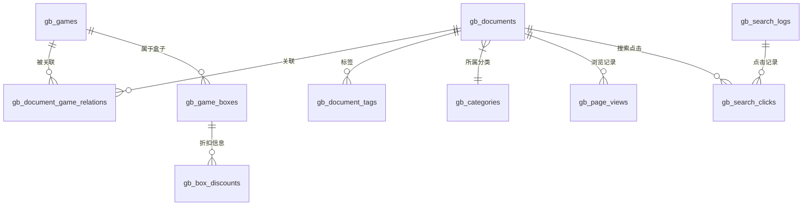

# 数据库设计文档

> 版本：v1.0.0  
> 日期：2025-12-13  
> 项目：游戏盒子内容管理系统

---

## 1. 数据库概览

### 1.1 数据库规划

| 数据库 | 用途 | 字符集 |
|-------|------|--------|
| `ruoyi_system` | 若依系统库（用户、权限等） | utf8mb4 |
| `gamebox_content` | 内容业务库（文档、游戏） | utf8mb4 |
| `gamebox_analytics` | 统计分析库（日志、报表） | utf8mb4 |

### 1.2 ER 总览图



---

## 2. 内容业务库表设计

### 2.1 文档表 (gb_documents)

存储 Markdown 文档的元数据信息。

```sql
CREATE TABLE `gb_documents` (
  `id` bigint NOT NULL AUTO_INCREMENT COMMENT '主键ID',
  `slug` varchar(255) NOT NULL COMMENT '文档路径标识（唯一）',
  `title` varchar(255) NOT NULL COMMENT '文档标题',
  `category_id` bigint DEFAULT NULL COMMENT '分类ID',
  `subcategory` varchar(100) DEFAULT NULL COMMENT '子分类',
  `keywords` varchar(500) DEFAULT NULL COMMENT '关键词，逗号分隔',
  `description` text COMMENT '文档描述/摘要',
  `content_preview` text COMMENT '内容预览（前500字）',
  `r2_key` varchar(500) NOT NULL COMMENT 'R2 存储键',
  `file_size` int DEFAULT 0 COMMENT '文件大小（字节）',
  `reading_time` int DEFAULT 0 COMMENT '预估阅读时间（分钟）',
  `word_count` int DEFAULT 0 COMMENT '字数统计',
  `view_count` int DEFAULT 0 COMMENT '浏览次数',
  `like_count` int DEFAULT 0 COMMENT '点赞次数',
  `is_published` tinyint DEFAULT 1 COMMENT '是否发布：0-否 1-是',
  `is_indexed` tinyint DEFAULT 0 COMMENT '是否已索引到ES：0-否 1-是',
  `published_at` datetime DEFAULT NULL COMMENT '发布时间',
  `created_at` datetime DEFAULT CURRENT_TIMESTAMP COMMENT '创建时间',
  `updated_at` datetime DEFAULT CURRENT_TIMESTAMP ON UPDATE CURRENT_TIMESTAMP COMMENT '更新时间',
  `deleted_at` datetime DEFAULT NULL COMMENT '删除时间（软删除）',
  PRIMARY KEY (`id`),
  UNIQUE KEY `uk_slug` (`slug`),
  KEY `idx_category` (`category_id`),
  KEY `idx_published_at` (`published_at`),
  KEY `idx_is_published` (`is_published`),
  KEY `idx_created_at` (`created_at`)
) ENGINE=InnoDB DEFAULT CHARSET=utf8mb4 COLLATE=utf8mb4_unicode_ci COMMENT='文档表';
```

### 2.2 分类表 (gb_categories)

```sql
CREATE TABLE `gb_categories` (
  `id` bigint NOT NULL AUTO_INCREMENT COMMENT '主键ID',
  `parent_id` bigint DEFAULT 0 COMMENT '父分类ID，0为顶级',
  `name` varchar(50) NOT NULL COMMENT '分类名称',
  `slug` varchar(50) NOT NULL COMMENT '分类标识',
  `icon` varchar(100) DEFAULT NULL COMMENT '分类图标',
  `description` varchar(255) DEFAULT NULL COMMENT '分类描述',
  `sort_order` int DEFAULT 0 COMMENT '排序序号',
  `document_count` int DEFAULT 0 COMMENT '文档数量',
  `status` tinyint DEFAULT 1 COMMENT '状态：0-禁用 1-启用',
  `created_at` datetime DEFAULT CURRENT_TIMESTAMP,
  `updated_at` datetime DEFAULT CURRENT_TIMESTAMP ON UPDATE CURRENT_TIMESTAMP,
  PRIMARY KEY (`id`),
  UNIQUE KEY `uk_slug` (`slug`),
  KEY `idx_parent_id` (`parent_id`)
) ENGINE=InnoDB DEFAULT CHARSET=utf8mb4 COLLATE=utf8mb4_unicode_ci COMMENT='文档分类表';
```

### 2.3 游戏表 (gb_games)

```sql
CREATE TABLE `gb_games` (
  `id` bigint NOT NULL AUTO_INCREMENT COMMENT '主键ID',
  `name` varchar(100) NOT NULL COMMENT '游戏名称',
  `short_name` varchar(50) DEFAULT NULL COMMENT '游戏简称',
  `category` varchar(50) DEFAULT NULL COMMENT '游戏分类（仙侠、传奇等）',
  `icon_url` varchar(500) DEFAULT NULL COMMENT '游戏图标URL',
  `cover_url` varchar(500) DEFAULT NULL COMMENT '游戏封面URL',
  `description` text COMMENT '游戏描述',
  `developer` varchar(100) DEFAULT NULL COMMENT '开发商',
  `package_name` varchar(200) DEFAULT NULL COMMENT '包名',
  `version` varchar(50) DEFAULT NULL COMMENT '版本号',
  `size` varchar(50) DEFAULT NULL COMMENT '安装包大小',
  `download_url` varchar(500) DEFAULT NULL COMMENT '下载链接',
  `download_count` int DEFAULT 0 COMMENT '下载次数',
  `rating` decimal(2,1) DEFAULT 0.0 COMMENT '评分（0-5）',
  `features` json DEFAULT NULL COMMENT '游戏特性（JSON数组）',
  `tags` varchar(255) DEFAULT NULL COMMENT '标签，逗号分隔',
  `status` tinyint DEFAULT 1 COMMENT '状态：0-下架 1-上架',
  `created_at` datetime DEFAULT CURRENT_TIMESTAMP,
  `updated_at` datetime DEFAULT CURRENT_TIMESTAMP ON UPDATE CURRENT_TIMESTAMP,
  PRIMARY KEY (`id`),
  KEY `idx_name` (`name`),
  KEY `idx_category` (`category`),
  KEY `idx_status` (`status`)
) ENGINE=InnoDB DEFAULT CHARSET=utf8mb4 COLLATE=utf8mb4_unicode_ci COMMENT='游戏表';
```

### 2.4 游戏盒子表 (gb_game_boxes)

```sql
CREATE TABLE `gb_game_boxes` (
  `id` bigint NOT NULL AUTO_INCREMENT COMMENT '主键ID',
  `name` varchar(100) NOT NULL COMMENT '盒子名称',
  `logo_url` varchar(500) DEFAULT NULL COMMENT '盒子Logo',
  `description` text COMMENT '盒子描述',
  `official_url` varchar(500) DEFAULT NULL COMMENT '官网地址',
  `download_url` varchar(500) DEFAULT NULL COMMENT '下载地址',
  `android_url` varchar(500) DEFAULT NULL COMMENT '安卓下载',
  `ios_url` varchar(500) DEFAULT NULL COMMENT 'iOS下载',
  `discount_rate` decimal(3,2) DEFAULT 1.00 COMMENT '折扣率（0.1-1.0）',
  `features` json DEFAULT NULL COMMENT '特色功能（JSON数组）',
  `game_count` int DEFAULT 0 COMMENT '收录游戏数',
  `sort_order` int DEFAULT 0 COMMENT '排序',
  `status` tinyint DEFAULT 1 COMMENT '状态：0-下架 1-上架',
  `created_at` datetime DEFAULT CURRENT_TIMESTAMP,
  `updated_at` datetime DEFAULT CURRENT_TIMESTAMP ON UPDATE CURRENT_TIMESTAMP,
  PRIMARY KEY (`id`),
  KEY `idx_name` (`name`)
) ENGINE=InnoDB DEFAULT CHARSET=utf8mb4 COLLATE=utf8mb4_unicode_ci COMMENT='游戏盒子表';
```

### 2.5 文档-游戏关联表 (gb_document_game_relations)

```sql
CREATE TABLE `gb_document_game_relations` (
  `id` bigint NOT NULL AUTO_INCREMENT COMMENT '主键ID',
  `document_id` bigint NOT NULL COMMENT '文档ID',
  `game_id` bigint NOT NULL COMMENT '游戏ID',
  `relation_type` varchar(20) DEFAULT 'auto' COMMENT '关联类型：auto-自动 manual-手动',
  `relevance_score` decimal(5,4) DEFAULT 0.0000 COMMENT '相关度评分（0-1）',
  `is_primary` tinyint DEFAULT 0 COMMENT '是否主关联：0-否 1-是',
  `created_by` bigint DEFAULT NULL COMMENT '创建人',
  `created_at` datetime DEFAULT CURRENT_TIMESTAMP,
  PRIMARY KEY (`id`),
  UNIQUE KEY `uk_document_game` (`document_id`, `game_id`),
  KEY `idx_document_id` (`document_id`),
  KEY `idx_game_id` (`game_id`),
  KEY `idx_relevance` (`relevance_score` DESC)
) ENGINE=InnoDB DEFAULT CHARSET=utf8mb4 COLLATE=utf8mb4_unicode_ci COMMENT='文档-游戏关联表';
```

### 2.6 标签表 (gb_tags)

```sql
CREATE TABLE `gb_tags` (
  `id` bigint NOT NULL AUTO_INCREMENT COMMENT '主键ID',
  `name` varchar(50) NOT NULL COMMENT '标签名称',
  `slug` varchar(50) NOT NULL COMMENT '标签标识',
  `color` varchar(20) DEFAULT NULL COMMENT '标签颜色',
  `use_count` int DEFAULT 0 COMMENT '使用次数',
  `created_at` datetime DEFAULT CURRENT_TIMESTAMP,
  PRIMARY KEY (`id`),
  UNIQUE KEY `uk_name` (`name`),
  UNIQUE KEY `uk_slug` (`slug`)
) ENGINE=InnoDB DEFAULT CHARSET=utf8mb4 COLLATE=utf8mb4_unicode_ci COMMENT='标签表';
```

### 2.7 文档-标签关联表 (gb_document_tags)

```sql
CREATE TABLE `gb_document_tags` (
  `document_id` bigint NOT NULL COMMENT '文档ID',
  `tag_id` bigint NOT NULL COMMENT '标签ID',
  `created_at` datetime DEFAULT CURRENT_TIMESTAMP,
  PRIMARY KEY (`document_id`, `tag_id`),
  KEY `idx_tag_id` (`tag_id`)
) ENGINE=InnoDB DEFAULT CHARSET=utf8mb4 COLLATE=utf8mb4_unicode_ci COMMENT='文档-标签关联表';
```

---

## 3. 统计分析库表设计

### 3.1 搜索日志表 (gb_search_logs)

```sql
CREATE TABLE `gb_search_logs` (
  `id` bigint NOT NULL AUTO_INCREMENT COMMENT '主键ID',
  `query` varchar(255) NOT NULL COMMENT '搜索关键词',
  `query_normalized` varchar(255) DEFAULT NULL COMMENT '标准化后的关键词',
  `result_count` int DEFAULT 0 COMMENT '结果数量',
  `search_time_ms` int DEFAULT 0 COMMENT '搜索耗时（毫秒）',
  `filters` json DEFAULT NULL COMMENT '筛选条件（JSON）',
  `user_id` bigint DEFAULT NULL COMMENT '用户ID（可选）',
  `session_id` varchar(100) DEFAULT NULL COMMENT '会话ID',
  `ip_address` varchar(45) DEFAULT NULL COMMENT 'IP地址',
  `user_agent` varchar(500) DEFAULT NULL COMMENT '用户代理',
  `referer` varchar(500) DEFAULT NULL COMMENT '来源页面',
  `created_at` datetime DEFAULT CURRENT_TIMESTAMP COMMENT '搜索时间',
  PRIMARY KEY (`id`),
  KEY `idx_query` (`query`),
  KEY `idx_created_at` (`created_at`),
  KEY `idx_session` (`session_id`)
) ENGINE=InnoDB DEFAULT CHARSET=utf8mb4 COLLATE=utf8mb4_unicode_ci COMMENT='搜索日志表';
```

### 3.2 页面浏览表 (gb_page_views)

```sql
CREATE TABLE `gb_page_views` (
  `id` bigint NOT NULL AUTO_INCREMENT COMMENT '主键ID',
  `document_id` bigint DEFAULT NULL COMMENT '文档ID',
  `page_path` varchar(500) NOT NULL COMMENT '页面路径',
  `page_title` varchar(255) DEFAULT NULL COMMENT '页面标题',
  `referer` varchar(500) DEFAULT NULL COMMENT '来源页面',
  `user_id` bigint DEFAULT NULL COMMENT '用户ID',
  `session_id` varchar(100) DEFAULT NULL COMMENT '会话ID',
  `ip_address` varchar(45) DEFAULT NULL COMMENT 'IP地址',
  `country` varchar(50) DEFAULT NULL COMMENT '国家',
  `city` varchar(50) DEFAULT NULL COMMENT '城市',
  `device_type` varchar(20) DEFAULT NULL COMMENT '设备类型：mobile/tablet/desktop',
  `browser` varchar(50) DEFAULT NULL COMMENT '浏览器',
  `os` varchar(50) DEFAULT NULL COMMENT '操作系统',
  `duration_seconds` int DEFAULT 0 COMMENT '停留时长（秒）',
  `created_at` datetime DEFAULT CURRENT_TIMESTAMP,
  PRIMARY KEY (`id`),
  KEY `idx_document_id` (`document_id`),
  KEY `idx_page_path` (`page_path`(191)),
  KEY `idx_created_at` (`created_at`),
  KEY `idx_session` (`session_id`)
) ENGINE=InnoDB DEFAULT CHARSET=utf8mb4 COLLATE=utf8mb4_unicode_ci COMMENT='页面浏览记录表';
```

### 3.3 每日统计汇总表 (gb_daily_stats)

```sql
CREATE TABLE `gb_daily_stats` (
  `id` bigint NOT NULL AUTO_INCREMENT COMMENT '主键ID',
  `stat_date` date NOT NULL COMMENT '统计日期',
  `stat_type` varchar(50) NOT NULL COMMENT '统计类型',
  `dimension` varchar(100) DEFAULT 'total' COMMENT '维度（分类、设备等）',
  `dimension_value` varchar(100) DEFAULT NULL COMMENT '维度值',
  `pv` int DEFAULT 0 COMMENT '页面浏览量',
  `uv` int DEFAULT 0 COMMENT '独立访客',
  `search_count` int DEFAULT 0 COMMENT '搜索次数',
  `download_count` int DEFAULT 0 COMMENT '下载次数',
  `new_documents` int DEFAULT 0 COMMENT '新增文档数',
  `created_at` datetime DEFAULT CURRENT_TIMESTAMP,
  `updated_at` datetime DEFAULT CURRENT_TIMESTAMP ON UPDATE CURRENT_TIMESTAMP,
  PRIMARY KEY (`id`),
  UNIQUE KEY `uk_date_type_dim` (`stat_date`, `stat_type`, `dimension`, `dimension_value`),
  KEY `idx_stat_date` (`stat_date`),
  KEY `idx_stat_type` (`stat_type`)
) ENGINE=InnoDB DEFAULT CHARSET=utf8mb4 COLLATE=utf8mb4_unicode_ci COMMENT='每日统计汇总表';
```

### 3.4 热门搜索词表 (gb_hot_keywords)

```sql
CREATE TABLE `gb_hot_keywords` (
  `id` bigint NOT NULL AUTO_INCREMENT COMMENT '主键ID',
  `keyword` varchar(100) NOT NULL COMMENT '关键词',
  `search_count` int DEFAULT 0 COMMENT '搜索次数',
  `click_count` int DEFAULT 0 COMMENT '点击次数',
  `ctr` decimal(5,4) DEFAULT 0.0000 COMMENT '点击率',
  `avg_position` decimal(4,2) DEFAULT 0.00 COMMENT '平均排名位置',
  `stat_date` date NOT NULL COMMENT '统计日期',
  `created_at` datetime DEFAULT CURRENT_TIMESTAMP,
  PRIMARY KEY (`id`),
  UNIQUE KEY `uk_keyword_date` (`keyword`, `stat_date`),
  KEY `idx_stat_date` (`stat_date`),
  KEY `idx_search_count` (`search_count` DESC)
) ENGINE=InnoDB DEFAULT CHARSET=utf8mb4 COLLATE=utf8mb4_unicode_ci COMMENT='热门搜索词表';
```

---

## 4. ElasticSearch 索引设计

### 4.1 文档索引 (documents)

```json
{
  "settings": {
    "number_of_shards": 3,
    "number_of_replicas": 1,
    "analysis": {
      "analyzer": {
        "ik_smart_synonym": {
          "type": "custom",
          "tokenizer": "ik_smart",
          "filter": ["lowercase", "synonym_filter"]
        },
        "ik_max_synonym": {
          "type": "custom",
          "tokenizer": "ik_max_word",
          "filter": ["lowercase", "synonym_filter"]
        }
      },
      "filter": {
        "synonym_filter": {
          "type": "synonym",
          "synonyms_path": "analysis/synonyms.txt"
        }
      }
    }
  },
  "mappings": {
    "properties": {
      "id": { "type": "long" },
      "slug": { "type": "keyword" },
      "title": {
        "type": "text",
        "analyzer": "ik_max_synonym",
        "search_analyzer": "ik_smart_synonym",
        "fields": {
          "keyword": { "type": "keyword" }
        }
      },
      "category": { "type": "keyword" },
      "subcategory": { "type": "keyword" },
      "keywords": {
        "type": "text",
        "analyzer": "ik_max_synonym"
      },
      "content": {
        "type": "text",
        "analyzer": "ik_max_synonym",
        "search_analyzer": "ik_smart_synonym"
      },
      "description": { "type": "text", "analyzer": "ik_smart" },
      "tags": { "type": "keyword" },
      "view_count": { "type": "integer" },
      "like_count": { "type": "integer" },
      "published_at": { "type": "date" },
      "created_at": { "type": "date" },
      "updated_at": { "type": "date" },
      "suggest": {
        "type": "completion",
        "analyzer": "ik_smart"
      }
    }
  }
}
```

### 4.2 游戏索引 (games)

```json
{
  "settings": {
    "number_of_shards": 1,
    "number_of_replicas": 1
  },
  "mappings": {
    "properties": {
      "id": { "type": "long" },
      "name": {
        "type": "text",
        "analyzer": "ik_max_word",
        "fields": { "keyword": { "type": "keyword" } }
      },
      "category": { "type": "keyword" },
      "description": { "type": "text", "analyzer": "ik_smart" },
      "tags": { "type": "keyword" },
      "features": { "type": "keyword" },
      "download_count": { "type": "integer" },
      "rating": { "type": "float" },
      "created_at": { "type": "date" }
    }
  }
}
```

---

## 5. 数据字典

### 5.1 状态枚举

| 字段 | 值 | 说明 |
|------|-----|------|
| status | 0 | 禁用/下架 |
| status | 1 | 启用/上架 |
| is_published | 0 | 未发布 |
| is_published | 1 | 已发布 |
| relation_type | auto | 自动关联 |
| relation_type | manual | 手动关联 |

### 5.2 分类初始数据

| ID | 名称 | Slug | 图标 |
|----|------|------|------|
| 1 | 传奇 | chuanqi | ⚔️ |
| 2 | 仙侠 | xianxia | 🏰 |
| 3 | 三国 | sanguo | 🎮 |
| 4 | 二次元 | erciyuan | 🌟 |
| 5 | 卡牌 | kapai | 🃏 |
| 6 | 回合 | huihe | 🎲 |
| 7 | 放置 | fangzhi | ⏰ |
| 8 | 动漫 | dongman | 📺 |
| 9 | 武侠 | wuxia | 🥷 |
| 10 | 西游 | xiyou | 🐒 |
| 11 | 魔幻 | mohuan | 🔮 |
| 12 | 策略 | celue | 🎯 |
| 13 | 冒险 | maoxian | 🗺️ |
| 14 | 网游 | wangyou | 🌐 |
| 15 | 休闲 | xiuxian | 🎪 |
| 16 | 割草 | gecao | ⚡ |
| 17 | 开箱 | kaixiang | 📦 |
| 18 | Q版 | qban | 🎨 |
| 19 | 角色 | juese | 👤 |

---

## 6. 索引优化建议

### 6.1 MySQL 索引策略

```sql
-- 复合索引优化搜索查询
CREATE INDEX idx_doc_category_published ON gb_documents(category_id, is_published, published_at DESC);

-- 统计查询优化
CREATE INDEX idx_pv_date_doc ON gb_page_views(created_at, document_id);

-- 热词查询优化
CREATE INDEX idx_hot_date_count ON gb_hot_keywords(stat_date DESC, search_count DESC);
```

### 6.2 分区策略

```sql
-- 页面浏览表按月分区
ALTER TABLE gb_page_views PARTITION BY RANGE (TO_DAYS(created_at)) (
    PARTITION p202501 VALUES LESS THAN (TO_DAYS('2025-02-01')),
    PARTITION p202502 VALUES LESS THAN (TO_DAYS('2025-03-01')),
    PARTITION p202503 VALUES LESS THAN (TO_DAYS('2025-04-01')),
    -- ... 更多分区
    PARTITION p_future VALUES LESS THAN MAXVALUE
);
```
