# 系统架构设计文档

> 版本：v2.7.0  
> 日期：2025-12-14  
> 项目：多产品内容管理系统（游戏盒子 / 短剧推广）

---

## 1. 整体架构

### 1.1 系统概述

本系统采用**统一管理后台 + 多站点边缘前端**的架构模式：

| 组件 | 说明 |
|------|------|
| **推广站点**（多个） | 部署在 Cloudflare 边缘网络，分别用于游戏推广、短剧推广等，展示内容并提供下载落地 |
| **管理后台**（单一） | 统一平台管理所有站点内容，通过 AI 生成游戏/短剧相关文章并发布 |
| **后端服务** | 若依 Boot 单体应用，为推广站点和管理后台提供 API 接口 |

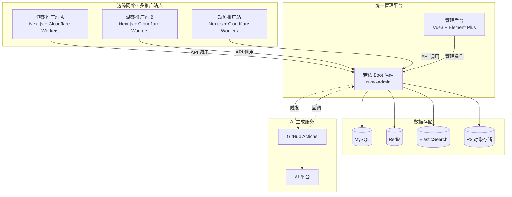

### 1.2 技术栈选择

| 层级 | 技术选择 | 理由 |
|------|---------|------|
| **推广站点** | Next.js 14 + Cloudflare Workers | SSR/ISR，边缘计算，SEO 友好，多站点复用 |
| **管理后台** | 若依 Vue3 + Element Plus | 开箱即用的后台解决方案 |
| **后端服务** | 若依 Boot (Spring Boot 3.x) | 单体架构，部署简单，成熟的权限体系 |
| **数据库** | MySQL 8.0 | 关系型数据，事务支持 |
| **搜索引擎** | ElasticSearch 8.x | 全文搜索，中文分词 |
| **对象存储** | Cloudflare R2 / 多存储支持 | Markdown 文件及资源存储 |
| **缓存** | Redis 6.x | 热点数据缓存 |
| **任务调度** | Spring Scheduler | 异步任务处理 |
| **AI 文章生成** | GitHub Actions | 自动化内容生成，可复用公共 Action |

### 1.3 后端模块架构

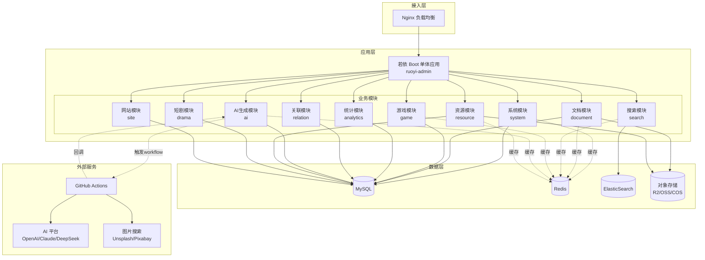

### 1.4 推广站点数据流

推广站点（如游戏推广站）通过调用后端 API 获取数据：

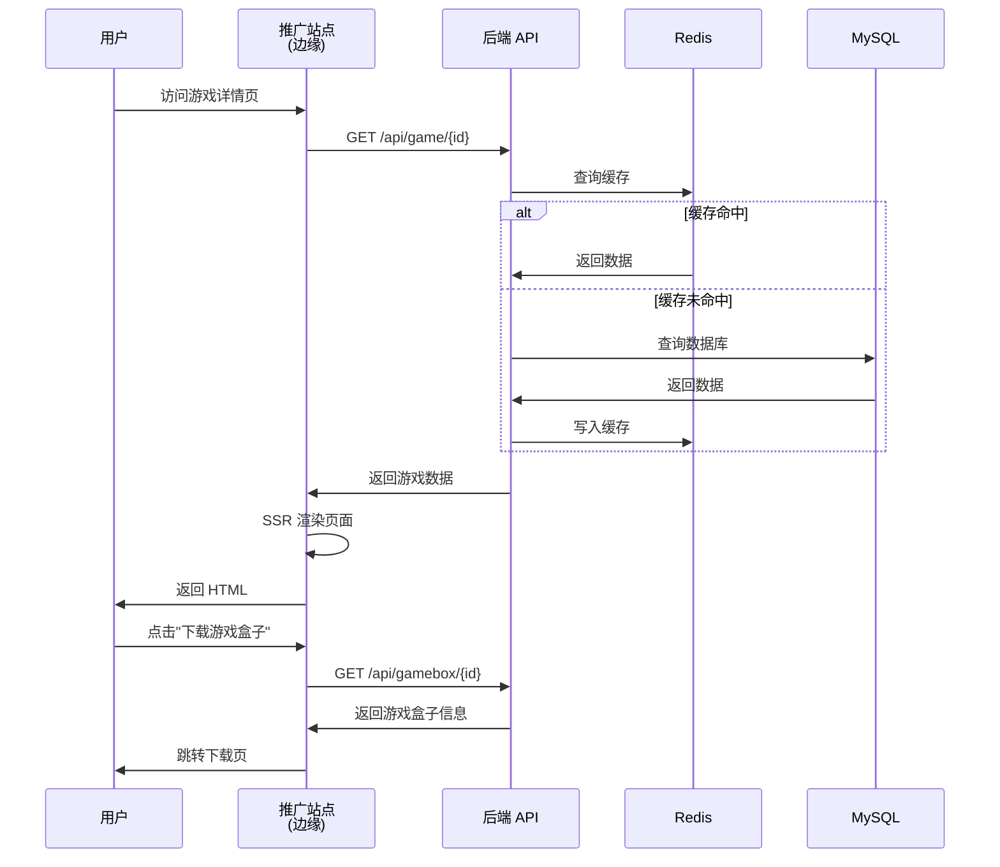

---

## 2. 数据流架构

### 2.1 文档处理流程

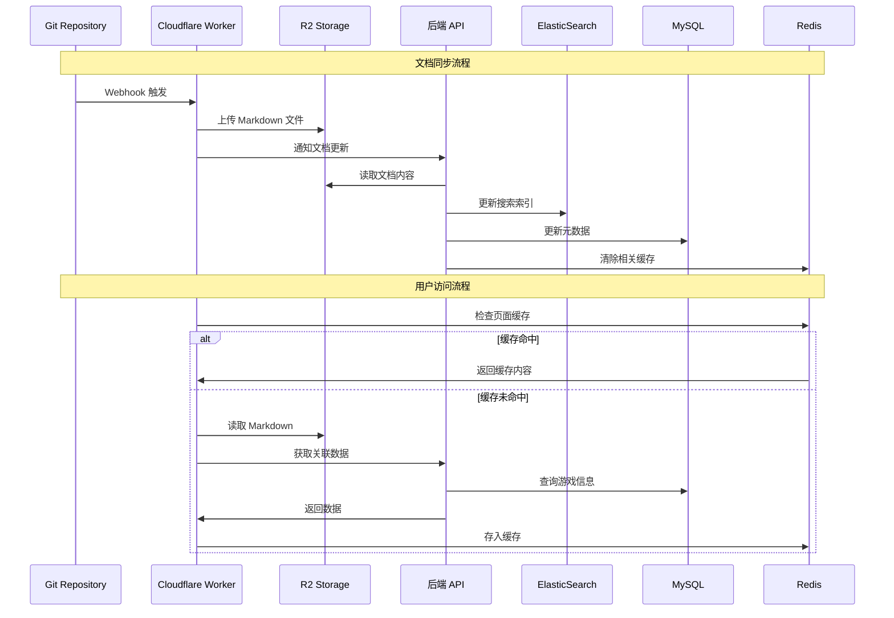

### 2.2 搜索流程

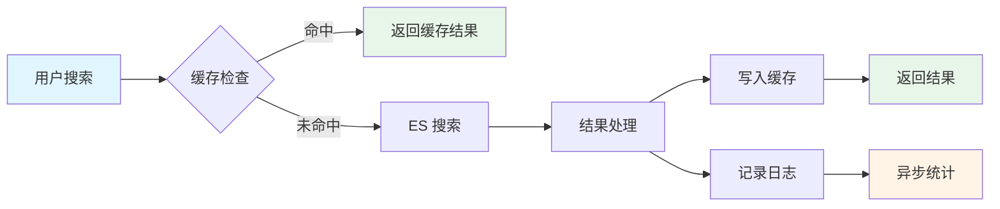

---

## 3. 部署架构

### 3.1 单体应用部署

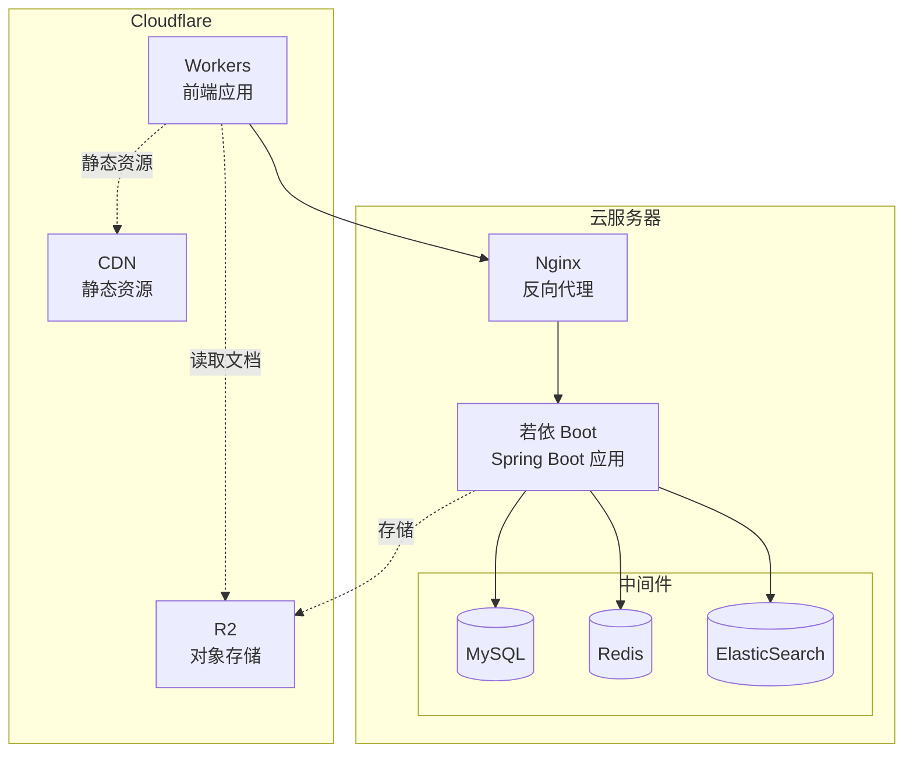

### 3.4 监控体系

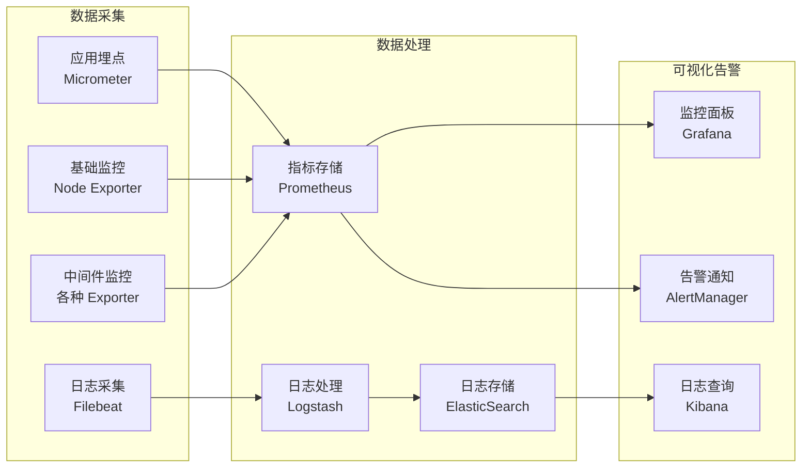

---

## 4. 核心模块设计

### 4.1 文档服务架构

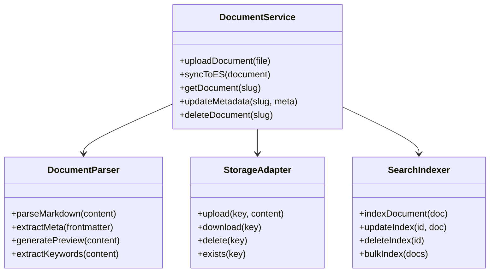

### 4.2 搜索服务架构

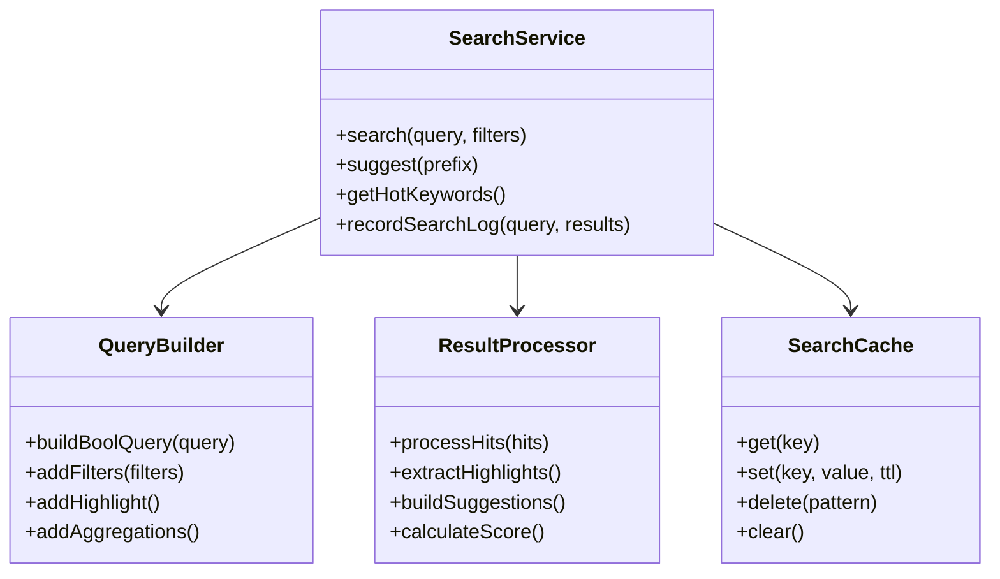

### 4.3 智能关联设计

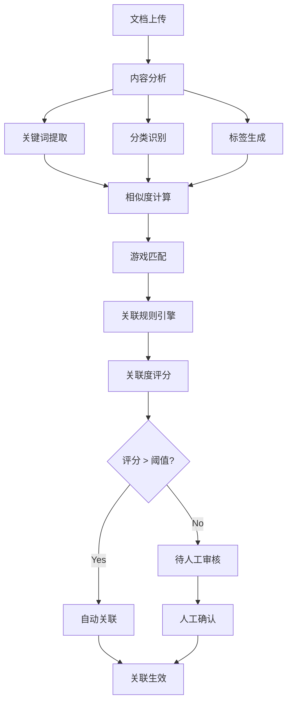

### 4.4 AI文章生成服务架构

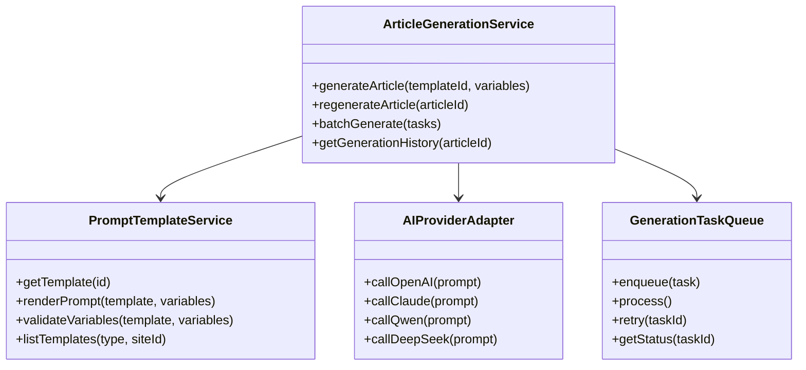

### 4.5 资源管理服务架构

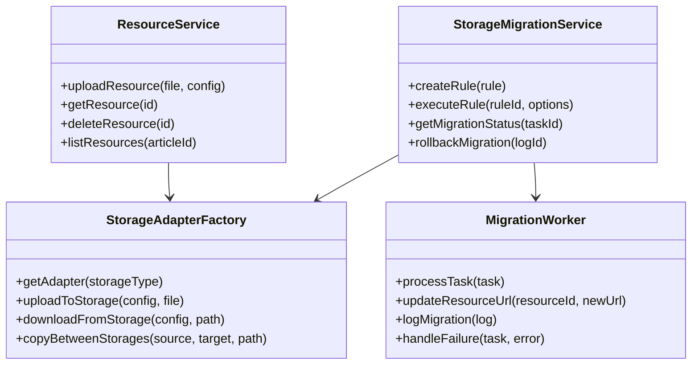

### 4.6 资源迁移流程

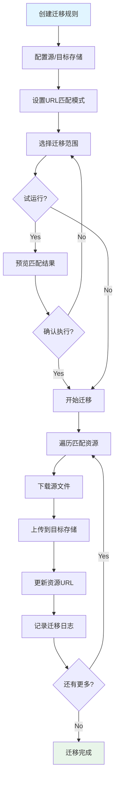

---

## 5. 性能优化策略

### 5.1 缓存策略

| 缓存层级 | 缓存内容 | TTL | 更新策略 |
|---------|---------|-----|---------|
| CDN 缓存 | 静态文件、图片 | 24h | 版本号更新 |
| Workers 缓存 | 热门文章页面 | 1h | 主动刷新 |
| Redis 缓存 | 搜索结果、API 响应 | 30min | LRU 淘汰 |
| 应用缓存 | 配置信息、用户会话 | 15min | 定时刷新 |

### 5.2 数据库优化

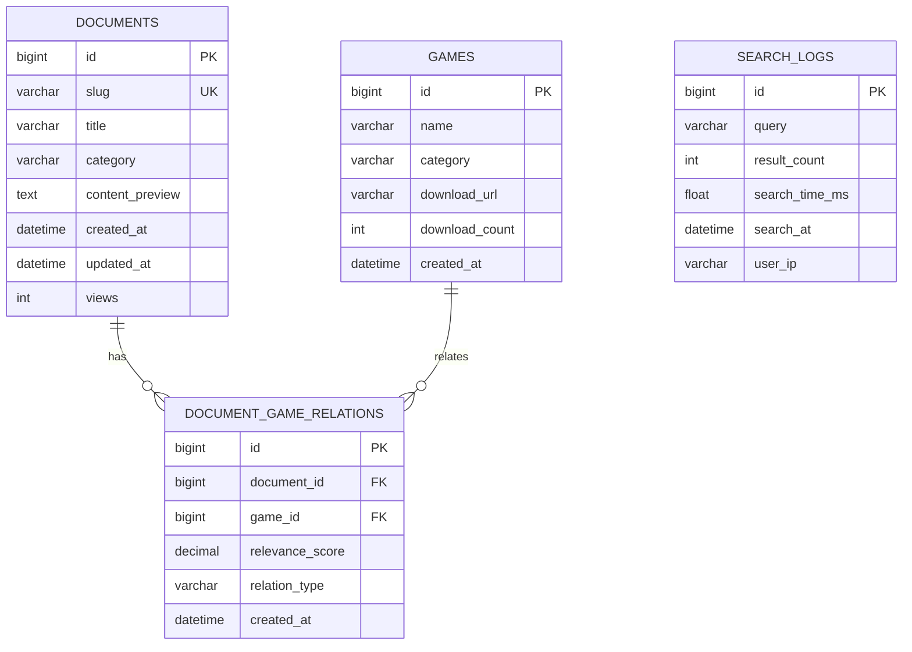

### 5.3 搜索性能优化

| 优化点 | 策略 | 预期效果 |
|-------|------|---------|
| 索引设计 | 分片数量优化、字段类型优化 | 响应时间 < 100ms |
| 查询优化 | 布尔查询、过滤器缓存 | QPS 提升 50% |
| 结果缓存 | Redis 缓存热门查询 | 缓存命中率 > 80% |
| 异步更新 | 消息队列处理索引更新 | 写入性能提升 3x |

---

## 6. 安全架构

### 6.1 安全防护体系

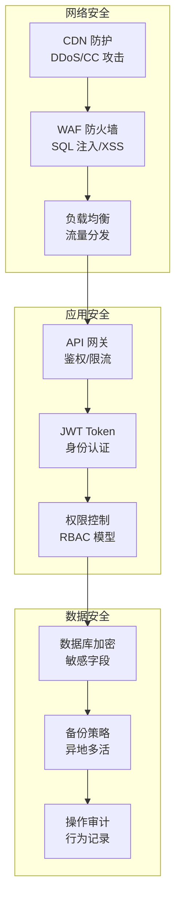

### 6.2 权限模型

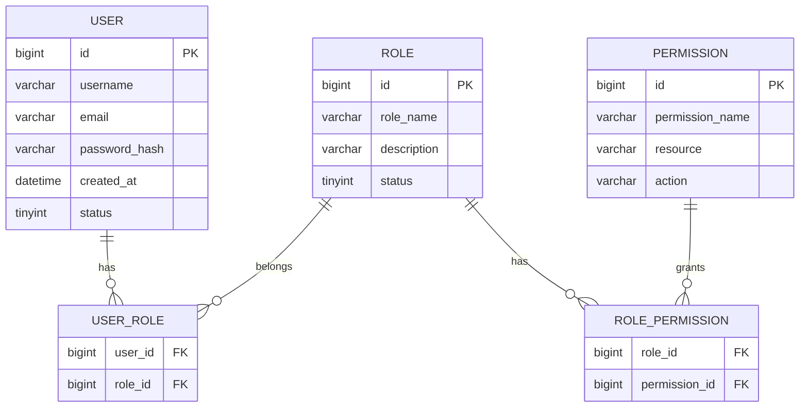

---

## 附录

### A.1 服务端口规划

| 服务 | 端口 | 协议 | 说明 |
|------|------|------|------|
| Nginx | 80/443 | HTTP/HTTPS | 反向代理 |
| RuoYi-Admin | 8080 | HTTP | 后端应用 |
| Redis | 6379 | TCP | 缓存 |
| MySQL | 3306 | TCP | 数据库 |
| ElasticSearch | 9200 | HTTP | 搜索引擎 |

### A.2 环境配置

| 环境 | 域名 | 说明 |
|------|------|------|
| 开发环境 | dev.gamebox.local | 本地开发 |
| 测试环境 | test.gamebox.com | 功能测试 |
| 预发环境 | staging.gamebox.com | 性能测试 |
| 生产环境 | www.gamebox.com | 正式环境 |

### A.3 版本历史

| 版本 | 日期 | 修改内容 |
|------|------|---------|
| v1.0.0 | 2025-12-13 | 初始版本，基础架构设计 |
| v2.2.0 | 2025-12-14 | 新增AI生成服务、资源服务、短剧服务架构；完善存储迁移流程设计 |
| v2.3.0 | 2025-12-14 | 架构降级：从微服务改为单体架构，简化部署复杂度 |
| v2.4.0 | 2025-12-14 | 新增 GitHub Action AI 文章生成架构设计 |

---

## 7. GitHub Action AI 文章生成架构

> 💡 **设计理念**：用户在管理后台连接公共 AI 生成仓库，配置 API Key 和图片服务，系统通过定时任务自动触发 GitHub Action 执行文章生成和发布。

### 7.1 系统集成架构

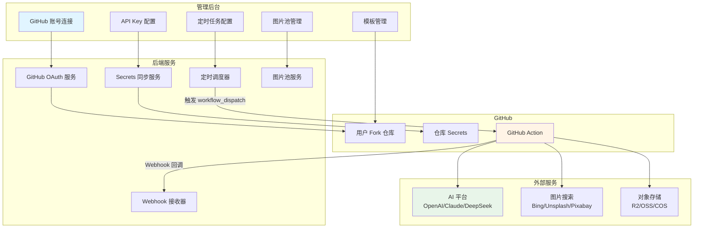

### 7.2 完整执行流程

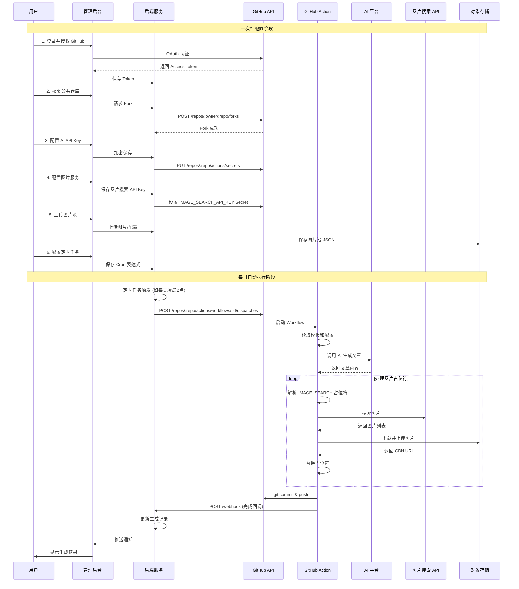

### 7.3 核心组件设计

#### 7.3.1 GitHub 集成服务

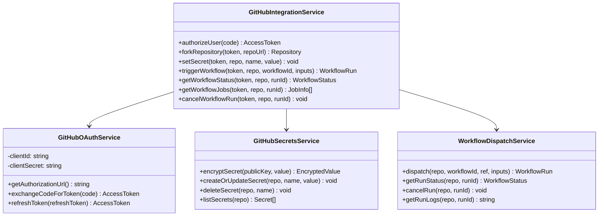

#### 7.3.2 图片服务架构

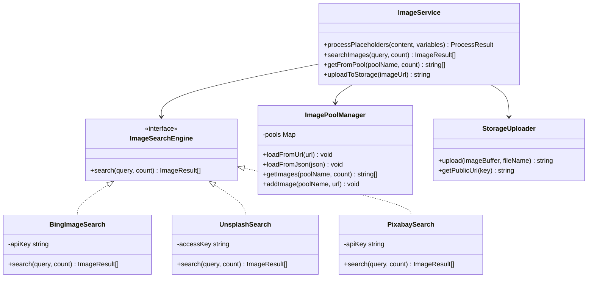

#### 7.3.3 定时调度与批量任务服务

```mermaid
classDiagram
    class SchedulerService {
        +createSchedule(config) Schedule
        +updateSchedule(id, config) Schedule
        +deleteSchedule(id) void
        +enableSchedule(id) void
        +disableSchedule(id) void
        +getNextExecutionTime(id) DateTime
        +executeNow(id) ExecutionResult
    }
    
    class BatchTaskService {
        +createBatchTask(config) BatchTask
        +executeBatchTask(id) ExecutionResult
        +getBatchTaskStatus(id) TaskStatus
        +cancelBatchTask(id) void
        +retryFailedItems(id) ExecutionResult
    }
    
    class ScheduleConfig {
        +id: Long
        +name: string
        +cronExpression: string
        +repositoryId: Long
        +batchConfig: BatchConfig
        +enabled: boolean
        +lastExecutionTime: DateTime
        +nextExecutionTime: DateTime
    }
    
    class BatchConfig {
        +tasks: BatchTaskItem[]
        +options: BatchOptions
    }
    
    class BatchTaskItem {
        +gameName: string
        +category: string
        +template: string
        +aiProvider: string
        +customPrompt: string
        +keywords: string
        +imageEnabled: boolean
        +imageEngine: string
        +variables: Map
    }
    
    class BatchOptions {
        +defaultAiProvider: string
        +imageSearchEnabled: boolean
        +imageSearchEngine: string
        +maxConcurrent: int
        +delayBetweenTasks: int
    }
    
    class ScheduleExecutor {
        +execute(schedule) ExecutionResult
        -prepareBatchInputs(schedule) WorkflowInputs
        -triggerBatchWorkflow(inputs) WorkflowRun
        -recordExecution(result) void
    }
    
    class ExecutionLog {
        +id: Long
        +scheduleId: Long
        +batchTaskId: Long
        +startTime: DateTime
        +endTime: DateTime
        +status: ExecutionStatus
        +workflowRunId: Long
        +totalArticles: int
        +completedArticles: int
        +failedArticles: int
        +tokensUsed: int
        +errorMessage: string
    }
    
    SchedulerService --> ScheduleConfig
    SchedulerService --> ScheduleExecutor
    BatchTaskService --> BatchConfig
    BatchConfig --> BatchTaskItem
    BatchConfig --> BatchOptions
    ScheduleConfig --> BatchConfig
    ScheduleExecutor --> ExecutionLog
```

#### 7.3.4 批量生成工作流程

```mermaid
sequenceDiagram
    participant Admin as 管理后台
    participant Backend as 后端服务
    participant Scheduler as 定时调度器
    participant GitHub as GitHub API
    participant Action as GitHub Action
    participant Webhook as Webhook 回调

    rect rgb(240, 248, 255)
        Note over Admin,Backend: 1. 创建批量任务
        Admin->>Backend: 创建批量生成任务（多篇文章配置）
        Backend->>Backend: 保存批量配置 BatchConfig
        Backend->>Admin: 返回任务 ID
    end

    rect rgb(255, 248, 240)
        Note over Admin,Scheduler: 2. 配置定时执行
        Admin->>Backend: 设置 Cron 表达式（如 0 0 2 * * ?）
        Backend->>Scheduler: 注册定时任务
        Scheduler-->>Admin: 定时任务已创建
    end

    rect rgb(240, 255, 240)
        Note over Scheduler,Action: 3. 定时触发执行
        Scheduler->>Scheduler: Cron 时间到达
        Scheduler->>Backend: 触发执行
        Backend->>GitHub: workflow_dispatch（batch_mode=true, batch_config=JSON）
        GitHub->>Action: 启动工作流
        
        loop 每篇文章（并行度=2）
            Action->>Action: AI 生成文章
            Action->>Action: 处理图片占位符
            Action->>Action: 提交到仓库
            Action->>Webhook: 单篇完成回调
            Webhook->>Backend: 更新单篇状态
        end
        
        Action->>Webhook: 批量完成汇总回调
        Webhook->>Backend: 更新任务状态
    end

    rect rgb(248, 240, 255)
        Note over Backend,Admin: 4. 状态同步
        Backend->>Admin: 推送任务完成通知
        Admin->>Admin: 展示生成结果
    end
```

#### 7.3.5 任务执行监控机制

系统通过以下两种方式监控 GitHub Action 的执行进度：

**方式一：Webhook 回调（推荐）**

GitHub Action 执行过程中主动向后端发送状态更新：

```mermaid
sequenceDiagram
    participant Action as GitHub Action
    participant Webhook as 后端 Webhook
    participant DB as 数据库
    participant WS as WebSocket

    Action->>Webhook: POST /ai-task/webhook（单篇完成）
    Webhook->>Webhook: 验证签名
    Webhook->>DB: 更新 execution_items 状态
    Webhook->>WS: 推送进度更新
    WS-->>Admin: 实时刷新页面
```

**方式二：轮询 GitHub API**

当 Webhook 不可用或需要同步最新状态时：

```mermaid
sequenceDiagram
    participant Admin as 管理后台
    participant API as 后端 API
    participant GitHub as GitHub API

    loop 每5秒
        Admin->>API: GET /ai-task/execution/{id}
        
        alt 执行中状态
            API->>GitHub: GET /repos/.../actions/runs/{runId}
            GitHub-->>API: Workflow 状态
            API->>GitHub: GET /repos/.../actions/runs/{runId}/jobs
            GitHub-->>API: Jobs 状态列表
            API->>API: 更新本地状态
        end
        
        API-->>Admin: 返回执行详情
    end
```

**状态同步逻辑**

| GitHub Workflow 状态 | 本地任务状态 | 说明 |
|---------------------|-------------|------|
| `queued` | 已触发(1) | 等待执行 |
| `in_progress` | 执行中(2) | 正在执行 |
| `completed` + `success` | 已完成(3) | 全部成功 |
| `completed` + `failure` | 部分失败(3)/全部失败(4) | 根据子任务判断 |
| `cancelled` | 已取消(5) | 用户取消 |

**执行详情解析**

通过 GitHub API 获取 Jobs 信息解析每篇文章状态：

```java
// 伪代码：解析 Workflow Jobs
List<Job> jobs = githubApi.getWorkflowJobs(runId);

for (Job job : jobs) {
    // Job name 格式: "generate (剑来, xianxia, game-intro)"
    if (job.getName().startsWith("generate")) {
        String gameName = parseGameName(job.getName());
        ExecutionItem item = findByGameName(gameName);
        
        item.setStatus(mapJobStatus(job.getStatus(), job.getConclusion()));
        if (job.getCompletedAt() != null) {
            item.setCompletedAt(job.getCompletedAt());
        }
    }
}
```

### 7.4 图片占位符语法

| 占位符格式 | 说明 | 示例 |
|-----------|------|------|
| `{IMAGE_SEARCH:关键词}` | 搜索并插入 1 张图片 | `{IMAGE_SEARCH:剑来游戏截图}` |
| `{IMAGE_SEARCH:关键词:数量}` | 搜索并随机选取多张 | `{IMAGE_SEARCH:仙侠游戏:3}` |
| `{IMAGE_POOL:分类}` | 从图片池随机选取 1 张 | `{IMAGE_POOL:banner}` |
| `{IMAGE_POOL:分类:数量}` | 从图片池选取多张 | `{IMAGE_POOL:screenshot:2}` |
| `{IMAGE:URL}` | 使用固定 URL | `{IMAGE:https://cdn.example.com/logo.png}` |

### 7.5 模板示例（含图片）

```text
---
title: "{gameName}破解版下载"
description: "{gameName}破解版，无限元宝，满VIP特权"
cover: "{IMAGE_POOL:banner}"
---

# {gameName}破解版下载

{IMAGE_SEARCH:{gameName}游戏截图}

## 游戏简介

{AI_GENERATE:请为{gameName}写一段200字的游戏简介}

## 游戏截图

{IMAGE_SEARCH:{gameName}:3}

## 游戏特色

{AI_GENERATE:请列出{gameName}的5个主要特色}

## 下载说明

{IMAGE_POOL:download-guide}

立即下载体验！
```

### 7.6 安全设计

#### 7.6.1 API Key 安全

- 后端加密存储（AES-256）
- 仅同步到用户自己 Fork 的仓库
- GitHub Secrets 加密存储
- 不在日志中打印

#### 7.6.2 Webhook 验证

```typescript
// Webhook 签名验证
const signature = crypto
  .createHmac('sha256', webhookSecret)
  .update(JSON.stringify(payload))
  .digest('hex');

if (signature !== request.headers['x-webhook-signature']) {
  throw new Error('Invalid webhook signature');
}
```