# 系统架构设计文档

> 版本：v1.0.0  
> 日期：2025-12-13  
> 项目：游戏盒子内容管理系统

---

## 1. 整体架构

### 1.1 技术栈选择

| 层级 | 技术选择 | 理由 |
|------|---------|------|
| 前端展示 | Next.js 14 + Cloudflare Workers | SSR/ISR，边缘计算，SEO 友好 |
| 管理后台 | 若依 Vue3 + Element Plus | 开箱即用的后台解决方案 |
| 后端服务 | 若依 Cloud (Spring Cloud) | 微服务架构，成熟的权限体系 |
| 数据库 | MySQL 8.0 | 关系型数据，事务支持 |
| 搜索引擎 | ElasticSearch 8.x | 全文搜索，中文分词 |
| 对象存储 | Cloudflare R2 | Markdown 文件存储 |
| 缓存 | Redis 6.x | 热点数据缓存 |
| 消息队列 | RabbitMQ | 异步任务处理 |

### 1.2 微服务架构

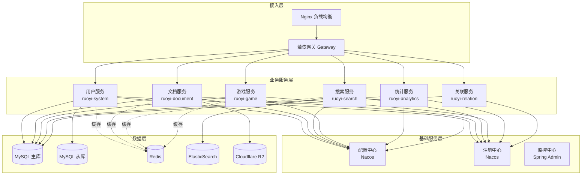

---

## 2. 数据流架构

### 2.1 文档处理流程

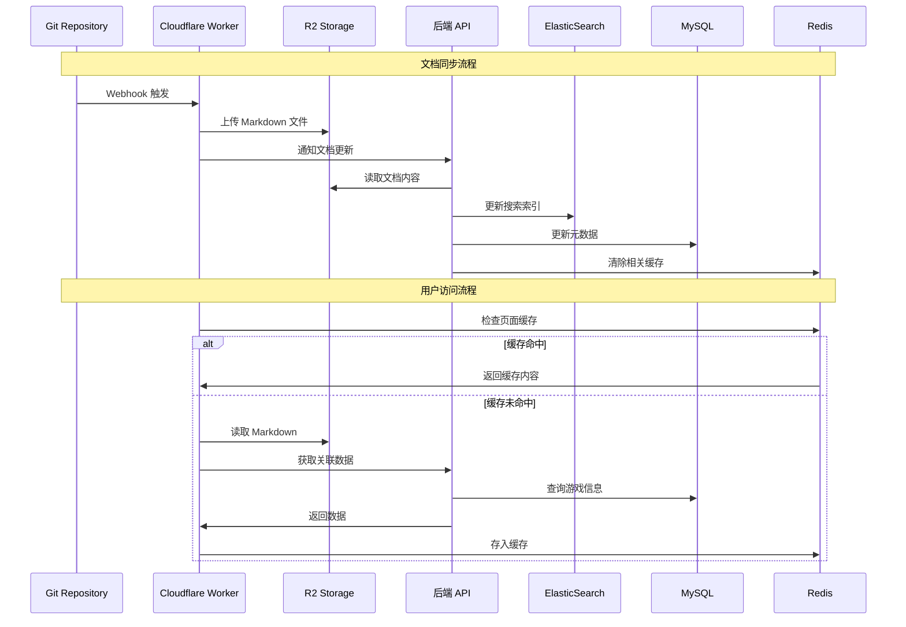

### 2.2 搜索流程

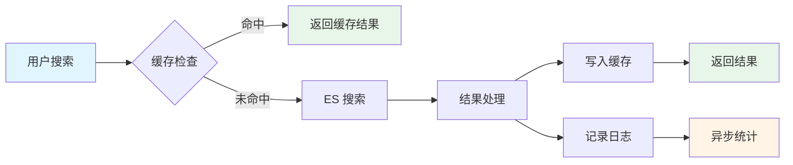

---

## 3. 部署架构

### 3.3 云原生部署

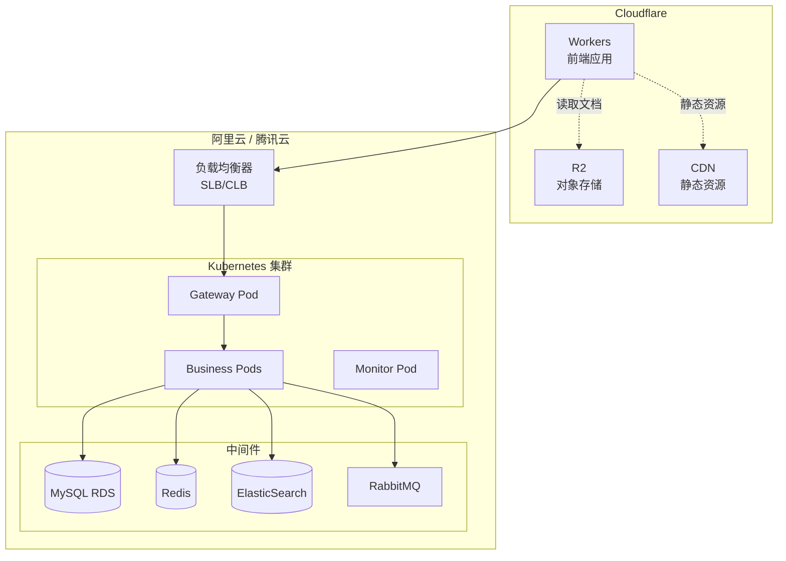

### 3.4 监控体系

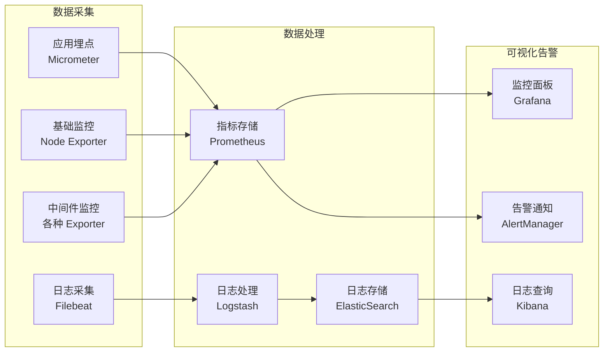

---

## 4. 核心模块设计

### 4.1 文档服务架构

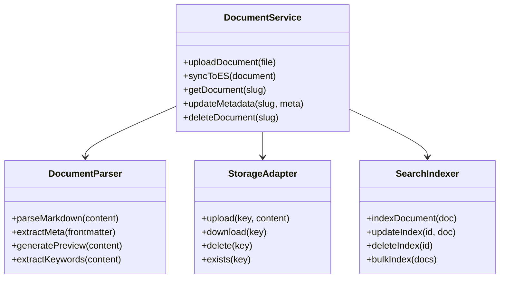

### 4.2 搜索服务架构

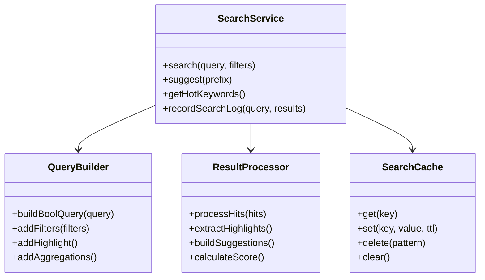

### 4.3 智能关联设计

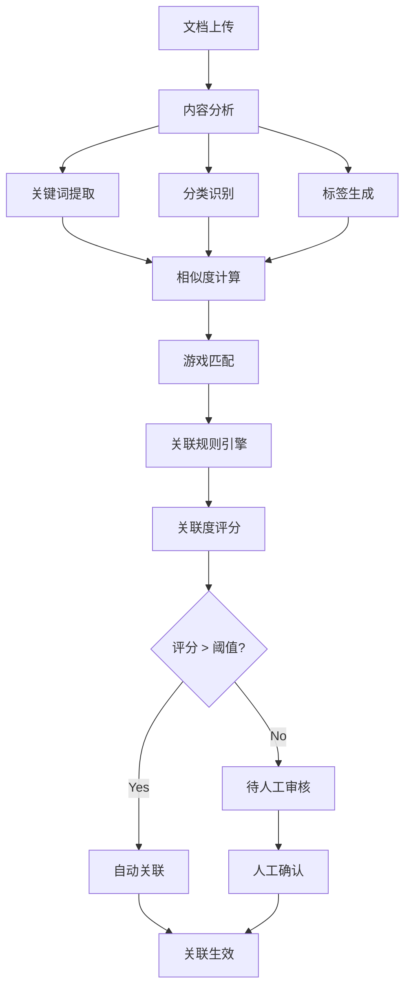

---

## 5. 性能优化策略

### 5.1 缓存策略

| 缓存层级 | 缓存内容 | TTL | 更新策略 |
|---------|---------|-----|---------|
| CDN 缓存 | 静态文件、图片 | 24h | 版本号更新 |
| Workers 缓存 | 热门文章页面 | 1h | 主动刷新 |
| Redis 缓存 | 搜索结果、API 响应 | 30min | LRU 淘汰 |
| 应用缓存 | 配置信息、用户会话 | 15min | 定时刷新 |

### 5.2 数据库优化

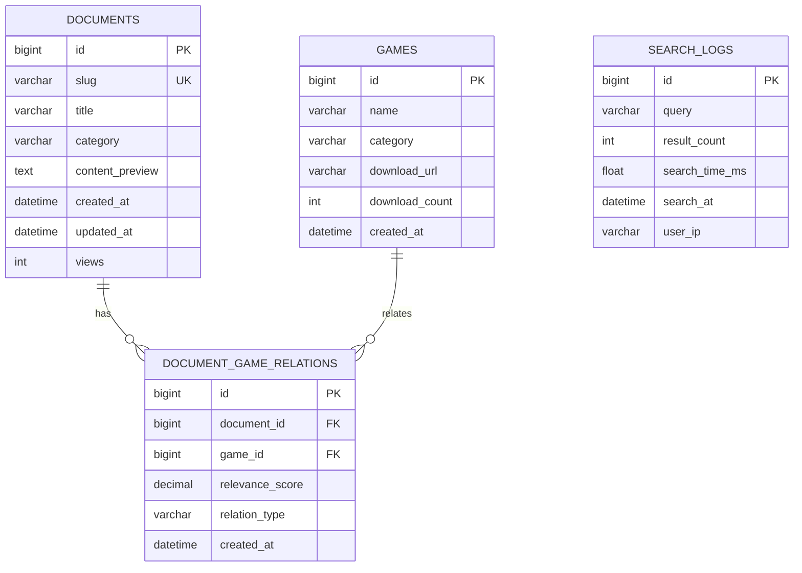

### 5.3 搜索性能优化

| 优化点 | 策略 | 预期效果 |
|-------|------|---------|
| 索引设计 | 分片数量优化、字段类型优化 | 响应时间 < 100ms |
| 查询优化 | 布尔查询、过滤器缓存 | QPS 提升 50% |
| 结果缓存 | Redis 缓存热门查询 | 缓存命中率 > 80% |
| 异步更新 | 消息队列处理索引更新 | 写入性能提升 3x |

---

## 6. 安全架构

### 6.1 安全防护体系

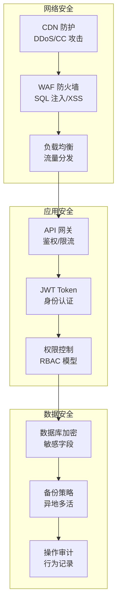

### 6.2 权限模型

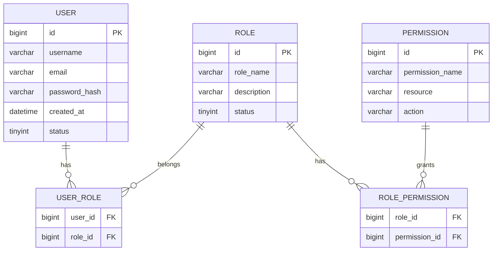

---

## 附录

### A.1 服务端口规划

| 服务 | 端口 | 协议 | 说明 |
|------|------|------|------|
| Gateway | 8080 | HTTP | API 网关 |
| System | 9201 | HTTP | 用户服务 |
| Document | 9202 | HTTP | 文档服务 |
| Search | 9203 | HTTP | 搜索服务 |
| Game | 9204 | HTTP | 游戏服务 |
| Analytics | 9205 | HTTP | 统计服务 |
| Redis | 6379 | TCP | 缓存 |
| MySQL | 3306 | TCP | 数据库 |
| ElasticSearch | 9200 | HTTP | 搜索引擎 |

### A.2 环境配置

| 环境 | 域名 | 说明 |
|------|------|------|
| 开发环境 | dev.gamebox.local | 本地开发 |
| 测试环境 | test.gamebox.com | 功能测试 |
| 预发环境 | staging.gamebox.com | 性能测试 |
| 生产环境 | www.gamebox.com | 正式环境 |