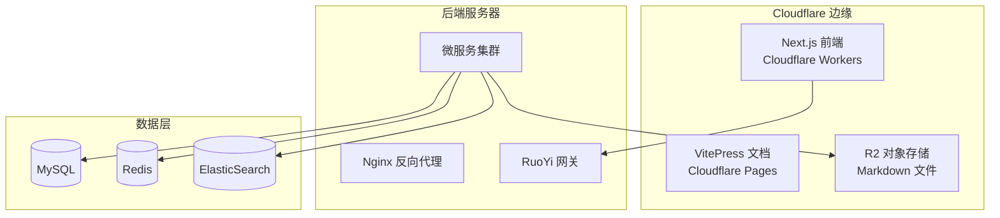

# 部署教程

> 版本：v1.0.0  
> 日期：2025-12-13  
> 项目：游戏盒子内容管理系统

---

## 1. 系统架构概览



---

## 2. 前端部署 (Next.js → Cloudflare Workers)

### 2.1 环境准备

```bash
# 安装依赖
pnpm install

# 安装 wrangler CLI
pnpm add -D wrangler @opennextjs/cloudflare
```

### 2.2 配置文件

**wrangler.toml**

```toml
name = "game-box"
main = ".open-next/worker.js"
compatibility_date = "2024-09-23"
compatibility_flags = ["nodejs_compat"]

[vars]
CLOUDFLARE_WORKERS = "true"

[assets]
directory = ".open-next/assets"
binding = "ASSETS"

[[r2_buckets]]
binding = "DOCS_BUCKET"
bucket_name = "game-box-docs"
```

### 2.3 构建与部署

```bash
# 本地预览
pnpm preview

# 部署到 Cloudflare Workers
pnpm deploy
```

### 2.4 环境变量配置

在 Cloudflare Dashboard 中设置：

| 变量名 | 说明 |
|--------|------|
| `API_BASE_URL` | 后端 API 地址 |
| `CLOUDFLARE_WORKERS` | 设为 `true` |

---

## 3. 后端部署 (RuoYi Cloud)

### 3.1 环境要求

| 组件 | 版本 | 说明 |
|------|-----|------|
| JDK | 17+ | OpenJDK 或 Oracle JDK |
| MySQL | 8.0+ | 主从架构推荐 |
| Redis | 6.x+ | 单机或集群 |
| Nacos | 2.x | 配置中心 + 注册中心 |
| ElasticSearch | 8.x | 全文搜索引擎 |

### 3.2 Docker Compose 部署

**docker-compose.yml**

```yaml
version: '3.8'

services:
  mysql:
    image: mysql:8.0
    environment:
      MYSQL_ROOT_PASSWORD: your_password
      MYSQL_DATABASE: ruoyi
    volumes:
      - mysql_data:/var/lib/mysql
    ports:
      - "3306:3306"

  redis:
    image: redis:7-alpine
    command: redis-server --requirepass your_password
    volumes:
      - redis_data:/data
    ports:
      - "6379:6379"

  nacos:
    image: nacos/nacos-server:v2.3.0
    environment:
      MODE: standalone
      SPRING_DATASOURCE_PLATFORM: mysql
      MYSQL_SERVICE_HOST: mysql
      MYSQL_SERVICE_DB_NAME: nacos
      MYSQL_SERVICE_USER: root
      MYSQL_SERVICE_PASSWORD: your_password
    ports:
      - "8848:8848"
      - "9848:9848"
    depends_on:
      - mysql

  elasticsearch:
    image: elasticsearch:8.11.0
    environment:
      - discovery.type=single-node
      - xpack.security.enabled=false
      - "ES_JAVA_OPTS=-Xms512m -Xmx512m"
    volumes:
      - es_data:/usr/share/elasticsearch/data
    ports:
      - "9200:9200"

  ruoyi-gateway:
    image: ruoyi/ruoyi-gateway:latest
    environment:
      - NACOS_HOST=nacos
    ports:
      - "8080:8080"
    depends_on:
      - nacos
      - redis

volumes:
  mysql_data:
  redis_data:
  es_data:
```

### 3.3 启动服务

```bash
# 启动所有服务
docker-compose up -d

# 查看服务状态
docker-compose ps

# 查看日志
docker-compose logs -f ruoyi-gateway
```

---

## 4. R2 对象存储配置

### 4.1 创建 R2 Bucket

1. 登录 Cloudflare Dashboard
2. 进入 R2 Object Storage
3. 创建 Bucket: `game-box-docs`

### 4.2 获取 API 凭证

1. 进入 R2 → Manage R2 API Tokens
2. 创建 API Token，授予读写权限
3. 记录 Access Key ID 和 Secret Access Key

### 4.3 上传 Markdown 文件

```bash
# 使用 rclone 同步文件
rclone sync ./src/docs r2:game-box-docs/docs --config rclone.conf
```

---

## 5. ElasticSearch 配置

### 5.1 安装 IK 中文分词

```bash
# 进入容器
docker exec -it elasticsearch bash

# 安装 IK 分词器
./bin/elasticsearch-plugin install https://github.com/medcl/elasticsearch-analysis-ik/releases/download/v8.11.0/elasticsearch-analysis-ik-8.11.0.zip

# 重启容器
docker restart elasticsearch
```

### 5.2 创建索引

```bash
curl -X PUT "localhost:9200/documents" \
  -H 'Content-Type: application/json' \
  -d '{
    "mappings": {
      "properties": {
        "title": { "type": "text", "analyzer": "ik_max_word" },
        "content": { "type": "text", "analyzer": "ik_smart" },
        "category": { "type": "keyword" },
        "slug": { "type": "keyword" },
        "publishedAt": { "type": "date" }
      }
    }
  }'
```

---

## 6. 文档站点部署 (VitePress → Cloudflare Pages)

### 6.1 前置条件

- Node.js 18+
- pnpm 包管理器
- Cloudflare 账号

### 6.2 安装依赖

```bash
pnpm install
```

### 6.3 本地开发

```bash
# 启动开发服务器
pnpm docs:dev
```

访问 http://localhost:5173 预览文档。

### 6.4 构建文档

```bash
pnpm docs:build
```

构建产物输出到 `docs/.vitepress/dist` 目录。

### 6.5 部署到 Cloudflare Pages

**方式一：命令行部署（推荐）**

```bash
pnpm docs:deploy
```

首次部署会打开浏览器进行 Cloudflare OAuth 登录授权。

**方式二：手动部署**

```bash
cd docs
npx vitepress build
npx wrangler pages deploy .vitepress/dist --project-name=game-box-docs
```

**方式三：CI/CD 自动部署**

```yaml
# .github/workflows/deploy-docs.yml
name: Deploy Docs

on:
  push:
    branches: [main]
    paths:
      - 'docs/**'

jobs:
  deploy:
    runs-on: ubuntu-latest
    steps:
      - uses: actions/checkout@v4
      
      - uses: pnpm/action-setup@v2
        with:
          version: 8
          
      - uses: actions/setup-node@v4
        with:
          node-version: 20
          cache: 'pnpm'
          
      - run: pnpm install
      
      - name: Build docs
        run: cd docs && npx vitepress build
        
      - name: Deploy to Cloudflare Pages
        uses: cloudflare/wrangler-action@v3
        with:
          apiToken: ${{ secrets.CLOUDFLARE_API_TOKEN }}
          accountId: ${{ secrets.CLOUDFLARE_ACCOUNT_ID }}
          command: pages deploy docs/.vitepress/dist --project-name=game-box-docs
```

### 6.6 配置 GitHub Secrets

1. 前往 Cloudflare API Tokens 页面
2. 创建 Token，选择 "Edit Cloudflare Workers" 模板
3. 在 GitHub 仓库 Settings → Secrets 添加：
   - `CLOUDFLARE_API_TOKEN`: API Token
   - `CLOUDFLARE_ACCOUNT_ID`: 账户 ID

### 6.7 文档项目结构

```
docs/
├── .vitepress/
│   ├── config.mts          # VitePress 配置
│   └── dist/               # 构建输出目录
├── public/
│   └── logo.svg            # 静态资源
├── index.md                # 首页
├── PRD-游戏盒子内容管理系统.md
├── 架构设计文档.md
├── 数据库设计文档.md
├── API接口文档.md
└── 部署教程.md             # 本文档
```

### 6.8 常用命令

| 命令 | 说明 |
|------|------|
| `pnpm docs:dev` | 启动开发服务器 |
| `pnpm docs:build` | 构建静态文档 |
| `pnpm docs:preview` | 预览构建结果 |
| `pnpm docs:deploy` | 部署到 Cloudflare Pages |

### 6.9 访问地址

- **生产环境**: https://game-box-docs.pages.dev
- **预览环境**: https://commit-hash.game-box-docs.pages.dev

---

## 7. 监控与日志

### 7.1 Prometheus + Grafana

```yaml
services:
  prometheus:
    image: prom/prometheus:latest
    volumes:
      - ./prometheus.yml:/etc/prometheus/prometheus.yml
    ports:
      - "9090:9090"

  grafana:
    image: grafana/grafana:latest
    ports:
      - "3000:3000"
    environment:
      - GF_SECURITY_ADMIN_PASSWORD=admin
```

---

## 8. 常见问题

### 8.1 Next.js 部署 404

检查 `wrangler.toml` 的 assets 配置是否正确。

### 8.2 ES 中文搜索不生效

确认 IK 分词器已正确安装，索引使用了 `ik_smart` 或 `ik_max_word` 分析器。

### 8.3 R2 连接失败

检查 API Token 权限，确认 Endpoint URL 格式正确。

### 8.4 构建失败：Dead link found

检查 Markdown 文件中的链接是否指向存在的文件。

### 8.5 页面空白

1. 检查 `docs/public/` 目录是否有必要的静态资源（如 logo.svg）
2. 打开浏览器开发者工具查看控制台错误

### 8.6 Mermaid 图表不显示

确保安装了依赖：

```bash
pnpm add -D vitepress-plugin-mermaid mermaid
```

### 8.7 wrangler 登录失败

```bash
npx wrangler logout
npx wrangler login
```

---

## 9. 部署检查清单

- [ ] Cloudflare Workers 前端部署成功
- [ ] Cloudflare Pages 文档站点部署成功
- [ ] R2 Bucket 创建并配置访问权限
- [ ] MySQL 数据库初始化
- [ ] Redis 服务启动
- [ ] Nacos 配置中心启动
- [ ] ElasticSearch 索引创建
- [ ] RuoYi 网关服务启动
- [ ] RuoYi 业务服务启动
- [ ] 监控告警配置
