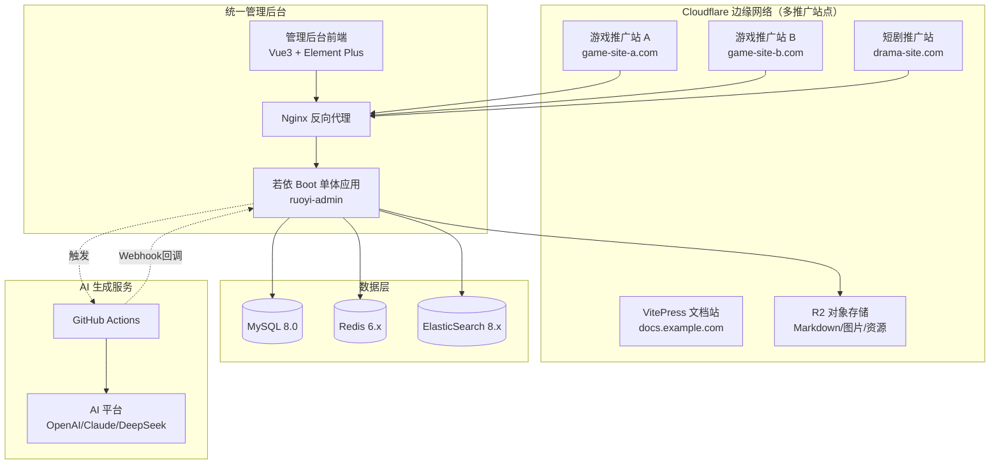

# 部署教程

> 版本：v2.5.0  
> 日期：2025-12-14  
> 项目：多产品内容管理系统（单体架构 + 多站点前端）

---

## 1. 系统架构概览

本系统采用**统一管理后台 + 多站点边缘前端**的架构：
- **管理后台**：统一平台管理所有网站内容，通过 AI 生成游戏/短剧相关文章
- **推广站点**：多个前端站点部署在 Cloudflare 边缘网络，分别用于游戏推广、短剧推广等
- **数据查询**：推广站点可调用后端 API 查询游戏盒子、游戏等数据，实现下载落地



### 1.1 架构说明

| 组件 | 说明 | 部署位置 |
|------|------|---------|
| **推广站点** | Next.js SSR，展示游戏/短剧内容，提供下载落地 | Cloudflare Workers（边缘） |
| **管理后台** | Vue3 + Element Plus，统一管理所有站点内容 | Nginx 静态托管 |
| **后端服务** | 若依 Boot 单体应用，提供 API 接口 | 服务器 Docker |
| **AI 生成** | GitHub Actions，自动生成并发布文章 | GitHub |

### 1.2 数据流向

1. **内容管理**：管理员在后台通过 AI 生成游戏/短剧文章 → 存储到数据库/R2
2. **内容展示**：推广站点调用后端 API → 获取文章/游戏盒子/游戏数据 → 边缘渲染展示
3. **下载落地**：用户访问推广站 → 查看游戏详情 → 跳转游戏盒子/游戏下载

---

## 2. 推广站点部署 (Next.js → Cloudflare Workers)

推广站点可部署多个，分别用于不同业务（游戏推广、短剧推广等）。

### 2.1 环境准备

```bash
# 安装依赖
pnpm install

# 安装 wrangler CLI
pnpm add -D wrangler @opennextjs/cloudflare
```

### 2.2 配置文件（游戏推广站示例）

**wrangler.toml**

```toml
name = "game-promo-site"
main = ".open-next/worker.js"
compatibility_date = "2024-09-23"
compatibility_flags = ["nodejs_compat"]

[vars]
CLOUDFLARE_WORKERS = "true"

[assets]
directory = ".open-next/assets"
binding = "ASSETS"

[[r2_buckets]]
binding = "DOCS_BUCKET"
bucket_name = "game-box-docs"
```

### 2.3 构建与部署

```bash
# 本地预览
pnpm preview

# 部署到 Cloudflare Workers
pnpm deploy
```

### 2.4 环境变量配置

在 Cloudflare Dashboard 中设置：

| 变量名 | 说明 |
|--------|------|
| `API_BASE_URL` | 后端 API 地址 |
| `CLOUDFLARE_WORKERS` | 设为 `true` |

---

## 3. 后端部署 (若依 Boot 单体架构)

### 3.1 环境要求

| 组件 | 版本 | 说明 |
|------|-----|------|
| JDK | 17+ | OpenJDK 或 Oracle JDK |
| MySQL | 8.0+ | 单机部署即可 |
| Redis | 6.x+ | 单机部署即可 |
| ElasticSearch | 8.x | 全文搜索引擎 |

> 💡 单体架构无需 Nacos 注册中心和 Spring Cloud Gateway

### 3.2 Docker Compose 部署

**docker-compose.yml**

```yaml
version: '3.8'

services:
  mysql:
    image: mysql:8.0
    container_name: ruoyi-mysql
    environment:
      MYSQL_ROOT_PASSWORD: ${MYSQL_PASSWORD:-your_password}
      MYSQL_DATABASE: ruoyi
    volumes:
      - mysql_data:/var/lib/mysql
      - ./sql:/docker-entrypoint-initdb.d
    ports:
      - "3306:3306"
    command: --character-set-server=utf8mb4 --collation-server=utf8mb4_unicode_ci

  redis:
    image: redis:7-alpine
    container_name: ruoyi-redis
    command: redis-server --requirepass ${REDIS_PASSWORD:-your_password}
    volumes:
      - redis_data:/data
    ports:
      - "6379:6379"

  elasticsearch:
    image: elasticsearch:8.11.0
    container_name: ruoyi-es
    environment:
      - discovery.type=single-node
      - xpack.security.enabled=false
      - "ES_JAVA_OPTS=-Xms512m -Xmx512m"
    volumes:
      - es_data:/usr/share/elasticsearch/data
    ports:
      - "9200:9200"

  ruoyi-admin:
    image: ruoyi/ruoyi-admin:latest
    container_name: ruoyi-admin
    environment:
      # 数据库配置
      - SPRING_DATASOURCE_URL=jdbc:mysql://mysql:3306/ruoyi?useUnicode=true&characterEncoding=utf8&serverTimezone=Asia/Shanghai
      - SPRING_DATASOURCE_USERNAME=root
      - SPRING_DATASOURCE_PASSWORD=${MYSQL_PASSWORD:-your_password}
      # Redis 配置
      - SPRING_REDIS_HOST=redis
      - SPRING_REDIS_PORT=6379
      - SPRING_REDIS_PASSWORD=${REDIS_PASSWORD:-your_password}
      # ElasticSearch 配置
      - SPRING_ELASTICSEARCH_URIS=http://elasticsearch:9200
      # GitHub 集成配置（用于 AI 生成）
      - GITHUB_CLIENT_ID=${GITHUB_CLIENT_ID}
      - GITHUB_CLIENT_SECRET=${GITHUB_CLIENT_SECRET}
      - GITHUB_WEBHOOK_SECRET=${GITHUB_WEBHOOK_SECRET}
    ports:
      - "8080:8080"
    depends_on:
      - mysql
      - redis
      - elasticsearch

  nginx:
    image: nginx:alpine
    container_name: ruoyi-nginx
    volumes:
      - ./nginx.conf:/etc/nginx/nginx.conf
      - ./html:/usr/share/nginx/html
    ports:
      - "80:80"
      - "443:443"
    depends_on:
      - ruoyi-admin

volumes:
  mysql_data:
  redis_data:
  es_data:
```

### 3.3 环境变量配置

创建 `.env` 文件：

```bash
# 数据库
MYSQL_PASSWORD=your_secure_password

# Redis
REDIS_PASSWORD=your_redis_password

# GitHub OAuth（用于 AI 生成功能）
GITHUB_CLIENT_ID=your_github_client_id
GITHUB_CLIENT_SECRET=your_github_client_secret
GITHUB_WEBHOOK_SECRET=your_webhook_secret
```

### 3.4 启动服务

```bash
# 启动所有服务
docker-compose up -d

# 查看服务状态
docker-compose ps

# 查看日志
docker-compose logs -f ruoyi-admin
```

### 3.5 Nginx 配置

**nginx.conf**

```nginx
events {
    worker_connections 1024;
}

http {
    upstream backend {
        server ruoyi-admin:8080;
    }

    server {
        listen 80;
        server_name your-domain.com;

        # 管理后台前端
        location / {
            root /usr/share/nginx/html;
            try_files $uri $uri/ /index.html;
        }

        # API 代理
        location /api {
            proxy_pass http://backend;
            proxy_set_header Host $host;
            proxy_set_header X-Real-IP $remote_addr;
            proxy_set_header X-Forwarded-For $proxy_add_x_forwarded_for;
        }

        # GitHub Webhook 回调
        location /api/ai-task/webhook {
            proxy_pass http://backend;
            proxy_set_header Host $host;
            proxy_set_header X-Real-IP $remote_addr;
        }
    }
}
```

---

## 4. GitHub Action AI 生成配置

### 4.1 创建 GitHub OAuth App

1. 访问 GitHub Settings → Developer settings → OAuth Apps
2. 点击 **New OAuth App**
3. 配置信息：

| 字段 | 值 |
|------|-----|
| Application name | Game Box AI Generator |
| Homepage URL | https://your-domain.com |
| Authorization callback URL | https://your-domain.com/api/github/oauth/callback |

4. 保存 Client ID 和 Client Secret

### 4.2 Fork AI 生成器仓库

用户在管理后台操作，系统自动 Fork 公共仓库到用户账号。

公共仓库地址：`https://github.com/your-org/game-box-ai-generator`

### 4.3 配置 Webhook 回调

确保后端服务能接收 GitHub Action 的回调：

```bash
# 测试 Webhook 端点
curl -X POST https://your-domain.com/api/ai-task/webhook \
  -H "Content-Type: application/json" \
  -H "X-Webhook-Secret: your_secret" \
  -d '{"event": "test"}'
```

### 4.4 AI 平台 API Key 配置

在管理后台配置各 AI 平台的 API Key，系统会自动同步到用户的 GitHub 仓库 Secrets：

| Secret 名称 | 说明 |
|------------|------|
| `OPENAI_API_KEY` | OpenAI API Key |
| `ANTHROPIC_API_KEY` | Claude API Key |
| `DEEPSEEK_API_KEY` | DeepSeek API Key |
| `DASHSCOPE_API_KEY` | 通义千问 API Key |
| `UNSPLASH_ACCESS_KEY` | Unsplash 图片搜索 |
| `PIXABAY_API_KEY` | Pixabay 图片搜索 |

---

## 5. R2 对象存储配置

### 5.1 创建 R2 Bucket

1. 登录 Cloudflare Dashboard
2. 进入 R2 Object Storage
3. 创建 Bucket: `game-box-docs`

### 5.2 获取 API 凭证

1. 进入 R2 → Manage R2 API Tokens
2. 创建 API Token，授予读写权限
3. 记录 Access Key ID 和 Secret Access Key

### 5.3 上传 Markdown 文件

```bash
# 使用 rclone 同步文件
rclone sync ./src/docs r2:game-box-docs/docs --config rclone.conf
```

---

## 6. ElasticSearch 配置

### 6.1 安装 IK 中文分词

```bash
# 进入容器
docker exec -it ruoyi-es bash

# 安装 IK 分词器
./bin/elasticsearch-plugin install https://github.com/medcl/elasticsearch-analysis-ik/releases/download/v8.11.0/elasticsearch-analysis-ik-8.11.0.zip

# 重启容器
docker restart ruoyi-es
```

### 6.2 创建索引

```bash
curl -X PUT "localhost:9200/documents" \
  -H 'Content-Type: application/json' \
  -d '{
    "mappings": {
      "properties": {
        "title": { "type": "text", "analyzer": "ik_max_word" },
        "content": { "type": "text", "analyzer": "ik_smart" },
        "category": { "type": "keyword" },
        "slug": { "type": "keyword" },
        "publishedAt": { "type": "date" }
      }
    }
  }'
```

---

## 7. 文档站点部署 (VitePress → Cloudflare Pages)

### 6.1 前置条件

- Node.js 18+
- pnpm 包管理器
- Cloudflare 账号

### 6.2 安装依赖

```bash
pnpm install
```

### 6.3 本地开发

```bash
# 启动开发服务器
pnpm docs:dev
```

访问 `http://localhost:5173` 预览文档。

### 6.4 构建文档

```bash
pnpm docs:build
```

构建产物输出到 `docs/.vitepress/dist` 目录。

### 6.5 部署到 Cloudflare Pages

**方式一：命令行部署（推荐）**

```bash
pnpm docs:deploy
```

首次部署会打开浏览器进行 Cloudflare OAuth 登录授权。

**方式二：手动部署**

```bash
cd docs
npx vitepress build
npx wrangler pages deploy .vitepress/dist --project-name=game-box-docs
```

**方式三：CI/CD 自动部署**

```yaml
# .github/workflows/deploy-docs.yml
name: Deploy Docs

on:
  push:
    branches: [main]
    paths:
      - 'docs/**'

jobs:
  deploy:
    runs-on: ubuntu-latest
    steps:
      - uses: actions/checkout@v4
      
      - uses: pnpm/action-setup@v2
        with:
          version: 8
          
      - uses: actions/setup-node@v4
        with:
          node-version: 20
          cache: 'pnpm'
          
      - run: pnpm install
      
      - name: Build docs
        run: cd docs && npx vitepress build
        
      - name: Deploy to Cloudflare Pages
        uses: cloudflare/wrangler-action@v3
        with:
          apiToken: ${{ secrets.CLOUDFLARE_API_TOKEN }}
          accountId: ${{ secrets.CLOUDFLARE_ACCOUNT_ID }}
          command: pages deploy docs/.vitepress/dist --project-name=game-box-docs
```

### 6.6 配置 GitHub Secrets

1. 前往 Cloudflare API Tokens 页面
2. 创建 Token，选择 "Edit Cloudflare Workers" 模板
3. 在 GitHub 仓库 Settings → Secrets 添加：
   - `CLOUDFLARE_API_TOKEN`: API Token
   - `CLOUDFLARE_ACCOUNT_ID`: 账户 ID

### 6.7 文档项目结构

```
docs/
├── .vitepress/
│   ├── config.mts          # VitePress 配置
│   └── dist/               # 构建输出目录
├── public/
│   └── logo.svg            # 静态资源
├── index.md                # 首页
├── PRD-游戏盒子内容管理系统.md
├── 架构设计文档.md
├── 数据库设计文档.md
├── API接口文档.md
└── 部署教程.md             # 本文档
```

### 6.8 常用命令

| 命令 | 说明 |
|------|------|
| `pnpm docs:dev` | 启动开发服务器 |
| `pnpm docs:build` | 构建静态文档 |
| `pnpm docs:preview` | 预览构建结果 |
| `pnpm docs:deploy` | 部署到 Cloudflare Pages |

### 6.9 访问地址

- **生产环境**: https://game-box-docs.pages.dev
- **预览环境**: https://commit-hash.game-box-docs.pages.dev

---

## 8. 监控与日志

### 7.1 Prometheus + Grafana

```yaml
services:
  prometheus:
    image: prom/prometheus:latest
    volumes:
      - ./prometheus.yml:/etc/prometheus/prometheus.yml
    ports:
      - "9090:9090"

  grafana:
    image: grafana/grafana:latest
    ports:
      - "3000:3000"
    environment:
      - GF_SECURITY_ADMIN_PASSWORD=admin
```

---

## 9. 常见问题

### 8.1 Next.js 部署 404

检查 `wrangler.toml` 的 assets 配置是否正确。

### 8.2 ES 中文搜索不生效

确认 IK 分词器已正确安装，索引使用了 `ik_smart` 或 `ik_max_word` 分析器。

### 8.3 R2 连接失败

检查 API Token 权限，确认 Endpoint URL 格式正确。

### 8.4 构建失败：Dead link found

检查 Markdown 文件中的链接是否指向存在的文件。

### 8.5 页面空白

1. 检查 `docs/public/` 目录是否有必要的静态资源（如 logo.svg）
2. 打开浏览器开发者工具查看控制台错误

### 8.6 Mermaid 图表不显示

确保安装了依赖：

```bash
pnpm add -D vitepress-plugin-mermaid mermaid
```

### 8.7 wrangler 登录失败

```bash
npx wrangler logout
npx wrangler login
```

---

## 10. 部署检查清单

- [ ] Cloudflare Workers 前端部署成功
- [ ] Cloudflare Pages 文档站点部署成功
- [ ] R2 Bucket 创建并配置访问权限
- [ ] MySQL 数据库初始化
- [ ] Redis 服务启动
- [ ] ElasticSearch 索引创建
- [ ] 若依 Boot 单体应用启动
- [ ] Nginx 反向代理配置
- [ ] GitHub OAuth App 创建
- [ ] AI 平台 API Key 配置
- [ ] Webhook 回调端点测试
- [ ] 监控告警配置
