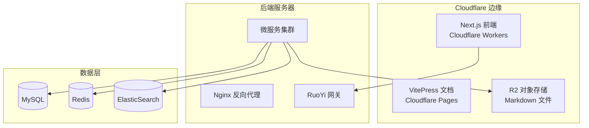

# 部署教程

> 版本：v1.0.0  
> 日期：2025-12-13  
> 项目：游戏盒子内容管理系统

---

## 1. 系统架构概览



---

## 2. 前端部署 (Next.js → Cloudflare Workers)

### 2.1 环境准备

```bash
# 安装依赖
pnpm install

# 安装 wrangler CLI
pnpm add -D wrangler @opennextjs/cloudflare
```

### 2.2 配置文件

**wrangler.toml**
```toml
name = "game-box"
main = ".open-next/worker.js"
compatibility_date = "2024-09-23"
compatibility_flags = ["nodejs_compat"]

[vars]
CLOUDFLARE_WORKERS = "true"

[assets]
directory = ".open-next/assets"
binding = "ASSETS"

[[r2_buckets]]
binding = "DOCS_BUCKET"
bucket_name = "game-box-docs"
```

### 2.3 构建与部署

```bash
# 本地预览
pnpm preview

# 部署到 Cloudflare Workers
pnpm deploy
```

### 2.4 环境变量配置

在 Cloudflare Dashboard 中设置：

| 变量名 | 说明 |
|--------|------|
| `API_BASE_URL` | 后端 API 地址 |
| `CLOUDFLARE_WORKERS` | 设为 `true` |

---

## 3. 后端部署 (RuoYi Cloud)

### 3.1 环境要求

| 组件 | 版本 | 说明 |
|------|-----|------|
| JDK | 17+ | OpenJDK 或 Oracle JDK |
| MySQL | 8.0+ | 主从架构推荐 |
| Redis | 6.x+ | 单机或集群 |
| Nacos | 2.x | 配置中心 + 注册中心 |
| ElasticSearch | 8.x | 全文搜索引擎 |

### 3.2 Docker Compose 部署

**docker-compose.yml**
```yaml
version: '3.8'

services:
  # MySQL 数据库
  mysql:
    image: mysql:8.0
    environment:
      MYSQL_ROOT_PASSWORD: ${MYSQL_PASSWORD}
      MYSQL_DATABASE: ruoyi
    volumes:
      - mysql_data:/var/lib/mysql
      - ./sql:/docker-entrypoint-initdb.d
    ports:
      - "3306:3306"

  # Redis 缓存
  redis:
    image: redis:7-alpine
    command: redis-server --requirepass ${REDIS_PASSWORD}
    volumes:
      - redis_data:/data
    ports:
      - "6379:6379"

  # Nacos 配置/注册中心
  nacos:
    image: nacos/nacos-server:v2.3.0
    environment:
      MODE: standalone
      SPRING_DATASOURCE_PLATFORM: mysql
      MYSQL_SERVICE_HOST: mysql
      MYSQL_SERVICE_DB_NAME: nacos
      MYSQL_SERVICE_USER: root
      MYSQL_SERVICE_PASSWORD: ${MYSQL_PASSWORD}
    ports:
      - "8848:8848"
      - "9848:9848"
    depends_on:
      - mysql

  # ElasticSearch 搜索引擎
  elasticsearch:
    image: elasticsearch:8.11.0
    environment:
      - discovery.type=single-node
      - xpack.security.enabled=false
      - "ES_JAVA_OPTS=-Xms512m -Xmx512m"
    volumes:
      - es_data:/usr/share/elasticsearch/data
    ports:
      - "9200:9200"

  # RuoYi 网关
  ruoyi-gateway:
    image: ruoyi/ruoyi-gateway:latest
    environment:
      - NACOS_HOST=nacos
    ports:
      - "8080:8080"
    depends_on:
      - nacos
      - redis

  # RuoYi 系统服务
  ruoyi-system:
    image: ruoyi/ruoyi-system:latest
    environment:
      - NACOS_HOST=nacos
      - MYSQL_HOST=mysql
      - REDIS_HOST=redis
    depends_on:
      - nacos
      - mysql
      - redis

  # RuoYi 文档服务
  ruoyi-document:
    image: ruoyi/ruoyi-document:latest
    environment:
      - NACOS_HOST=nacos
      - MYSQL_HOST=mysql
      - REDIS_HOST=redis
      - R2_ENDPOINT=${R2_ENDPOINT}
      - R2_ACCESS_KEY=${R2_ACCESS_KEY}
      - R2_SECRET_KEY=${R2_SECRET_KEY}
    depends_on:
      - nacos
      - mysql

  # RuoYi 搜索服务
  ruoyi-search:
    image: ruoyi/ruoyi-search:latest
    environment:
      - NACOS_HOST=nacos
      - ES_HOST=elasticsearch
    depends_on:
      - nacos
      - elasticsearch

volumes:
  mysql_data:
  redis_data:
  es_data:
```

### 3.3 启动服务

```bash
# 创建环境变量文件
cat > .env << EOF
MYSQL_PASSWORD=your_mysql_password
REDIS_PASSWORD=your_redis_password
R2_ENDPOINT=https://xxx.r2.cloudflarestorage.com
R2_ACCESS_KEY=your_access_key
R2_SECRET_KEY=your_secret_key
EOF

# 启动所有服务
docker-compose up -d

# 查看服务状态
docker-compose ps

# 查看日志
docker-compose logs -f ruoyi-gateway
```

---

## 4. Kubernetes 部署

### 4.1 命名空间

```yaml
# namespace.yaml
apiVersion: v1
kind: Namespace
metadata:
  name: game-box
```

### 4.2 ConfigMap

```yaml
# configmap.yaml
apiVersion: v1
kind: ConfigMap
metadata:
  name: game-box-config
  namespace: game-box
data:
  NACOS_HOST: "nacos.game-box.svc.cluster.local"
  MYSQL_HOST: "mysql.game-box.svc.cluster.local"
  REDIS_HOST: "redis.game-box.svc.cluster.local"
  ES_HOST: "elasticsearch.game-box.svc.cluster.local"
```

### 4.3 网关 Deployment

```yaml
# gateway-deployment.yaml
apiVersion: apps/v1
kind: Deployment
metadata:
  name: ruoyi-gateway
  namespace: game-box
spec:
  replicas: 2
  selector:
    matchLabels:
      app: ruoyi-gateway
  template:
    metadata:
      labels:
        app: ruoyi-gateway
    spec:
      containers:
        - name: gateway
          image: ruoyi/ruoyi-gateway:latest
          ports:
            - containerPort: 8080
          envFrom:
            - configMapRef:
                name: game-box-config
          resources:
            requests:
              memory: "512Mi"
              cpu: "250m"
            limits:
              memory: "1Gi"
              cpu: "500m"
---
apiVersion: v1
kind: Service
metadata:
  name: ruoyi-gateway
  namespace: game-box
spec:
  type: LoadBalancer
  ports:
    - port: 8080
      targetPort: 8080
  selector:
    app: ruoyi-gateway
```

### 4.4 部署命令

```bash
# 应用配置
kubectl apply -f namespace.yaml
kubectl apply -f configmap.yaml
kubectl apply -f gateway-deployment.yaml

# 查看 Pod 状态
kubectl get pods -n game-box

# 查看服务
kubectl get svc -n game-box
```

---

## 5. R2 对象存储配置

### 5.1 创建 R2 Bucket

1. 登录 Cloudflare Dashboard
2. 进入 R2 Object Storage
3. 创建 Bucket: `game-box-docs`

### 5.2 获取 API 凭证

1. 进入 R2 → Manage R2 API Tokens
2. 创建 API Token，授予读写权限
3. 记录 Access Key ID 和 Secret Access Key

### 5.3 上传 Markdown 文件

```bash
# 使用 rclone 同步文件
rclone sync ./src/docs r2:game-box-docs/docs \
  --config rclone.conf
```

**rclone.conf**
```ini
[r2]
type = s3
provider = Cloudflare
access_key_id = YOUR_ACCESS_KEY
secret_access_key = YOUR_SECRET_KEY
endpoint = https://ACCOUNT_ID.r2.cloudflarestorage.com
```

---

## 6. ElasticSearch 配置

### 6.1 安装 IK 中文分词

```bash
# 进入容器
docker exec -it elasticsearch bash

# 安装 IK 分词器
./bin/elasticsearch-plugin install https://github.com/medcl/elasticsearch-analysis-ik/releases/download/v8.11.0/elasticsearch-analysis-ik-8.11.0.zip

# 重启容器
docker restart elasticsearch
```

### 6.2 创建索引

```bash
curl -X PUT "localhost:9200/documents" -H 'Content-Type: application/json' -d '
{
  "settings": {
    "number_of_shards": 3,
    "number_of_replicas": 1,
    "analysis": {
      "analyzer": {
        "ik_smart_pinyin": {
          "type": "custom",
          "tokenizer": "ik_smart"
        }
      }
    }
  },
  "mappings": {
    "properties": {
      "title": { "type": "text", "analyzer": "ik_max_word" },
      "content": { "type": "text", "analyzer": "ik_smart" },
      "category": { "type": "keyword" },
      "slug": { "type": "keyword" },
      "publishedAt": { "type": "date" }
    }
  }
}'
```

---

## 7. 文档站点部署 (VitePress → Cloudflare Pages)

### 7.1 构建与部署

```bash
# 本地开发
pnpm docs:dev

# 构建
pnpm docs:build

# 部署到 Cloudflare Pages
pnpm docs:deploy
```

### 7.2 访问地址

- **生产环境**: https://game-box-docs.pages.dev
- **预览环境**: https://<commit-hash>.game-box-docs.pages.dev

---

## 8. 监控与日志

### 8.1 Prometheus + Grafana

```yaml
# prometheus.yaml
services:
  prometheus:
    image: prom/prometheus:latest
    volumes:
      - ./prometheus.yml:/etc/prometheus/prometheus.yml
    ports:
      - "9090:9090"

  grafana:
    image: grafana/grafana:latest
    ports:
      - "3000:3000"
    environment:
      - GF_SECURITY_ADMIN_PASSWORD=admin
```

### 8.2 日志收集 (ELK)

```yaml
# 使用 Filebeat 收集日志
services:
  filebeat:
    image: elastic/filebeat:8.11.0
    volumes:
      - ./filebeat.yml:/usr/share/filebeat/filebeat.yml
      - /var/log:/var/log:ro
    depends_on:
      - elasticsearch
```

---

## 9. 常见问题

### 9.1 Next.js 部署 404

检查 `wrangler.toml` 的 assets 配置是否正确。

### 9.2 ES 中文搜索不生效

确认 IK 分词器已正确安装，索引使用了 `ik_smart` 或 `ik_max_word` 分析器。

### 9.3 R2 连接失败

检查 API Token 权限，确认 Endpoint URL 格式正确。

### 9.4 Nacos 注册失败

检查网络连通性，确认 Nacos 服务已启动且端口开放。

---

## 10. 部署检查清单

- [ ] Cloudflare Workers 前端部署成功
- [ ] Cloudflare Pages 文档站点部署成功
- [ ] R2 Bucket 创建并配置访问权限
- [ ] MySQL 数据库初始化
- [ ] Redis 服务启动
- [ ] Nacos 配置中心启动
- [ ] ElasticSearch 索引创建
- [ ] RuoYi 网关服务启动
- [ ] RuoYi 业务服务启动
- [ ] 监控告警配置
